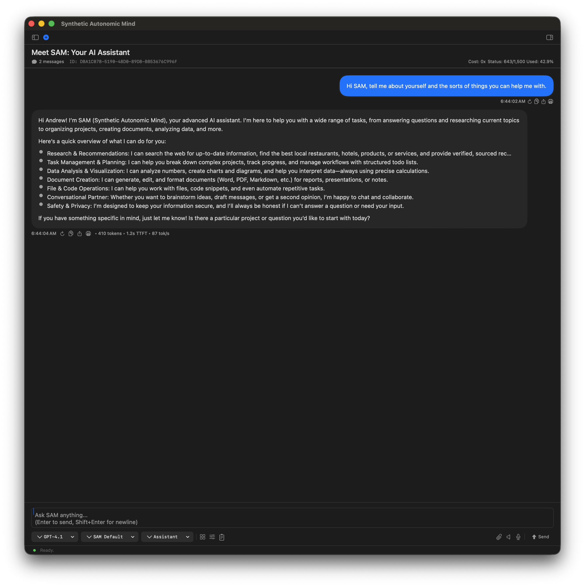
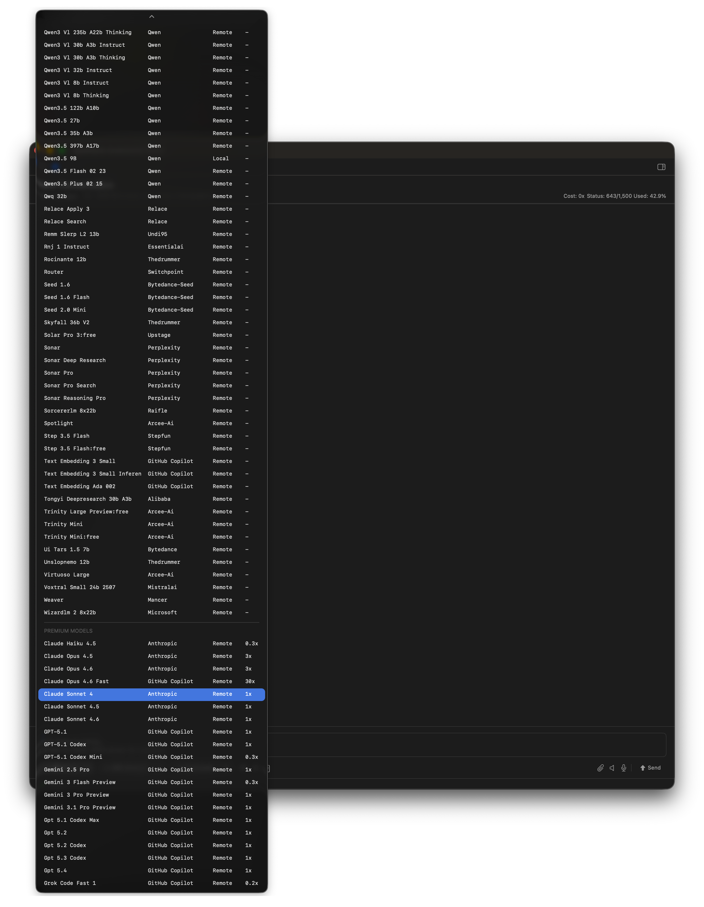
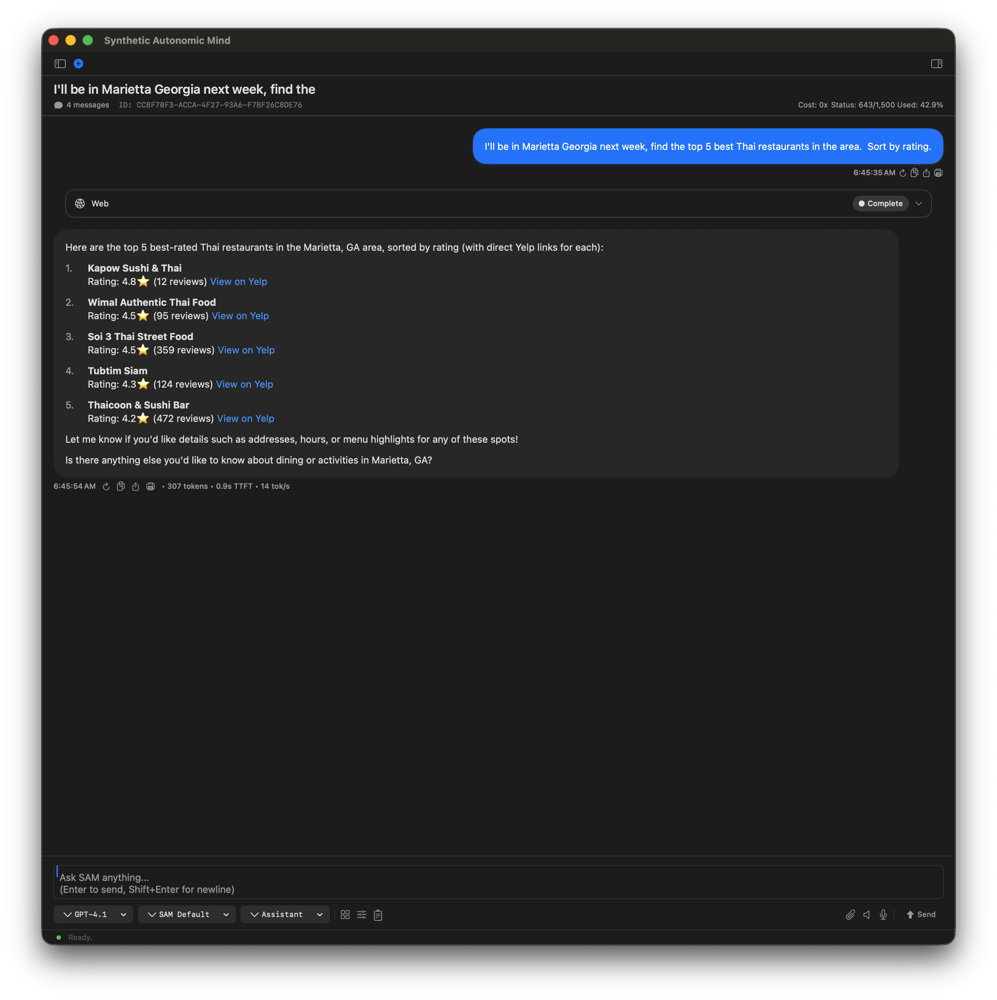
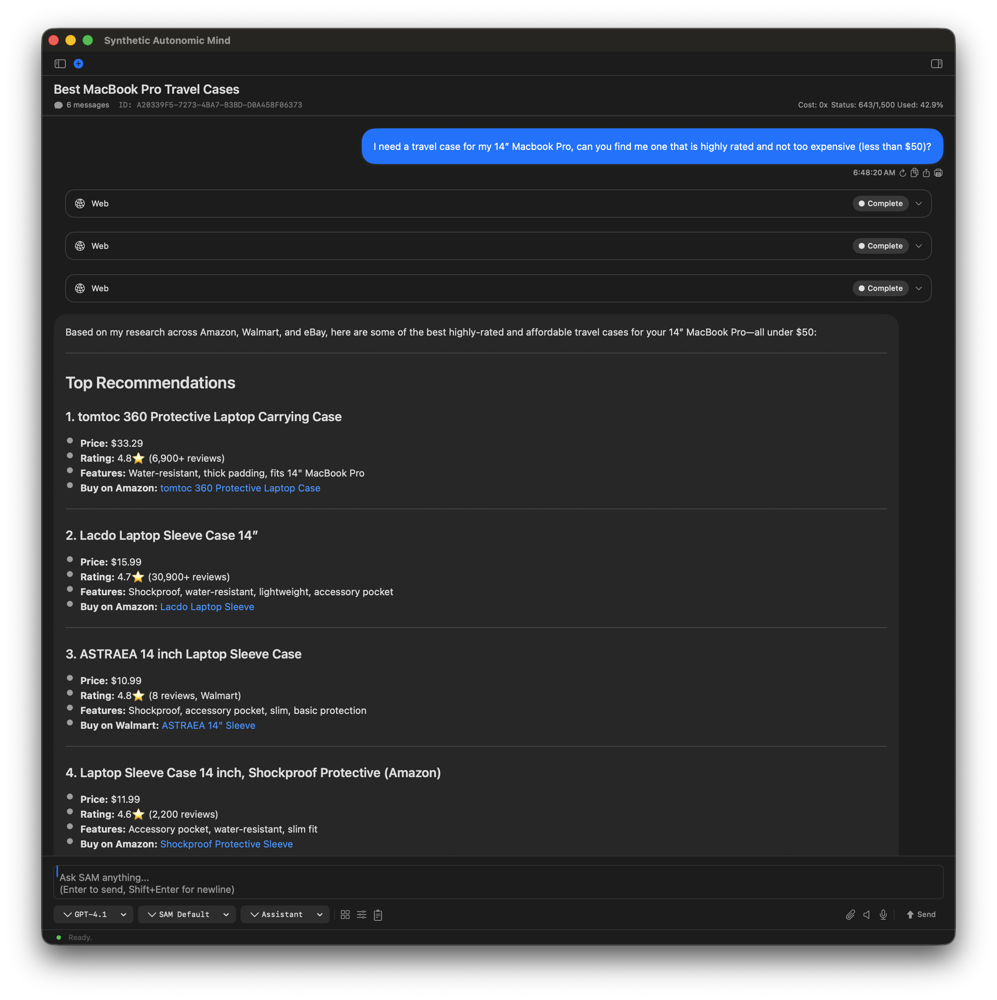
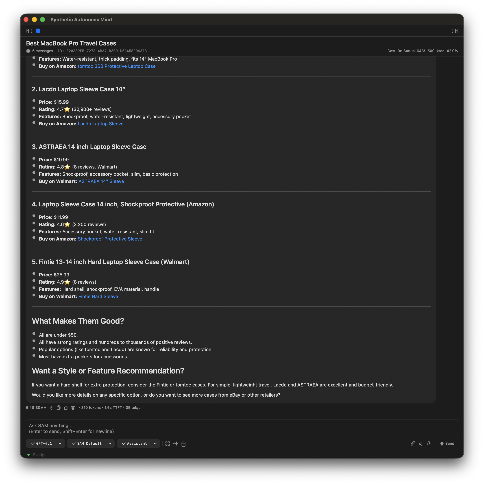

# SAM - Synthetic Autonomic Mind

**A native macOS AI assistant that remembers, gets work done, and keeps your data on your Mac.**

I built SAM for my wife. She wanted an AI assistant that could work with her documents, research purchases, generate images, and remember what they'd talked about. Nothing fit, so I built it. SAM was made for her - and dedicated to her.

[](https://www.gnu.org/licenses/gpl-3.0)
[](https://www.apple.com/macos/)
[](https://swift.org/)

[Website](https://www.syntheticautonomicmind.org) | [Download](https://github.com/SyntheticAutonomicMind/SAM/releases) | [Part of Synthetic Autonomic Mind](https://github.com/SyntheticAutonomicMind)

---

## What You Can Do With SAM

SAM is a native macOS app for people who aren't developers. Say "Hey SAM" to go hands-free. Upload a PDF and ask questions about it. Research a purchase across Amazon, Walmart, and eBay in one conversation. Generate images by connecting to ALICE. All without touching a command line.

**Your data stays on your Mac.** Run local models with MLX or llama.cpp and nothing leaves your machine. Switch to cloud providers when you want more capability - you choose.

### Documents & Research

- Upload and ask questions about PDFs, Word docs, Excel files, and text files
- Research online with live data from Google, Bing, Amazon, Yelp, and TripAdvisor
- Create Shared Topics to connect related conversations
- Search your history by meaning, not just keywords

### Writing & Communication

- Draft emails, essays, or reports
- Improve your writing with suggestions
- Brainstorm ideas and organize your thoughts
- Translate text between languages

### Creativity & Design

- Generate images from text descriptions via [ALICE](https://github.com/SyntheticAutonomicMind/ALICE)
- Browse and download models from CivitAI and HuggingFace
- Apply LoRA adapters for specific art styles
- Train custom models on your own documents and conversations

### Organization & Productivity

- Manage files and folders with voice commands
- Create project plans and task lists
- Organize your work in project folders
- Access SAM from your iPad or phone via [SAM-Web](https://github.com/SyntheticAutonomicMind/SAM-web)

### Math & Calculations

- Calculate mortgages, tips, compound interest, and ROI
- Convert units (temperature, length, weight, volume, speed)
- Get computed answers with Python, not AI approximation

### Voice Control

- "Hey SAM" wake word for hands-free use
- Speech recognition and text-to-speech
- Works offline with local models

---

## Personalities

Choose how SAM talks to you - friendly, professional, creative, or create your own.

---

## Screenshots

<table>
  <tr>
    <td width="50%">
      <h3>Natural Conversation</h3>
      
      <em>User greeting SAM and asking it to describe what it can help with</em>
    </td>
    <td width="50%">
      <h3>Flexible AI Provider Selection</h3>
      
      <em>Choose from local models (MLX, llama.cpp), or cloud providers (OpenAI, GitHub Copilot, Google Gemini, DeepSeek, MiniMax, OpenRouter)</em>
    </td>
  </tr>
</table>

<table>
  <tr>
    <td width="50%">
      <h3>Travel Research</h3>
      
      <em>User asks about restaurants in a town they'll be visiting</em>
    </td>
    <td width="50%">
      <h3>Shopping Assistance</h3>
      
      
      <em>User inquires about a product - SAM helps with research</em>
    </td>
  </tr>
</table>

---

## AI Providers

| Provider | What You Get |
|----------|--------------|
| **OpenAI** | GPT-4, GPT-4o, GPT-3.5, o1/o3 models |
| **Anthropic** | Claude models available via GitHub Copilot and OpenRouter |
| **GitHub Copilot** | GPT-4o, Claude 3.5, o1 (requires subscription) |
| **DeepSeek** | Cost-effective AI models |
| **Google Gemini** | Gemini 2.5 Pro/Flash, large context windows |
| **MiniMax** | MiniMax-M2.7, M2.5 (128K context) |
| **OpenRouter** | Access 100+ models from multiple providers |
| **Local MLX** | Run models on Apple Silicon Macs |
| **Local llama.cpp** | Run models on any Mac (Intel or Apple Silicon) |
| **Custom** | Use any OpenAI-compatible API |

Switch providers mid-conversation. Use local models for privacy, cloud models for capability. Your choice.

---

## Quick Start

### Install

**Homebrew (recommended):**
```bash
brew tap SyntheticAutonomicMind/homebrew-SAM
brew install --cask sam
```

**Manual:** Download from [GitHub Releases](https://github.com/SyntheticAutonomicMind/SAM/releases), move to Applications, open SAM.

### Set Up Your AI Provider

1. Launch SAM
2. Open Settings (`,`)
3. Go to **AI Providers** tab
4. Click **Add Provider**
5. Choose a cloud provider (enter your API key) or a local model (download from within SAM)

### Start Talking

Press `N` for a new conversation. Type your message. Say "Hey SAM" for hands-free.

### Access From Other Devices

[SAM-Web](https://github.com/SyntheticAutonomicMind/SAM-web) provides chat from your iPad, iPhone, or any browser. Enable API Server in SAM Preferences, then visit the SAM-Web repository for setup instructions.

---

## System Requirements

**To use SAM:**
- macOS 14.0 (Sonoma) or later
- 4GB RAM minimum (8GB+ recommended)
- 3GB free disk space

**For local AI models:**
- 16GB+ RAM recommended
- 20GB+ free disk space (models can be large)
- Apple Silicon (M1/M2/M3/M4) recommended for MLX
- Intel Macs can use llama.cpp models

---

## Privacy & Security

- Conversations stored locally in `~/Library/Application Support/SAM/`
- Per-conversation memory isolation
- API keys stored in UserDefaults
- Zero telemetry, zero tracking
- When you use cloud providers, only the messages you send go to those providers

---

## Part of the Ecosystem

SAM is part of [Synthetic Autonomic Mind](https://github.com/SyntheticAutonomicMind) - a family of open source AI tools:

- **[CLIO](https://github.com/SyntheticAutonomicMind/CLIO)** - Terminal AI coding assistant (macOS, Linux, Windows)
- **[ALICE](https://github.com/SyntheticAutonomicMind/ALICE)** - Image generation server (SAM's image engine)
- **[SAM-Web](https://github.com/SyntheticAutonomicMind/SAM-web)** - Access SAM from any browser

---

## Documentation

| Document | What You'll Find |
|----------|-----------------|
| [User Guide](docs/USER_GUIDE.md) | Getting started, daily use, tips |
| [Features](docs/FEATURES.md) | Complete feature reference |
| [Providers](docs/PROVIDERS.md) | AI provider setup and configuration |
| [Tools](docs/TOOLS.md) | Built-in tools reference |
| [Memory](docs/MEMORY.md) | How memory and search work |
| [Security](docs/SECURITY.md) | Privacy and security model |
| [Architecture](docs/ARCHITECTURE.md) | How SAM is built |
| [Performance](docs/PERFORMANCE.md) | Optimization and tuning |
| [Installation](docs/INSTALLATION.md) | Detailed install guide |
| [BUILDING.md](BUILDING.md) | Build from source |
| [CONTRIBUTING.md](CONTRIBUTING.md) | How to contribute |
| [Website](https://www.syntheticautonomicmind.org) | Online guides and updates |

---

## License

**GPL-3.0** - See [LICENSE](LICENSE) for details.

Created by Andrew Wyatt (Fewtarius) · [syntheticautonomicmind.org](https://www.syntheticautonomicmind.org) · [github.com/SyntheticAutonomicMind/SAM](https://github.com/SyntheticAutonomicMind/SAM)

Built with open source: [Vapor](https://vapor.codes) · [MLX](https://github.com/ml-explore/mlx-swift) · [llama.cpp](https://github.com/ggerganov/llama.cpp) · [Sparkle](https://sparkle-project.org)