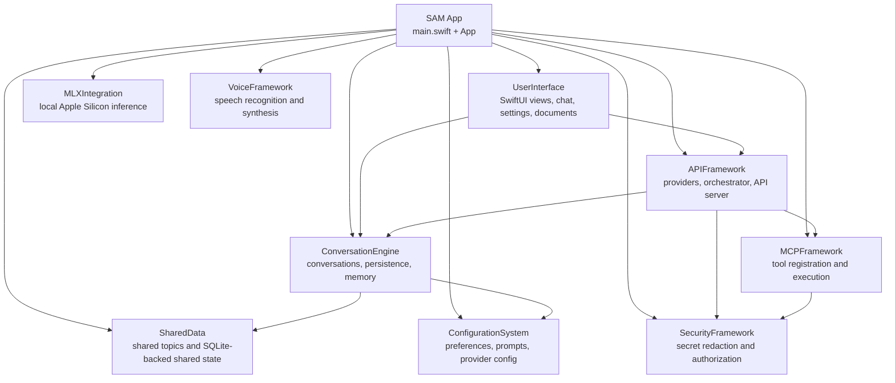
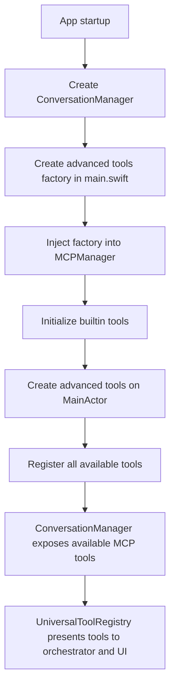
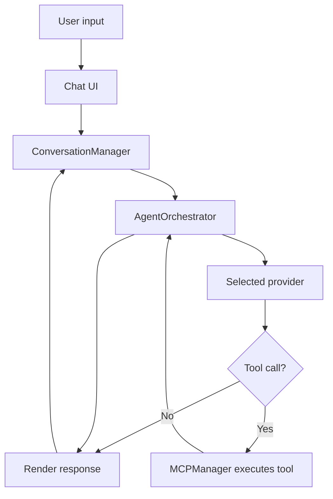

# SAM Architecture

High-level overview of how SAM is built today.

---

## Overview

SAM is a native macOS application built with Swift 6 and SwiftUI. It is organized as a set of Swift Package Manager targets with clear subsystem boundaries for UI, AI orchestration, tools, memory, configuration, security, and voice.

The system is designed around a few core ideas:

- native macOS user experience
- local-first data handling
- provider flexibility
- structured tool execution
- strict concurrency discipline

---

## Top-Level Architecture



---

## Swift Package Targets

SAM is organized into these primary targets:

- `SAM`
- `ConversationEngine`
- `MLXIntegration`
- `UserInterface`
- `ConfigurationSystem`
- `APIFramework`
- `MCPFramework`
- `SharedData`
- `SecurityFramework`
- `VoiceFramework`

This structure reflects the actual package definition in `Package.swift`.

---

## Module Responsibilities

### `SAM`

Application entry point and top-level wiring.

Key responsibilities:
- App startup
- dependency construction
- advanced tool factory injection
- ALICE service injection
- API server startup when enabled

### `UserInterface`

The SwiftUI frontend.

Key areas include:
- chat interface
- tool cards
- preferences
- model management UI
- document import/export UI
- performance display
- onboarding and help

### `APIFramework`

The orchestration and provider layer.

Key responsibilities:
- request routing to providers
- provider implementations
- model capability handling
- tool call extraction across response formats
- API server for SAM-Web and integrations
- multi-step orchestration through `AgentOrchestrator`

### `MCPFramework`

The tool execution layer.

Key responsibilities:
- built-in tool registration
- parameter validation
- operation alias handling
- execution dispatch
- tool ordering and availability

### `ConversationEngine`

Conversation lifecycle and persistence.

Key responsibilities:
- conversation storage
- active conversation state
- memory indexing and retrieval
- context archival and recall
- import/export support

### `ConfigurationSystem`

Settings, provider configuration, and prompt management.

Key responsibilities:
- preferences persistence
- provider configuration models
- system prompt configuration
- mini-prompt and supporting configuration data

### `MLXIntegration`

Local-model support for Apple Silicon.

Key responsibilities:
- model loading
- model cache management
- Apple Silicon inference support
- local model lifecycle coordination

### `SharedData`

Shared Topics and related cross-conversation state.

### `SecurityFramework`

Security-sensitive functionality.

Key responsibilities:
- secret redaction
- authorization support
- command and content safety helpers

### `VoiceFramework`

Speech and audio functionality.

Key responsibilities:
- speech recognition
- speech synthesis
- wake word and voice workflow support

---

## Provider Architecture

SAM currently supports these provider types:

- `openai`
- `github-copilot`
- `deepseek`
- `gemini`
- `minimax`
- `openrouter`
- `local-llama`
- `local-mlx`
- `custom`

Provider configuration lives in `ConfigurationSystem`, while provider implementations live in `APIFramework`.

Important current-state note:
- Direct Anthropic integration is not part of the current provider enum
- Claude-family model access is expected to come through GitHub Copilot or OpenRouter where available

---

## Tool Architecture

SAM uses a consolidated tool model.

### Built-in core tools

Registered from `MCPFramework`:
- `memory_operations`
- `todo_operations`
- `math_operations`
- `image_generation`
- `calendar_operations`
- `contacts_operations`
- `notes_operations`
- `spotlight_search`
- `weather_operations`

### Advanced tools injected at startup

Injected from `main.swift` through the advanced tools factory:
- `web_operations`
- `document_operations`
- `file_operations`
- `user_collaboration`

This split exists to avoid circular dependencies while still exposing a unified tool surface to the orchestrator.

---

## Tool Registration Flow



This is the actual pattern used in the current code, and it matters because some documentation still describes the older static 8-tool picture as if it were the whole story.

---

## Message and Tool Execution Flow



At a high level:
- the orchestrator builds context
- the provider returns content and possibly tool calls
- the tool system executes structured operations
- results are fed back into the orchestrator
- the final output is rendered and stored

---

## Data Storage Layout

Primary data lives under:

```text
~/Library/Application Support/SAM/
├── conversations/
├── endpoints/
├── preferences/
├── system-prompts/
├── backups/
└── other app-managed state
```

Additional working and cache locations include:

```text
~/SAM/                          # conversation and topic workspaces
~/Library/Caches/sam-rewritten/models/
~/Library/Caches/sam/images/
```

API credentials are stored in the macOS Keychain.

---

## Concurrency Model

SAM is built around Swift 6 concurrency rules.

Key patterns:
- `@MainActor` for UI-facing work
- explicit actor isolation for shared async state
- `Sendable` compliance at module boundaries
- structured concurrency for coordinated async operations

This is a core architectural constraint, not a style preference.

---

## API Server and Remote Access

The local API server lives in `APIFramework` and supports SAM-Web plus other local-network integrations.

Key characteristics:
- token-based authentication
- configurable port
- optional remote access within the local network
- conversation handling options for API-originated sessions

---

## Security Model in Architecture Terms

Security is woven through the system rather than isolated to one place.

Examples:
- file access authorization in tool flows
- credential storage in Keychain
- secret redaction before sending content to cloud providers
- explicit tool enablement and user-controlled access patterns

---

## See Also

- [Security](SECURITY.md)
- [Memory](MEMORY.md)
- [Tools](TOOLS.md)
- [Providers](PROVIDERS.md)
- [project-docs/](../project-docs/)
