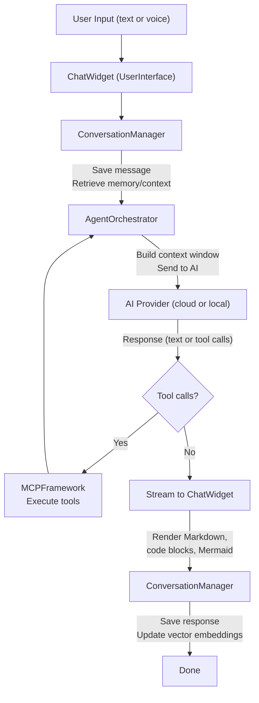
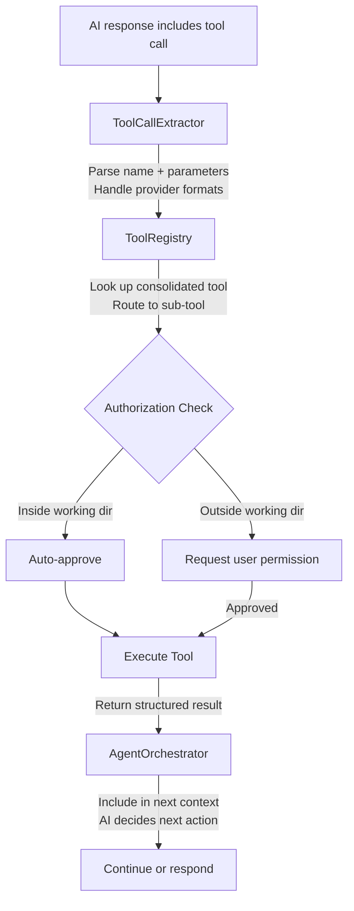

# SAM Architecture

**High-level overview of how SAM is built**

---

## Overview

SAM is a native macOS application built with Swift 6.0 and SwiftUI. It follows a modular architecture with clear boundaries between subsystems, uses actor-based concurrency for thread safety, and is designed around the principle that your data stays on your machine.

This document is a starting point for understanding SAM's design. For deep implementation details, see the files in [project-docs/](../project-docs/).

---

## System Architecture

```mermaid
block-beta
  columns 1

  block:app["SAM Application"]
    columns 3

    block:ui["UserInterface\nChatWidget - Preferences - Documents - Help - Search"]:3
    end

    block:api["APIFramework\nAgentOrchestrator - Providers - EndpointManager\nToolCallExtractor - TokenCounter - SAMAPIServer"]:3
    end

    block:mcp["MCPFramework\nTools (8)"]
    end
    block:conv["ConversationEngine\nMemory - VectorRAG"]
    end
    block:config["ConfigurationSystem\nPreferences - Prompts"]
    end

    block:mlx["MLXIntegration\nLocal Models"]
    end
    block:voice["VoiceFramework\nTTS - STT"]
    end
    block:shared["SharedData\nSQLite"]
    end
  end
```

---

## Module Overview

SAM is organized into ten Swift modules (SPM targets), each with a clear responsibility:

### SAM (Entry Point)

The application entry point. Contains `main.swift` (AppDelegate) and `App.swift` (SwiftUI App definition). Minimal code - just wires everything together.

### UserInterface

SwiftUI views and components that make up the UI. Organized by feature area:

| Area | What It Contains |
|------|-----------------|
| **Chat** | ChatWidget, message rendering, Mermaid diagrams, code blocks |
| **Components** | Reusable UI components (agent todo list, etc.) |
| **Documents** | Document viewer, import/export UI |
| **Help** | Help windows, onboarding |
| **LocalModels** | Model browser, download management UI |
| **MiniPrompts** | Quick-action prompt templates |
| **Performance** | Performance monitoring display |
| **Preferences** | Settings panels (General, Voice, Providers, etc.) |
| **Search** | Conversation search UI |
| **Web** | Web content views |
| **Welcome** | First-launch experience |

All UI code is `@MainActor` isolated for thread safety, following Swift 6 strict concurrency rules.

### APIFramework

The largest module. Handles all AI communication, orchestration, and the local API server.

**Key Components:**

- **AgentOrchestrator** - The brain. Manages multi-step tool-calling workflows, context management, and autonomous task execution. Split across multiple files for organization:
  - `AgentOrchestrator.swift` - Core orchestration loop
  - `AgentOrchestrator+LLMCalls.swift` - AI provider communication
  - `AgentOrchestrator+ToolExecution.swift` - Tool dispatch and result handling
  - `AgentOrchestrator+ContextManagement.swift` - Context window management

- **Providers** - Implementations for each AI provider:
  - `Providers.swift` - OpenAI, Anthropic, GitHub Copilot
  - `ExtendedProviders.swift` - DeepSeek, Google Gemini, MiniMax, Custom
  - `OpenRouterProvider.swift` - OpenRouter multi-model gateway
  - `ALICEProvider.swift` - ALICE image generation
  - `MLXProvider.swift` - Local MLX models
  - `LlamaProvider.swift` - Local llama.cpp models
  - `OpenRouterProvider.swift` - OpenRouter multi-provider

- **EndpointManager** - Routes requests to the correct provider, manages model lists, handles authentication
- **SAMAPIServer** - Local HTTP server (Vapor-based) for SAM-Web and external integrations
- **ToolCallExtractor** - Parses tool calls from AI responses across different provider formats
- **TokenCounter** - Tracks token usage for context management

### MCPFramework

The tool system. Implements the Model Context Protocol pattern where tools are registered, discovered, and executed by the AI.

**Components:**
- **ToolRegistry** - Central registry of all available tools
- **Tools/** - Individual tool implementations (file operations, web, documents, math, etc.)
- **Authorization/** - Path-based authorization for file access
- **Internal/** - Sub-tools dispatched by consolidated tools

SAM exposes 8 consolidated tools to the AI, which internally dispatch to ~21 sub-tools. This keeps the tool interface clean for the AI while providing fine-grained functionality.

### ConversationEngine

Manages conversation lifecycle, persistence, and memory.

**Key Components:**
- **ConversationManager** - Core conversation state, message handling, persistence
- **ConversationModel** - Data model for conversations, settings, messages
- **ConversationMessageBus** - Event-driven message routing
- **VectorRAGService** - Semantic document search using vector embeddings
- **ContextArchiveManager** - Context compression and archival
- **ConversationImportExportService** - JSON/Markdown export

### ConfigurationSystem

Centralized settings and configuration management.

**Key Components:**
- **ConfigurationManager** - JSON-based configuration with atomic writes
- **SystemPromptConfiguration** - System prompt management and customization
- **PersonalityManager** - Personality trait system
- **PerformanceMonitor** - RSS, CPU, and inference tracking
- **ChatSessionManager** - Session lifecycle management
- **EndpointConfigurationModels** - Provider configuration models
- **MiniPromptConfiguration** - Quick-action prompt templates

**Storage Layout:**
```
~/Library/Application Support/SAM/
├── conversations/       # Conversation JSON files + vector databases
├── system-prompts/      # Custom system prompt templates
├── endpoints/           # API endpoint configurations
├── preferences/         # Application preferences
└── backups/            # Automatic configuration backups
```

### MLXIntegration

Apple Silicon local model support using the MLX framework.

- Model loading, caching, and lifecycle management
- Metal GPU acceleration
- Performance monitoring (tokens/sec, memory usage)
- Automatic memory management and LRU eviction

### VoiceFramework

Speech recognition and text-to-speech.

- **SpeechRecognitionService** - On-device speech recognition using Apple's Speech framework
- **SpeechSynthesisService** - Text-to-speech with streaming support (speaks as text arrives)
- **AudioDeviceManager** - Input/output device enumeration and selection
- **VoiceManager** - Coordination between speech services
- Wake word detection ("Hey SAM")

### SharedData

Cross-conversation data sharing via SQLite.

- Shared Topics - Named workspaces that multiple conversations can access
- Entry management with full CRUD operations
- Optimistic locking for concurrent access
- Per-topic file directories

### SecurityFramework

Authorization and security operations.

- Path-based authorization for file access
- Working directory enforcement
- Tool permission management

---

## Data Flow

### Message Processing



### Tool Execution



---

## Concurrency Model

SAM uses Swift 6 strict concurrency:

- **@MainActor** - All UI code and ViewModels
- **Actors** - For shared mutable state across async boundaries
- **Sendable** - All types crossing actor boundaries must be Sendable
- **Structured concurrency** - TaskGroup for parallel operations

This eliminates data races at compile time. The trade-off is ~211 Sendable-related warnings from third-party dependencies, which don't affect functionality.

---

## Build System

SAM uses Swift Package Manager (SPM) with a Makefile wrapper:

- **Package.swift** - Defines modules, dependencies, and build targets
- **Makefile** - Wraps xcodebuild for debug/release builds, llama.cpp compilation, DMG creation, code signing, and notarization
- **external/llama.cpp** - Git submodule compiled as a framework for local model support

---

## Dependencies

### First-Party (Apple)

- SwiftUI, AppKit - UI framework
- NaturalLanguage - Vector embeddings for semantic search
- Speech - On-device speech recognition
- CoreAudio - Audio device management
- Metal - GPU acceleration for local models

### Third-Party

| Dependency | Purpose |
|-----------|---------|
| **mlx-swift** | Apple MLX framework for local models |
| **mlx-swift-lm** | Language model support for MLX |
| **swift-transformers** | Tokenization |
| **llama.cpp** | Local model inference (GGUF format) |
| **Vapor** | HTTP server for API and SAM-Web |
| **SQLite.swift** | Database for conversations and shared data |
| **Sparkle** | Auto-update framework |
| **swift-log** | Structured logging |
| **swift-markdown** | Markdown parsing |
| **ZIPFoundation** | Archive operations |
| **swift-crypto** | Cryptographic operations |

---

## Further Reading

- [project-docs/API_FRAMEWORK.md](../project-docs/API_FRAMEWORK.md) - Deep dive into the API system
- [project-docs/AGENT_ORCHESTRATOR.md](../project-docs/AGENT_ORCHESTRATOR.md) - Agent loop details
- [project-docs/CONVERSATION_ENGINE.md](../project-docs/CONVERSATION_ENGINE.md) - Conversation system internals
- [project-docs/MESSAGING_ARCHITECTURE.md](../project-docs/MESSAGING_ARCHITECTURE.md) - Message flow details
- [project-docs/MLX_INTEGRATION.md](../project-docs/MLX_INTEGRATION.md) - MLX implementation
- [project-docs/SOUND.md](../project-docs/SOUND.md) - Voice framework details
- [project-docs/CONFIGURATION_SYSTEM.md](../project-docs/CONFIGURATION_SYSTEM.md) - Configuration internals
- [project-docs/SECURITY_SPECIFICATION.md](../project-docs/SECURITY_SPECIFICATION.md) - Security model details
