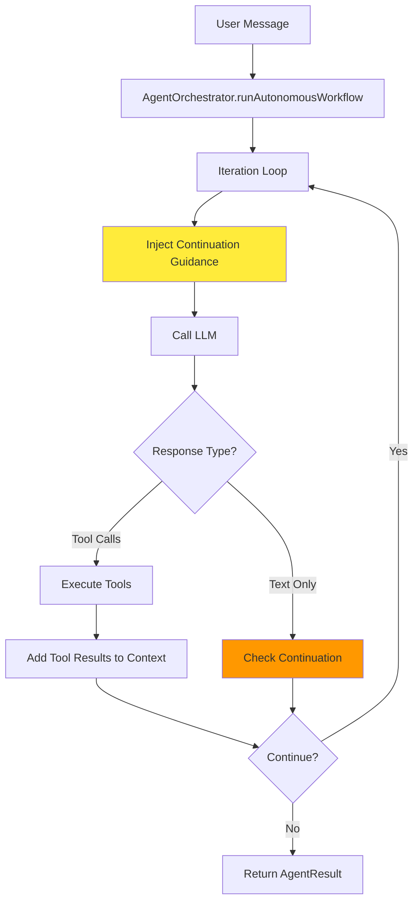
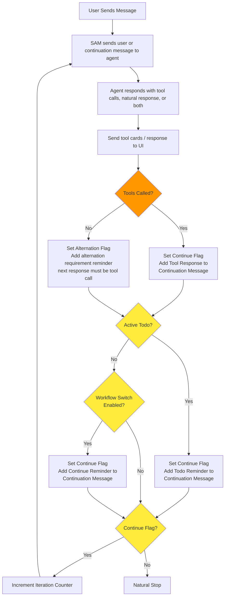

<!-- SPDX-License-Identifier: CC-BY-NC-4.0 -->
<!-- SPDX-FileCopyrightText: Copyright (c) 2025 Andrew Wyatt (Fewtarius) -->

# AgentOrchestrator - Autonomous Workflow Engine

**Version:** 3.0  
**Last Updated:** January 4, 2026

## Table of Contents

- [Overview](#overview)
- [Architecture](#architecture)
- [Continuation Guidance System](#continuation-guidance-system)
- [Message Alternation](#message-alternation)
- [Workflow Control](#workflow-control)
- [Todo Workflow Discipline](#todo-workflow-discipline)
- [Known Issues](#known-issues)

---

## Overview

The **AgentOrchestrator** is SAM's autonomous workflow execution engine. It enables multi-step workflows where the AI agent can execute tools, analyze results, and continue working without user prompting.

### Purpose and Responsibilities

1. **Autonomous Execution**: Agent can call tools repeatedly to complete complex tasks
2. **Workflow Control**: Manages iteration limits, continuation logic, and completion detection
3. **Message Alternation**: Ensures proper user/assistant message alternation for all providers
4. **Tool Execution**: Coordinates parallel and serial tool execution with progress tracking
5. **Context Management**: Intelligent message filtering and context optimization
6. **Todo Workflow**: Enforces disciplined workflow when todos exist

### Key Design Principles

- **Model-Agnostic**: Works with MLX, OpenAI, GitHub Copilot, Anthropic
- **Streaming-First**: Real-time progress updates for better UX
- **Context-Aware**: Adapts guidance based on workflow state
- **Safe**: Iteration limits prevent infinite loops
- **Transparent**: Full execution history tracked in WorkflowRounds

---

## Architecture



### Core Components

- **WorkflowExecutionContext**: Single source of truth for workflow state
- **Continuation Guidance System**: Context-aware prompts injected each iteration
- **Message Alternation**: Ensures Claude/OpenAI API compatibility
- **Tool Execution Scheduler**: Parallel/serial execution with progress streaming
- **WorkflowRound**: Captures complete iteration history for debugging

---

## Continuation Guidance System

**Added:** January 4, 2026  
**Replaces:** Rigid alternation flag system

The continuation guidance system provides **context-aware prompts** to the agent at the start of each iteration. This prevents common workflow bugs while allowing flexibility.

### Guidance Matrix

The system uses a **2×2 decision matrix** based on:
1. **Are there incomplete todos?** (workflow discipline needed)
2. **Did last iteration use tools?** (what happened)

This produces 4 guidance variants:

#### Variant 1: Todos Exist + Tools Used

```
WORKFLOW GUIDANCE (TODO MODE):
You have incomplete todos and just executed tools.

MANDATORY TODO WORKFLOW:
1. Before doing work → Mark todo as "in-progress" using todo_operations
2. Do the actual work (tell story, write content, etc.)
3. After completing work → Mark todo as "completed" using todo_operations

NEVER skip marking todos in-progress before starting work.
NEVER skip marking todos completed after finishing work.
Do NOT provide multiple text responses without tool calls between them.
```

**Purpose:** Enforce strict todo workflow discipline  
**Prevents:** Skipping todo status updates, doing work without marking todos

#### Variant 2: Todos Exist + No Tools Used

```
CRITICAL WORKFLOW GUIDANCE (TODO MODE):
You have incomplete todos but didn't use tools in your last iteration.

This is ONLY acceptable if you just answered the user's question.
Otherwise, you MUST follow the todo workflow:

1. Mark next todo as "in-progress" using todo_operations
2. Do the work for that todo
3. Mark todo as "completed" using todo_operations

Text-only responses are NOT acceptable when todos remain.
```

**Purpose:** Prevent text-only loops when todos exist  
**Prevents:** Agent talking about work instead of doing it

#### Variant 3: No Todos + Tools Used

```
WORKFLOW GUIDANCE:
Your previous iteration included tool execution and results.

Now you must decide:
- If you need MORE data/analysis → Use tools to gather it
- If you have ENOUGH information → Provide your response to the user
- If you ALREADY responded to the user → Use tools for next steps (don't repeat your answer)

Do NOT provide multiple text responses without tool calls between them.
```

**Purpose:** Allow flexible multi-tool workflows  
**Prevents:** Consecutive assistant messages without tool execution

#### Variant 4: No Todos + No Tools Used

```
CRITICAL WORKFLOW GUIDANCE:
Your previous iteration did NOT include any tool execution.

If you already answered the user's question → Use tools for follow-up work
If you need to do work → You MUST use tools (don't just talk about it)

Text-only responses are ONLY acceptable when directly answering the user.
```

**Purpose:** Prevent text-only loops  
**Prevents:** Agent planning without executing

### Implementation

```swift
// Location: Sources/APIFramework/AgentOrchestrator.swift
// Lines: ~1590-1650

let hadToolsLastIteration = context.lastIterationHadToolResults
let hasIncompleteTodos = !currentTodoList.filter { $0.status.lowercased() != "completed" }.isEmpty

let continuationGuidance: String

if hasIncompleteTodos {
    if hadToolsLastIteration {
        continuationGuidance = "WORKFLOW GUIDANCE (TODO MODE): ..."
    } else {
        continuationGuidance = "CRITICAL WORKFLOW GUIDANCE (TODO MODE): ..."
    }
} else if hadToolsLastIteration {
    continuationGuidance = "WORKFLOW GUIDANCE: ..."
} else {
    continuationGuidance = "CRITICAL WORKFLOW GUIDANCE: ..."
}

let guidanceMessage = createSystemReminder(content: continuationGuidance, model: model)
context.ephemeralMessages.append(guidanceMessage)
```

---

## Message Alternation

**Challenge:** Claude API requires strict user/assistant alternation. Consecutive assistant messages cause 400 errors.

**Previous Approach (Rejected):**
- Binary flag: "No tools? Force tools next time!"
- Too rigid - broke legitimate multi-tool workflows
- Didn't account for todo workflow needs

**Current Approach (January 4, 2026):**
- **Context-aware continuation guidance** (see above)
- Prevents consecutive messages via intelligent prompts, not forced tool calls
- Allows flexibility while maintaining alternation

### How It Works

1. **Track what happened:** `context.lastIterationHadToolResults`
2. **Check workflow state:** `hasIncompleteTodos`
3. **Inject appropriate guidance:** Tells agent what's expected
4. **Agent follows guidance:** Natural alternation through proper workflow

### Message Filtering

The `ensureMessageAlternation()` function handles edge cases:

```swift
// Merges consecutive same-role messages
// Filters empty messages
// Ensures user/assistant alternation
// Used before sending to LLM
```

**Location:** `Sources/APIFramework/AgentOrchestrator.swift:171-251`

---

## Workflow Control

### Iteration Loop

```
while context.shouldContinue && context.iteration < context.maxIterations {
    1. Inject continuation guidance (context-aware)
    2. Call LLM with conversation + tools + ephemeral messages
    3. Process response (markers, content filtering)
    4. Save assistant message to conversation
    5. Check finish reason:
       - tool_calls → Execute tools, continue
       - stop → Check for continuation conditions
    6. Continuation logic:
       - Explicit [WORKFLOW_COMPLETE] marker → Stop
       - Explicit [CONTINUE] marker → Continue
       - Incomplete todos → Auto-continue with graduated intervention
       - Workflow mode enabled → Continue
       - Otherwise → Natural stop
}
```

### Continuation Conditions

The orchestrator checks these conditions to decide whether to continue:

1. **Explicit Signals** (highest priority):
   - `[WORKFLOW_COMPLETE]` → Stop immediately
   - `[CONTINUE]` → Continue immediately

2. **Todo-Based Continuation**:
   - If incomplete todos exist → Auto-continue with intervention
   - Uses graduated intervention system (see below)

3. **Workflow Mode**:
   - If `enableWorkflowMode` is true → Continue
   - Fallback for workflows without todos

4. **Natural Stop**:
   - No continuation conditions met → Stop

### Graduated Intervention System

When agent doesn't continue on incomplete todos, inject escalating reminders:

**Level 1 (first attempt):**
```
REMINDER: You have incomplete todos.
Execute the next todo and mark it complete.
```

**Level 2 (second attempt):**
```
WARNING: You're in a loop. You have incomplete todos but stopped.
Break the loop NOW by executing work and marking todos complete.
```

**Level 3 (third+ attempt):**
```
FINAL WARNING: This is your last chance.
If you don't execute and complete todos now, the workflow will fail.
```

**Location:** `Sources/APIFramework/AgentOrchestrator.swift:820-912`

---

## Todo Workflow Discipline

When todos are present, the agent MUST follow this workflow:

```
1. Mark todo as "in-progress" using todo_operations
   ↓
2. Do the actual work (tell story, write file, research topic, etc.)
   ↓
3. Mark todo as "completed" using todo_operations
   ↓
4. Move to next todo (repeat)
```

### Why This Matters

**Without discipline:**
- ❌ Agent tells Story 5 without marking todo in-progress
- ❌ Agent doesn't mark todo completed after work
- ❌ Workflow ends with incomplete todos
- ❌ No tracking of what was actually done

**With discipline:**
- ✅ Every todo is marked in-progress before work starts
- ✅ Every todo is marked completed after work finishes
- ✅ Clear audit trail of workflow progress
- ✅ User can see exactly what's happening

### Enforcement

The **todo-aware continuation guidance** (Variants 1 & 2 above) explicitly instructs the agent to follow this workflow:

```swift
if hasIncompleteTodos {
    // Inject MANDATORY TODO WORKFLOW guidance
    // Explicitly states: NEVER skip marking todos
}
```

This is injected **every iteration** when todos exist, ensuring the agent can't forget or skip steps.

---

## Known Issues

### Issue 1: Last Todo Not Marked In-Progress/Completed

**Status:** RESOLVED (January 4, 2026)  
**Symptom:** Agent completes last todo work but doesn't mark it in-progress or completed  
**Example:** `gpt-simple-fail.json` - Story 5 told without todo status updates

**Root Cause:**
Generic continuation guidance said "If you have ENOUGH information → Provide your response"
Agent interpreted this as permission to skip todo workflow and just tell the story.

**Fix Applied:**
- Added todo-aware continuation guidance system
- When todos exist, inject MANDATORY TODO WORKFLOW guidance
- Makes explicit: NEVER skip marking todos in-progress/completed
- 4 guidance variants based on (todos YES/NO) × (tools YES/NO)

**Verification:**
✅ Simple workflow (3 stories): All tracked,completed, brief summary
✅ Agent now follows: mark in-progress → do work → mark completed

### Issue 2: Stale Todo List Causing Early Workflow Stop

**Status:** RESOLVED (January 4, 2026)  
**Symptom:** Workflow stopped early when todos were incomplete, but orchestrator thought all were complete  
**Example:** `complex-workflow-didn't-close-out.json` - Todo #3 in-progress but workflow stopped

**Root Cause:**
currentTodoList was only updated AFTER todo_operations tool execution.
When agent provided text response without tools, the list remained stale from previous iteration.
Workflow check saw stale "all complete" state and stopped naturally.

**Fix Applied:**
```swift
// Read fresh todo list from MCP BEFORE workflow checks
if currentTodoList.count > 0 {
    freshTodoResult = await executeMCPTool("todo_operations", ["operation": "read"])
    currentTodoList = parseTodoList(freshTodoResult)
}
```

**Impact:**
✅ Workflows now correctly continue when todos incomplete
✅ Fresh state prevents false "all complete" signals
✅ No more premature workflow stops

**Location:** `Sources/APIFramework/AgentOrchestrator.swift:1860-1880`

### Issue 3: Complex Workflows with Consecutive Messages

**Status:** PARTIALLY RESOLVED (as of January 4, 2026)  
**Symptom:** Multiple assistant messages without user input (breaks alternation)  
**Example:** `complex-fails.json` - 5 consecutive assistant messages

**Root Cause:**
Agent was responding multiple times with research summaries without being prompted.

**Fix Applied:**
- Replaced rigid alternation enforcement with context-aware guidance
- Guidance prevents repetitive responses: "Do NOT provide multiple text responses without tool calls between them"

**Verification Needed:**
- Test complex multi-tool research workflow
- Ensure proper alternation maintained
- Check that agent doesn't repeat summaries

### Issue 4: Planning Loop Detection

**Status:** RESOLVED (as of January 4, 2026)  
**Fix:** Allow todo_operations completion calls to count as progress

**Details:**
Previously, marking a todo as "completed" was counted as a "planning tool" and triggered planning loop detection. This was incorrect - completing todos IS progress.

**Solution:**
```swift
let todoCompletionCalls = actualToolCalls.filter { 
    AgentOrchestrator.isTodoCompletionCall($0.name, arguments: $0.arguments) 
}
let onlyPlanningTools = workToolsCalled.isEmpty && todoCompletionCalls.isEmpty
```

Now todo completions reset the planning loop counter.

---

## Orchestrator Flow Diagram

### Complete Workflow Flow



### Detailed Workflow Steps

**STEP 1: User Sends Message**
- Initial message or follow-up from user
- Stored in conversation history

**STEP 2: SAM Sends Message to Agent**
- First iteration: User message
- Subsequent iterations: Continuation message with guidance

**STEP 3: Agent Responds**
- May include tool calls, text response, or both
- finish_reason: `tool_calls` or `stop`

**STEP 4: Send to UI**
- Tool cards displayed if tools called
- Text response shown to user
- Real-time streaming updates

**STEP 5: Tools Called Decision**

**If YES (finish_reason=tool_calls):**
1. Execute all requested tools (parallel or serial)
2. Set Continue Flag = true
3. Add tool results to continuation message
4. Proceed to Active Todo check

**If NO (finish_reason=stop):**
1. Set Alternation Flag = true
2. Add alternation requirement reminder:
   - "Next response MUST be a tool call"
   - Prevents consecutive text-only responses
3. Proceed to Active Todo check

**STEP 6: Active Todo Check**

Read fresh todo list from MCP (fixes stale cache bug):
```swift
if currentTodoList.count > 0 {
    // Read fresh state
    freshTodos = await executeMCPTool("todo_operations", ["operation": "read"])
    currentTodoList = parseTodoList(freshTodos)
}
hasIncompleteTodos = !currentTodoList.filter { $0.status != "completed" }.isEmpty
```

**If YES (incomplete todos exist):**
1. Set Continue Flag = true
2. Add todo-aware continuation guidance:
   - Variant 1 or 2 based on whether tools were called
   - Enforces: mark in-progress → do work → mark completed
3. Proceed to Workflow Switch check

**If NO (all todos complete or no todos):**
- Proceed directly to Workflow Switch check

**STEP 7: Workflow Switch Check**

**If YES (enableWorkflowMode=true):**
1. Set Continue Flag = true
2. Add generic continuation guidance
3. Proceed to Continue Flag check

**If NO (workflow mode disabled):**
- Proceed directly to Continue Flag check

**STEP 8: Continue Flag Check**

**If YES (shouldContinueAfterChecks=true):**
1. Increment iteration counter
2. Loop back to STEP 2
3. Inject continuation guidance at start of next iteration

**If NO (no continuation conditions met):**
- Natural Stop - workflow complete

### Key Decision Points

| Decision | YES Path | NO Path |
|----------|----------|---------|
| **Tools Called?** | Set Continue Flag + Add tool results | Set Alternation Flag + reminder |
| **Active Todo?** | Set Continue Flag + Todo reminder | Check Workflow Switch |
| **Workflow Switch?** | Set Continue Flag + Continue reminder | Check Continue Flag |
| **Continue Flag?** | Increment iteration, loop | Natural Stop |

### Continuation Priority

The Continue Flag can be set by multiple sources (priority order):

1. **Tool Execution** (always continues)
2. **Incomplete Todos** (auto-continues with graduated intervention)
3. **Workflow Mode Enabled** (generic continuation)

If ANY of these set the flag, workflow continues.

### Fresh Todo State Reads

**Critical Fix (January 4, 2026):**

Before EVERY workflow check, read fresh todo list from MCP:
```swift
// CRITICAL: Read fresh state before workflow check
// currentTodoList may be stale if agent didn't call tools this iteration
if currentTodoList.count > 0 {
    let freshTodoResult = await executeMCPTool(...)
    currentTodoList = parseTodoList(freshTodoResult)
}
```

**Why this matters:**
- Agent might respond with text only (no tools)
- currentTodoList only updates AFTER todo_operations tool execution
- Without fresh read, workflow sees stale "all complete" state
- With fresh read, workflow correctly detects incomplete todos

**Location:** `Sources/APIFramework/AgentOrchestrator.swift:1860-1880`

---

## Future Improvements

1. **Adaptive Guidance Strength**
   - Track how many times agent ignored guidance
   - Escalate wording if agent keeps violating workflow
   - Similar to graduated intervention but for guidance itself

2. **Workflow Validation**
   - Before allowing stop, verify all todos completed
   - Warn user if stopping with incomplete todos
   - Allow override for emergency stops

3. **Better Loop Detection**
   - Detect when agent repeats same response multiple times
   - Inject "you already said this" reminder
   - Prevent semantic loops (different wording, same content)

4. **Performance Metrics**
   - Track guidance effectiveness (did agent follow it?)
   - Measure workflow completion rate
   - Identify patterns in failures

---

## Related Documentation

- `orchestrator.txt` - Visual flow diagram (draw.io)
- `project-docs/API_FRAMEWORK.md` - Provider system
- `project-docs/TOOL_CARD_ARCHITECTURE.md` - Tool execution UI
- `project-docs/MCP_TOOLS_SPECIFICATION.md` - Tool definitions
- `ai-assisted/2026-01-04/workflow-alternation-fix/` - Session handoff

---

## Version History

**3.1** (January 4, 2026)
- **CRITICAL FIX:** Fresh todo list reads before workflow checks (fixes stale cache bug)
- **CRITICAL FIX:** Todo-aware continuation guidance prevents skipping workflow steps
- **CRITICAL FIX:** Stale todo list causing premature workflow stop
- Updated orchestrator flow diagram with complete decision tree
- All major workflow bugs resolved (4 critical fixes)
- Comprehensive testing: simple + complex workflows passing

**3.0** (January 4, 2026)
- Added context-aware continuation guidance system
- Replaced rigid alternation enforcement
- Added todo-aware guidance variants
- Fixed planning loop detection for todo completions

**2.x** (December 2025)
- Streaming support
- Tool card architecture
- Workflow rounds tracking
- YARN context management

**1.x** (November 2025)
- Initial autonomous workflow implementation
- Basic tool execution
- Iteration limits
