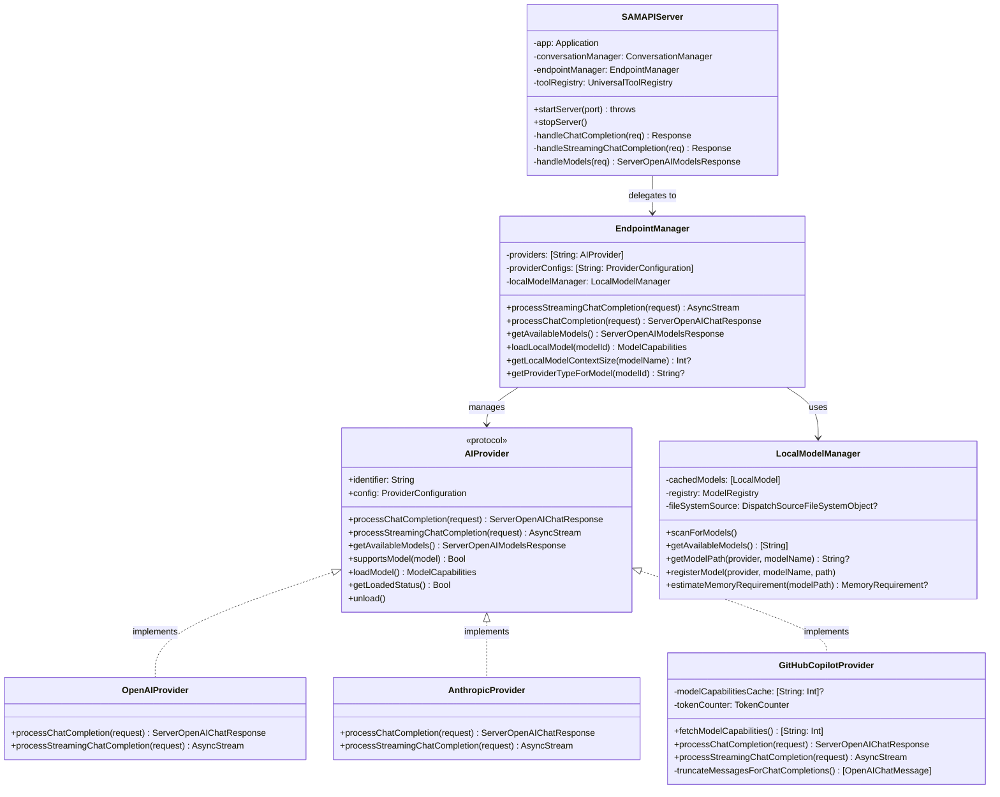
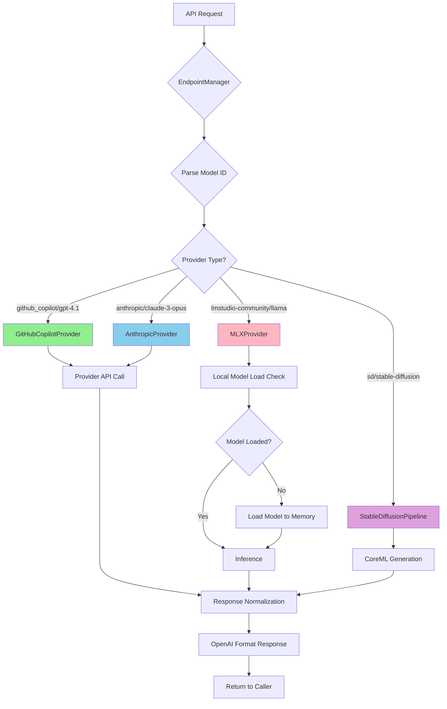
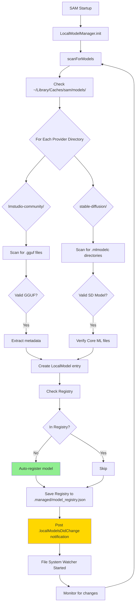
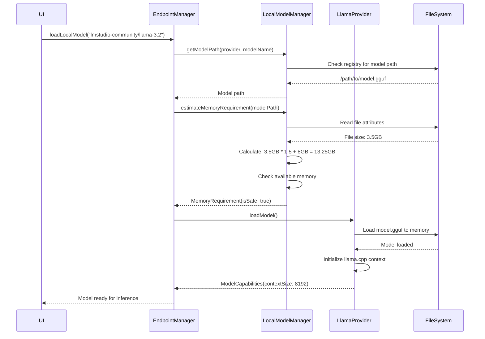

<!-- SPDX-License-Identifier: CC-BY-NC-4.0 -->
<!-- SPDX-FileCopyrightText: Copyright (c) 2025 Andrew Wyatt (Fewtarius) -->


# APIFramework Subsystem

**Version:** 2.4  
**Last Updated:** December 28, 2025

## Table of Contents

- [Overview](#overview)
- [Architecture](#architecture)
- [Key Components](#key-components)
- [Data Flow](#data-flow)
- [Provider System](#provider-system)
- [Model Management](#model-management)
- [Public Interfaces](#public-interfaces)
- [Error Handling](#error-handling)
- [Integration Points](#integration-points)

---

## Overview

The **APIFramework** subsystem is SAM's multi-provider AI integration layer. It provides a unified interface for routing chat requests to different AI providers (OpenAI, Anthropic, GitHub Copilot, DeepSeek, local models) with automatic fallback handling, response normalization, and comprehensive error management.

### Purpose and Responsibilities

1. **Provider Abstraction**: Unified interface across multiple AI providers
2. **Request Routing**: Intelligent routing based on model identifiers
3. **Response Normalization**: Convert all provider responses to OpenAI-compatible format
4. **Model Discovery**: Automatic scanning and registration of local models
5. **Lifecycle Management**: Loading/unloading of local models (GGUF, MLX)
6. **API Server**: OpenAI-compatible HTTP API endpoint
7. **Context Management**: Token-aware message truncation and optimization

### Key Design Principles

- **Provider Neutrality**: Application code doesn't know which provider is used
- **OpenAI Compatibility**: All responses normalized to OpenAI format
- **Hot Reload**: Model changes detected automatically without restart
- **Memory Safety**: Per-conversation database isolation
- **Streaming-First**: Real-time response streaming for better UX

---

## Architecture



---

## Key Components

### EndpointManager

**Location:** `Sources/APIFramework/EndpointManager.swift`

**Purpose:** Central routing hub for all AI provider interactions.

**Key Responsibilities:**
- Provider lifecycle management (initialization, configuration)
- Request routing based on model identifiers
- Model-to-provider mapping
- Local model loading/unloading
- Fallback handling when providers fail

**Public Methods:**

```swift
/// Process streaming chat completion (primary method for real-time responses)
func processStreamingChatCompletion(_ request: OpenAIChatRequest) async throws -> AsyncThrowingStream<ServerOpenAIChatStreamChunk, Error>

/// Process non-streaming chat completion (used for tool execution)
func processChatCompletion(_ request: OpenAIChatRequest) async throws -> ServerOpenAIChatResponse

/// Get all available models from all providers
func getAvailableModels() async throws -> ServerOpenAIModelsResponse

/// Get model capabilities from GitHub Copilot API (context sizes, billing)
func getGitHubCopilotModelCapabilities() async throws -> [String: Int]?

/// Get model capabilities from Gemini API (context sizes)
func getGeminiModelCapabilities() async throws -> [String: Int]?

/// Get billing information for GitHub Copilot model (cached)
func getGitHubCopilotModelBillingInfo(modelId: String) -> (isPremium: Bool, multiplier: Double?)?

/// Get quota information from GitHub Copilot provider
func getGitHubCopilotQuotaInfo() -> GitHubCopilotProvider.QuotaInfo?

/// Load local model into memory (GGUF/MLX only)
func loadLocalModel(modelId: String) async throws -> ModelCapabilities

/// Get context size for local model
func getLocalModelContextSize(modelName: String) -> Int?

/// Get provider type for model identifier
func getProviderTypeForModel(_ modelId: String) -> String?
```

**Model Identifier Format:**
- Remote: `provider/model` (e.g., `github_copilot/gpt-4.1`, `gemini/gemini-2.5-pro`)
- Local: `provider/model` (e.g., `lmstudio-community/Llama-3.2-3B-Instruct-GGUF`)
- Stable Diffusion: `sd/model` (e.g., `sd/coreml-stable-diffusion-v1-5`)

**Notification Events:**

EndpointManager posts NotificationCenter events for model and provider lifecycle:

```swift
extension Notification.Name {
    /// Posted when providers/endpoints are reloaded
    static let endpointManagerDidReloadProviders
    
    /// Posted when local models are scanned
    static let endpointManagerDidUpdateModels
    
    /// Posted when Stable Diffusion model installed
    static let stableDiffusionModelInstalled
    
    /// Posted when ALICE remote models loaded
    static let aliceModelsLoaded
    
    /// Posted when provider hits rate limit (userInfo: retryAfterSeconds, providerName)
    static let providerRateLimitHit
    
    /// Posted when rate limit retry begins
    static let providerRateLimitRetrying
}
```

---

### LocalModelManager

**Location:** `Sources/APIFramework/LocalModelManager.swift`

**Purpose:** Discover, register, and manage locally installed AI models (GGUF, MLX, Stable Diffusion).

**Key Features:**
- **Automatic Discovery**: File system watching for hot reload
- **Registry Persistence**: JSON-based model metadata cache
- **Memory Validation**: Pre-flight checks for model loading safety
- **Stable Diffusion Support**: Core ML model detection

**Directory Structure:**
```
~/Library/Caches/sam/models/
├── lmstudio-community/          # MLX models
│   └── Llama-3.2-3B-Instruct-GGUF/
│       └── model.gguf
├── stable-diffusion/            # Core ML SD models
│   ├── coreml-stable-diffusion-v1-5/
│   │   ├── TextEncoder.mlmodelc
│   │   ├── Unet.mlmodelc
│   │   └── VAEDecoder.mlmodelc
│   └── loras/                   # LoRA files
└── .managed/
    └── model_registry.json      # Model registry
```

**Public Methods:**

```swift
/// Scan models directory and update registry
func scanForModels()

/// Get list of available model names
func getAvailableModels() -> [String]

/// Get model file path
func getModelPath(provider: String, modelName: String) -> String?

/// Register new model in registry
func registerModel(provider: String, modelName: String, path: String, sizeBytes: Int64?, quantization: String?)

/// Estimate memory requirements before loading
func estimateMemoryRequirement(modelPath: String, inferenceLimitGB: Double) -> MemoryRequirement?
```

**Model Registry Entry:**
```swift
struct ModelRegistryEntry: Codable {
    let provider: String
    let modelName: String
    let path: String
    let installedDate: Date
    let sizeBytes: Int64?
    let quantization: String?
    
    var identifier: String { "\(provider)/\(modelName)" }
}
```

---

### AIProvider Protocol

**Location:** `Sources/APIFramework/AIProvider.swift`

**Purpose:** Unified interface for all AI providers (remote and local).

**Protocol Requirements:**

```swift
@MainActor
protocol AIProvider {
    var identifier: String { get }
    var config: ProviderConfiguration { get }
    
    func processChatCompletion(_ request: OpenAIChatRequest) async throws -> ServerOpenAIChatResponse
    func processStreamingChatCompletion(_ request: OpenAIChatRequest) async throws -> AsyncThrowingStream<ServerOpenAIChatStreamChunk, Error>
    func getAvailableModels() async throws -> ServerOpenAIModelsResponse
    func supportsModel(_ model: String) -> Bool
    func validateConfiguration() async throws -> Bool
    
    // Local models only
    func loadModel() async throws -> ModelCapabilities
    func getLoadedStatus() async -> Bool
    func unload() async
}
```

**Implementation Classes:**
- `OpenAIProvider` - OpenAI API integration
- `AnthropicProvider` - Claude API with message format conversion
- `GitHubCopilotProvider` - GitHub Copilot with token-aware truncation and billing
- `GeminiProvider` - Google Gemini API with metadata discovery
- `DeepSeekProvider` - DeepSeek API (OpenAI-compatible)
- `CustomProvider` - Generic OpenAI-compatible providers
- `LlamaProvider` - Local GGUF models via llama.cpp
- `MLXProvider` - Local MLX models for Apple Silicon

---

### SAMAPIServer

**Location:** `Sources/APIFramework/SAMAPIServer.swift`

**Purpose:** OpenAI-compatible HTTP API server for external tool integration.

**Endpoints:**

```
POST /v1/chat/completions          - Standard chat completion
POST /api/chat/completions         - Alternative route
POST /api/chat/autonomous          - Multi-step autonomous workflow
GET  /v1/models                    - List available models
GET  /v1/conversations             - List conversations
GET  /v1/conversations/:id         - Get conversation
POST /api/models/download          - Download model from hub
GET  /api/models/download/:id/status - Download progress
```

**Features:**
- Streaming responses (SSE format)
- Tool execution integration
- Memory-enhanced responses
- Context trimming for token limits
- Proxy mode for external tools (Aider)

**Example Request:**
```json
{
  "model": "github_copilot/gpt-4.1",
  "messages": [
    {"role": "user", "content": "Hello!"}
  ],
  "stream": true,
  "session_id": "550e8400-e29b-41d4-a716-446655440000"
}
```

---

## Data Flow

### Request Routing Flow



### Model Discovery Flow



---

## Response Metadata

### SAM Enhanced Metadata

All API responses include an optional `sam_metadata` field with comprehensive information:

```swift
public struct SAMResponseMetadata: Content {
    let provider: SAMProviderInfo      // Provider details
    let modelInfo: SAMModelInfo        // Model capabilities
    let workflow: SAMWorkflowInfo?     // Workflow execution details
    let costEstimate: SAMCostEstimate? // Cost estimation
    let providerMetadata: [String: String]? // Raw provider data
}
```

### Provider Information

```swift
public struct SAMProviderInfo: Content {
    let type: String       // openai, anthropic, github_copilot, mlx, gguf, custom
    let name: String       // Human-readable name (e.g., "GitHub Copilot")
    let isLocal: Bool      // true for MLX/GGUF, false for remote APIs
    let baseUrl: String?   // Sanitized URL (no API keys)
}
```

### Model Information

```swift
public struct SAMModelInfo: Content {
    let contextWindow: Int       // Max context tokens (e.g., 128000)
    let maxOutputTokens: Int?    // Max output tokens (when known)
    let supportsTools: Bool      // Tool/function calling capability
    let supportsVision: Bool     // Image input support
    let supportsStreaming: Bool  // SSE streaming support
    let family: String?          // Model family (gpt-4, claude-4, llama)
}
```

### Workflow Information

For autonomous requests, includes workflow execution details:

```swift
public struct SAMWorkflowInfo: Content {
    let iterations: Int         // Iterations executed
    let maxIterations: Int      // Maximum allowed (default 300)
    let toolCallCount: Int      // Total tool invocations
    let toolsUsed: [String]     // Unique tools called
    let durationSeconds: Double // Total workflow time
    let completionReason: String // workflow_complete, max_iterations_reached, etc.
    let hadErrors: Bool         // Error status
}
```

### Cost Estimation

When pricing data is available:

```swift
public struct SAMCostEstimate: Content {
    let estimatedCostUsd: Double?    // Calculated cost
    let promptCostPer1k: Double?     // Input token rate
    let completionCostPer1k: Double? // Output token rate
    let currency: String             // "USD"
    let note: String?                // e.g., "Local model - no API cost"
}
```

### Example Response with Metadata

```json
{
  "id": "chatcmpl-123",
  "object": "chat.completion",
  "model": "gpt-4",
  "choices": [...],
  "usage": {"prompt_tokens": 15, "completion_tokens": 28, "total_tokens": 43},
  "sam_metadata": {
    "provider": {
      "type": "openai",
      "name": "OpenAI",
      "is_local": false,
      "base_url": "api.openai.com"
    },
    "model_info": {
      "context_window": 8192,
      "supports_tools": true,
      "family": "gpt-4"
    },
    "cost_estimate": {
      "estimated_cost_usd": 0.0012,
      "prompt_cost_per_1k": 0.03,
      "completion_cost_per_1k": 0.06
    }
  }
}
```

---

## Provider System

### Provider Configuration

**Location:** `Sources/ConfigurationSystem/ProviderConfiguration.swift`

Providers are configured in `~/Library/Application Support/SAM/providers/`:

```json
{
  "providerId": "github_copilot",
  "type": "github_copilot",
  "name": "GitHub Copilot",
  "baseURL": "https://api.githubcopilot.com",
  "apiKey": "ghu_xxxxx",
  "models": ["gpt-4.1", "claude-sonnet-4.5"],
  "isEnabled": true,
  "maxTokens": 4096,
  "temperature": 0.7,
  "timeoutSeconds": 300
}
```

### Response Normalization

All providers return responses in OpenAI-compatible format:

```swift
struct ServerOpenAIChatResponse: Codable {
    let id: String
    let object: String                    // "chat.completion"
    let created: Int                       // Unix timestamp
    let model: String
    let choices: [OpenAIChatChoice]
    let usage: ServerOpenAIUsage
    let statefulMarker: String?            // GitHub Copilot response ID
}

struct OpenAIChatChoice: Codable {
    let index: Int
    let message: OpenAIChatMessage
    let finishReason: String               // "stop", "tool_calls", etc.
}
```

### Provider-Specific Adaptations

#### Anthropic Provider

Converts Anthropic's message format to OpenAI:
- `content` array → `message.content` string
- `stop_reason` → `finish_reason`
- Tool calls: `tool_use` → `tool_calls`

#### GitHub Copilot Provider

**Critical Features:**
- Token-aware message truncation for Claude models
- Session continuity via `previous_response_id`
- Model capabilities caching
- Quota tracking headers

**Token Management:**
```swift
func truncateMessagesForChatCompletions(
    _ messages: [OpenAIChatMessage],
    statefulMarker: String?,
    modelName: String,
    systemPrompt: String,
    tools: [OpenAITool]?
) async -> [OpenAIChatMessage]
```

Uses `TokenCounter` to calculate actual budget:
1. Fetch model's `maxInputTokens` from API
2. Calculate overhead (system prompt + tools)
3. Keep newest messages within budget
4. Insert context trim notice

---

## Model Management

### Local Model Lifecycle



### Memory Validation

Before loading any local model, SAM performs memory safety checks:

```swift
struct MemoryRequirement {
    let modelSizeGB: Double
    let estimatedTotalGB: Double        // model * 1.5 + inference limit
    let isSafe: Bool
    let warningMessage: String?
}
```

**Formula:**
```
Estimated Total = (Model Size × 1.5) + Inference Limit
Available Memory = Free + Inactive + Purgeable pages
Is Safe = Estimated Total ≤ Available Memory
```

**Example:**
- Model: Llama-3.2-3B (3.5GB GGUF)
- Inference Limit: 8GB
- Estimated: 3.5 × 1.5 + 8 = 13.25GB
- Available: 16GB
- Result: ✅ Safe to load

---

## Public Interfaces

### EndpointManagerProtocol

Minimal interface for UI/API access:

```swift
@MainActor
public protocol EndpointManagerProtocol: AnyObject {
    func getEndpointInfo() -> [[String: Any]]
}
```

### Provider Registration

Providers self-register during initialization:

```swift
class EndpointManager {
    private var providers: [String: AIProvider] = [:]
    
    func registerProvider(_ provider: AIProvider) {
        providers[provider.identifier] = provider
    }
}
```

---

## Error Handling

### Provider Errors

```swift
public enum ProviderError: LocalizedError {
    case authenticationFailed(String)
    case invalidConfiguration(String)
    case networkError(String)
    case modelNotSupported(String)
    case responseNormalizationFailed(String)
    case rateLimitExceeded(String)
    case quotaExceeded(String)
    case invalidRequest(String)
}
```

### Error Recovery

1. **Rate Limit Exceeded**: Exponential backoff with retry
2. **Network Errors**: Automatic fallback to alternative provider
3. **Model Not Found**: Suggest similar models
4. **Memory Errors**: Warn user and suggest smaller model

---

## Integration Points

### ConversationEngine Integration

APIFramework provides chat completion services to ConversationEngine:

```swift
// ConversationEngine calls APIFramework
let response = try await endpointManager.processStreamingChatCompletion(request)

for try await chunk in response {
    // Update UI in real-time
    conversation.messageBus?.updateStreamingMessage(id: messageId, content: chunk.content)
}
```

### MCPFramework Integration

Tools can query model capabilities:

```swift
let contextSize = endpointManager.getLocalModelContextSize(modelName)
```

### UI Integration

SwiftUI views observe model changes:

```swift
struct ModelPickerView: View {
    @EnvironmentObject var endpointManager: EndpointManager
    
    var body: some View {
        Picker("Model", selection: $selectedModel) {
            ForEach(endpointManager.availableModels, id: \.self) { model in
                Text(model).tag(model)
            }
        }
        .onReceive(NotificationCenter.default.publisher(for: .localModelsDidChange)) { _ in
            // Refresh picker when models change
        }
    }
}
```

---

## Provider Implementations

### GeminiProvider

**Location:** `Sources/APIFramework/ExtendedProviders.swift`

**Purpose:** Integration with Google Gemini API supporting the full family of Gemini models.

**Key Features:**
- **Metadata Discovery**: Queries `/v1beta/models` endpoint for context sizes and capabilities
- **Rate Limit Handling**: Automatic retry with user notifications on HTTP 429
- **Model Filtering**: Excludes non-chat models (imagen, veo, gemma) from chat interface
- **Message Conversion**: Transforms OpenAI format to Gemini's native format
- **Function Calling**: Supports tool/function calling with capability detection

**Supported Models:**
- `gemini-2.5-flash` - Fast, efficient model with free and paid tiers
- `gemini-2.5-pro` - Advanced reasoning with free and paid tiers
- `gemini-2.0-flash` - Next generation flash model
- `gemini-3-flash-preview` - Preview of Gemini 3 flash variant
- `gemini-3-pro-preview` - Preview of Gemini 3 pro variant
- `gemini-1.5-flash`, `gemini-1.5-pro` - Legacy 1.5 series

**API Integration:**

```swift
class GeminiProvider: AIProvider {
    /// Fetch model capabilities from Gemini API
    /// Returns: [modelId: inputTokenLimit]
    func fetchModelCapabilities() async throws -> [String: Int]
    
    /// Check if model supports function calling (cached)
    private func modelSupportsFunctionCalling(_ modelName: String) async -> Bool
    
    /// Process chat completion with native Gemini format
    func processChatCompletion(_ request: OpenAIChatRequest) async throws -> ServerOpenAIChatResponse
}
```

**Rate Limit Behavior:**

When Gemini API returns HTTP 429:
1. Parse `retryAfterSeconds` from error response
2. Post `.providerRateLimitHit` notification with retry timing
3. Wait for specified duration
4. Post `.providerRateLimitRetrying` notification
5. Retry request automatically

**Message Format Conversion:**

OpenAI format → Gemini format using `GeminiMessageConverter`:
- System messages → `systemInstruction` field
- User/assistant messages → `contents` array
- Tool calls → `functionCall` format
- Function results → `functionResponse` format

**Model Filtering:**

The provider automatically filters out non-chat models:
- Image generation: `imagen-*` models
- Video generation: `veo-*` models  
- Text-only (non-chat): `gemma-*` models

These models are excluded from the chat interface but may be integrated with Stable Diffusion UI in future updates.

**Configuration Example:**

```json
{
  "providerId": "gemini-api",
  "providerType": "gemini",
  "name": "Google Gemini",
  "baseURL": "https://generativelanguage.googleapis.com/v1beta",
  "apiKey": "your-gemini-api-key",
  "isActive": true
}
```

---

## File Locations

### Source Files
```
Sources/APIFramework/
├── EndpointManager.swift              # Central routing hub
├── LocalModelManager.swift            # Model discovery
├── AIProvider.swift                   # Provider protocol
├── Providers.swift                    # Provider implementations
│   ├── OpenAIProvider
│   ├── AnthropicProvider
│   ├── GitHubCopilotProvider
│   ├── GeminiProvider
│   ├── DeepSeekProvider
│   └── CustomProvider
├── SAMAPIServer.swift                 # HTTP API server
└── EndpointManagerProtocol.swift     # Public protocol
```

### Storage Locations
```
~/Library/Caches/sam/models/           # Local models
~/Library/Application Support/SAM/providers/  # Provider configs
```

---

## Additional Resources

- [Provider Configuration Guide](../DEVELOPER_GUIDE.md#provider-configuration)
- [Model Registry Specification](../API_INTEGRATION_SPECIFICATION.md)
- [OpenAI API Compatibility](../API_INTEGRATION_SPECIFICATION.md)
