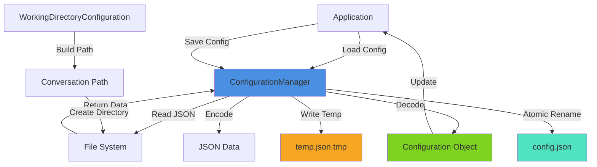

<!-- SPDX-License-Identifier: CC-BY-NC-4.0 -->
<!-- SPDX-FileCopyrightText: Copyright (c) 2025 Andrew Wyatt (Fewtarius) -->


# Configuration System

**Version:** 2.2  
**Last Updated:** December 1, 2025  
**Location:** `Sources/ConfigurationSystem/`

## Overview

The Configuration System provides centralized management of all SAM settings, preferences, and runtime configuration. It replaces UserDefaults with a robust JSON-based configuration system, ensuring atomic writes, proper backups, and organized storage of all application state.

**Key Responsibilities:**
- File-based configuration management (JSON)
- Working directory configuration
- System prompt management
- Application preferences
- Endpoint configuration
- Performance monitoring
- Build-time configuration

**Design Philosophy:**
- JSON-first (no UserDefaults except for simple flags)
- Atomic writes with temp file → rename pattern
- Organized directory structure in Application Support
- Codable-based type safety
- Centralized configuration access

---

## Directory Structure

```
~/Library/Application Support/SAM/
├── conversations/          # Conversation JSON files
│   ├── backups/           # Automatic backups
│   ├── {UUID}/            # Per-conversation directories
│   │   ├── conversation.json
│   │   ├── tasks.json
│   │   └── .vectorrag/
│   └── active-conversation.json  # Current conversation ID
├── system-prompts/        # System prompt templates
├── endpoints/             # API endpoint configurations
├── preferences/           # Application preferences
└── backups/              # Configuration backups
```

---

## Core Components

### ConfigurationManager

**File:** `ConfigurationManager.swift`  
**Type:** Singleton (`@MainActor`)  
**Purpose:** Central hub for all file-based configuration operations

**Key Features:**
- Generic save/load for any Codable type
- Atomic write operations (temp → rename)
- Directory structure management
- File existence checking
- Configuration deletion
- Automatic directory creation

**Public Interface:**

```swift
@MainActor
public class ConfigurationManager: ObservableObject {
    public static let shared = ConfigurationManager()
    
    // Directory URLs
    public let configurationDirectory: URL      // ~/Library/Application Support/SAM/
    public let conversationsDirectory: URL      // .../conversations/
    public let systemPromptsDirectory: URL      // .../system-prompts/
    public let endpointsDirectory: URL          // .../endpoints/
    public let preferencesDirectory: URL        // .../preferences/
    public let backupsDirectory: URL            // .../backups/
    
    // Generic configuration operations
    func save<T: Codable>(_ object: T, to filename: String, in directory: URL) throws
    func load<T: Codable>(_ type: T.Type, from filename: String, in directory: URL) throws -> T
    func exists(_ filename: String, in directory: URL) -> Bool
    func delete(_ filename: String, in directory: URL) throws
    func listFiles(in directory: URL, withExtension ext: String) throws -> [String]
}
```

**Atomic Write Pattern:**

```swift
// 1. Write to temporary file
let tempURL = fileURL.appendingPathExtension("tmp")
try data.write(to: tempURL)

// 2. Atomic rename (replaces existing file)
_ = try FileManager.default.replaceItem(
    at: fileURL,
    withItemAt: tempURL,
    backupItemName: nil,
    options: [],
    resultingItemURL: nil
)
```

**Why Atomic Writes:**
- Prevents corruption if app crashes during write
- Ensures file is always in valid state
- OS-level atomic operation (all or nothing)

---

### WorkingDirectoryConfiguration

**File:** `WorkingDirectoryConfiguration.swift`  
**Type:** Singleton (`ObservableObject`)  
**Purpose:** Manage conversation working directory paths

**Key Features:**
- Configurable base path (default: `~/SAM`)
- Per-conversation subdirectories
- Path normalization and validation
- Automatic directory creation
- Persistent storage via UserDefaults

**Public Interface:**

```swift
public class WorkingDirectoryConfiguration: ObservableObject {
    public static let shared = WorkingDirectoryConfiguration()
    
    @Published public private(set) var basePath: String  // e.g., "~/SAM"
    
    public var expandedBasePath: String  // Expands ~ to full path
    
    func updateBasePath(_ newPath: String)
    func resetToDefault()
    func buildPath(subdirectory: String) -> String
}
```

**Usage Example:**

```swift
let config = WorkingDirectoryConfiguration.shared
let workDir = config.buildPath(subdirectory: "My Conversation")
// Result: "/Users/andrew/SAM/My Conversation/"
```

**Path Building Logic:**
1. Replace `/` in subdirectory name with `-` (safety)
2. Append to base path
3. Expand `~` to full user path
4. Ensure trailing slash

---

### EndpointConfigurationManager

**File:** `EndpointConfigurationManager.swift`  
**Type:** Singleton (`@MainActor`)  
**Purpose:** Manage API endpoint configurations

**Key Responsibilities:**
- Load/save endpoint configurations
- Validate endpoint settings
- Provide default configurations
- Handle multiple providers (OpenAI, Anthropic, GitHub, etc.)

**Configuration Structure:**

```swift
public struct EndpointConfiguration: Codable, Identifiable {
    public let id: UUID
    public var name: String
    public var provider: String           // "openai", "anthropic", "github_copilot"
    public var baseURL: String?
    public var apiKey: String?
    public var defaultModel: String?
    public var isActive: Bool
    public var customHeaders: [String: String]?
}
```

**Public Interface:**

```swift
@MainActor
public class EndpointConfigurationManager: ObservableObject {
    public static let shared = EndpointConfigurationManager()
    
    @Published public var endpoints: [EndpointConfiguration] = []
    @Published public var activeEndpoint: EndpointConfiguration?
    
    func loadEndpoints() async throws
    func saveEndpoints() async throws
    func addEndpoint(_ endpoint: EndpointConfiguration) async throws
    func updateEndpoint(_ endpoint: EndpointConfiguration) async throws
    func deleteEndpoint(id: UUID) async throws
    func setActiveEndpoint(_ endpoint: EndpointConfiguration) async throws
}
```

---

### SystemPromptConfiguration

**File:** `SystemPromptConfiguration.swift`  
**Purpose:** Define system prompt structure and build SAM's comprehensive system prompt

**Prompt Structure:**

```swift
public struct SystemPromptConfiguration: Codable, Identifiable {
    public let id: UUID
    public var name: String
    public var content: String
    public var priority: Int              // Determines load order
    public var isActive: Bool
    public var category: String?          // e.g., "personality", "tools", "safety"
    public var variables: [String: String]?  // Template variables
}
```

**Manager Implementations:**

Two implementations exist:
1. **SimpleSystemPromptManager** - Basic string-based prompts
2. **EnhancedSystemPromptManager** - Component-based system with priority

**Key System Prompt Sections (December 2025 Updates):**

**Multi-Step Task Guidance:**
The system prompt includes todo workflow instructions:
- "MUST use the todo_operations tool to plan and track progress"
- "ALWAYS mark exactly ONE todo 'in-progress' before starting work"
- "ALWAYS mark a todo 'completed' immediately after finishing"
- "Update todos frequently - the user sees your progress through the todo list"

**Workflow Continuation Protocol:**
The `buildWorkflowContinuationProtocol()` function provides mandatory status signal guidance:
- Status signals are MANDATORY for any multi-step task (with OR without todo list)
- Format: `{"status": "continue"}` for ongoing, `{"status": "complete"}` for done
- Prevents agents from ending without explicit continuation or completion

**XML Tag Structure (for Claude/Anthropic models):**
When `usesXMLTags` is true, the system prompt uses proper layering:
- `<instructions>` - Main system prompt
- `<context>` - Todo state and user query
- Model-specific adjustments for optimal behavior

---

### ApplicationPreferencesManager

**File:** `ApplicationPreferencesManager.swift`  
**Type:** Singleton (`@MainActor`)  
**Purpose:** Manage application-wide preferences

**Preferences Structure:**

```swift
public struct ApplicationPreferences: Codable {
    // UI Preferences
    public var theme: Theme
    public var fontSize: Double
    public var showLineNumbers: Bool
    
    // Voice Preferences
    public var voiceEnabled: Bool
    public var voiceLanguage: String
    
    // Model Preferences
    public var defaultModel: String?
    public var temperatureDefault: Double
    
    // Performance
    public var enablePerformanceMonitoring: Bool
    public var maxMemoryUsage: Int64
}
```

---

### PerformanceMonitor

**File:** `PerformanceMonitor.swift`  
**Purpose:** Runtime performance tracking and reporting

**Monitored Metrics:**
- CPU usage (user + system time)
- Memory usage (resident size)
- GPU utilization (via Metal)
- Model load times
- Inference latency
- Token generation rate

**Public Interface:**

```swift
@MainActor
public class PerformanceMonitor: ObservableObject {
    @Published public var cpuUsage: Double = 0.0
    @Published public var memoryUsage: Int64 = 0
    @Published public var gpuUtilization: Double = 0.0
    
    func startMonitoring()
    func stopMonitoring()
    func recordModelLoad(modelId: String, duration: TimeInterval)
    func recordInference(duration: TimeInterval, tokens: Int)
}
```

---

### BuildConfiguration

**File:** `BuildConfiguration.swift`  
**Purpose:** Compile-time configuration flags

**Configuration Flags:**

```swift
public enum BuildConfiguration {
    public static var isDebug: Bool {
        #if DEBUG
        return true
        #else
        return false
        #endif
    }
    
    public static var isRelease: Bool {
        !isDebug
    }
    
    public static var bundledPythonPath: String {
        // Path to bundled Python environment
    }
    
    public static var mlStableDiffusionPath: String {
        // Path to ml-stable-diffusion tools
    }
}
```

---

### Other Components

#### AIInstructionsScanner
**Purpose:** Scan for `.github/copilot-instructions.md` and similar AI context files

#### LocationManager
**Purpose:** Manage geographic location data (if needed for location-aware features)

#### PersonalityManager & PersonalityTrait
**Purpose:** Manage AI personality configurations and behavioral traits

#### PromptComponentLibrary
**Purpose:** Reusable prompt components for system prompt composition

#### ToolResultStorage
**Purpose:** Store and retrieve tool execution results

#### TodoReminderInjector
**Purpose:** Inject todo list context into conversation messages

**File:** `TodoReminderInjector.swift`

Provides todo list state injection for multi-step workflows, ensuring agents maintain awareness of task progress.

**Key Features:**
- **Injects on EVERY request** when todos exist (not periodically)
- **Progress rules included** to remind agent to update todos
- **Conversation-scoped** via effectiveScopeId
- **Stateless design** for thread safety

**Injection Trigger:**
```swift
// Returns true when todos exist for this conversation
func shouldInjectReminder(
    conversationId: UUID?,
    effectiveScopeId: UUID?,
    responseCount: Int
) async -> Bool {
    let todos = TodoManager.shared.getTodos(scopeId: effectiveScopeId ?? conversationId)
    return !todos.isEmpty
}
```

**Reminder Format:**
```
<todo_context>
## Current Todo List State
[Status counts: X completed, Y in-progress, Z not-started]

[Formatted todo items with status and descriptions]

## Progress Rules (CRITICAL)
- Before beginning ANY todo: mark it in-progress FIRST
- After completing ANY todo: mark it completed IMMEDIATELY
- Update todos FREQUENTLY - user sees progress through the list
- ONE todo can be in-progress at a time
</todo_context>
```

**Usage in System Prompt:**
The reminder is injected as context immediately before the user's message for maximum salience.

---

## Configuration Patterns

### Loading Configuration

```swift
let config = try ConfigurationManager.shared.load(
    MyConfiguration.self,
    from: "my-config.json",
    in: ConfigurationManager.shared.preferencesDirectory
)
```

### Saving Configuration

```swift
try ConfigurationManager.shared.save(
    myConfig,
    to: "my-config.json",
    in: ConfigurationManager.shared.preferencesDirectory
)
```

### Checking Existence

```swift
if ConfigurationManager.shared.exists(
    "my-config.json",
    in: ConfigurationManager.shared.preferencesDirectory
) {
    // Load existing config
} else {
    // Create default config
}
```

---

## Error Handling

```swift
public enum ConfigurationError: LocalizedError {
    case saveFailure(String)
    case loadFailure(String)
    case fileNotFound(String)
    case deleteFailure(String)
    case invalidConfiguration(String)
    
    public var errorDescription: String? {
        switch self {
        case .saveFailure(let message):
            return "Failed to save configuration: \(message)"
        case .loadFailure(let message):
            return "Failed to load configuration: \(message)"
        case .fileNotFound(let path):
            return "Configuration file not found: \(path)"
        case .deleteFailure(let message):
            return "Failed to delete configuration: \(message)"
        case .invalidConfiguration(let message):
            return "Invalid configuration: \(message)"
        }
    }
}
```

---

## Data Flow



---

## Integration with Other Subsystems

### ConversationEngine
- Loads/saves conversation JSON files via ConfigurationManager
- Uses WorkingDirectoryConfiguration for conversation directories
- Stores conversation backups in `backups/` directory

### APIFramework
- Uses EndpointConfigurationManager for provider settings
- Stores API keys and endpoint configurations
- Validates configurations before API calls

### MCPFramework
- Stores tool configurations
- Manages MCP server connection settings
- Persists tool execution results via ToolResultStorage

### StableDiffusion
- Uses ApplicationPreferencesManager for default settings
- Stores SD model preferences
- Configures generation parameters

---

## Best Practices

### 1. Always Use ConfigurationManager
```swift
// ❌ WRONG: Direct UserDefaults
UserDefaults.standard.set(value, forKey: "my-setting")

// ✅ RIGHT: ConfigurationManager with Codable type
try ConfigurationManager.shared.save(
    settings,
    to: "settings.json",
    in: ConfigurationManager.shared.preferencesDirectory
)
```

### 2. Define Codable Structs
```swift
// Define type-safe configuration
struct MySettings: Codable {
    var option1: String
    var option2: Int
}
```

### 3. Handle Errors Gracefully
```swift
do {
    let config = try ConfigurationManager.shared.load(...)
} catch ConfigurationError.fileNotFound {
    // Use defaults
    let config = MySettings.default
} catch {
    logger.error("Failed to load config: \(error)")
}
```

### 4. Validate After Loading
```swift
let config = try ConfigurationManager.shared.load(...)
guard config.isValid() else {
    throw ConfigurationError.invalidConfiguration("Missing required fields")
}
```

---

## File Locations

### Application Support
```
~/Library/Application Support/SAM/
├── conversations/          # Managed by ConversationManager
├── system-prompts/        # System prompt templates
├── endpoints/             # API endpoint configs
├── preferences/           # App preferences
└── backups/              # Automatic backups
```

### User Defaults (Minimal Use)
Only for simple boolean flags:
- `voiceListeningMode`
- `voiceSpeakingMode`
- `workingDirectory.basePath`

**Everything else uses JSON files via ConfigurationManager**

---

## Recent Changes

### December 2, 2025
- **TodoReminderInjector:** Updated to inject todo context on EVERY request (not periodically)
- **SystemPromptConfiguration:** Rewrote multi-step workflow guidance for clarity and consistency
- **buildWorkflowContinuationProtocol():** Added mandatory status signals for ANY multi-step task
- Added comprehensive TodoReminderInjector documentation

### December 1, 2025
- Created comprehensive configuration system documentation
- Documented atomic write patterns
- Explained directory structure and organization

---

## Future Enhancements

### Planned
- Configuration versioning and migration
- Configuration validation schemas
- Import/export of configurations
- Configuration profiles (dev, prod, test)
- Encrypted configuration storage for sensitive data

### Under Consideration
- Remote configuration sync
- Configuration templates
- Configuration change notifications
- Configuration history/versioning

---

## See Also

- [API Framework](API_FRAMEWORK.md) - Uses endpoint configurations
- [Conversation Engine](CONVERSATION_ENGINE.md) - Uses conversation storage
- [Shared Topics](SHARED_DATA.md) - Shared topic models
- [Working Directory Flow](../flows/working_directory_setup.md)
