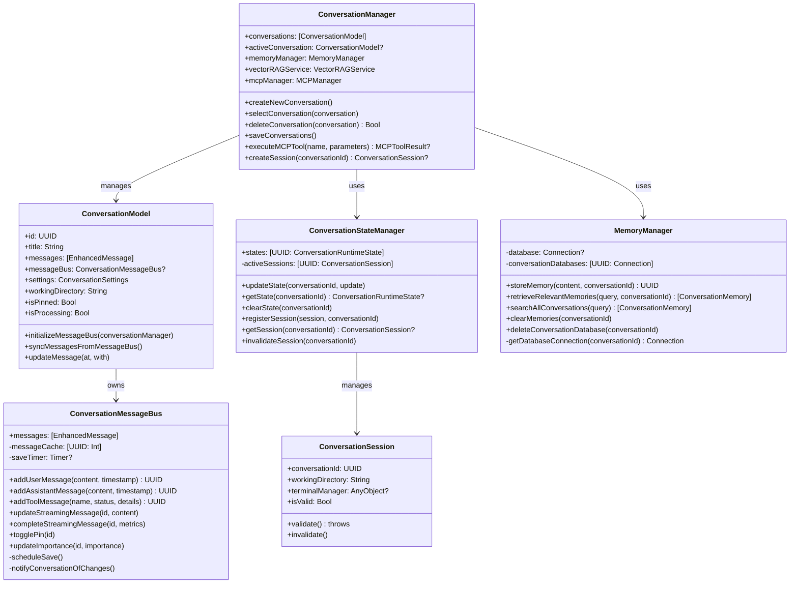
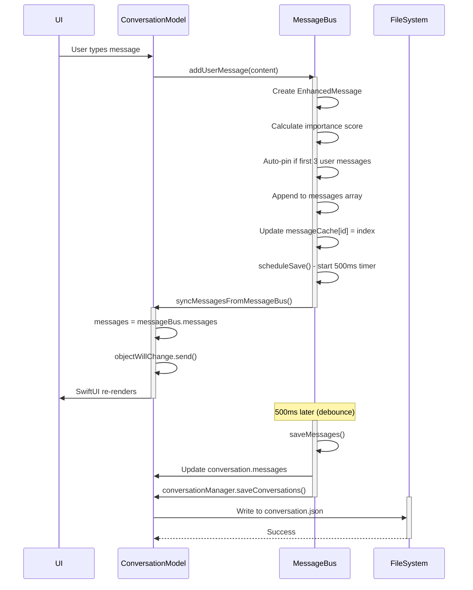
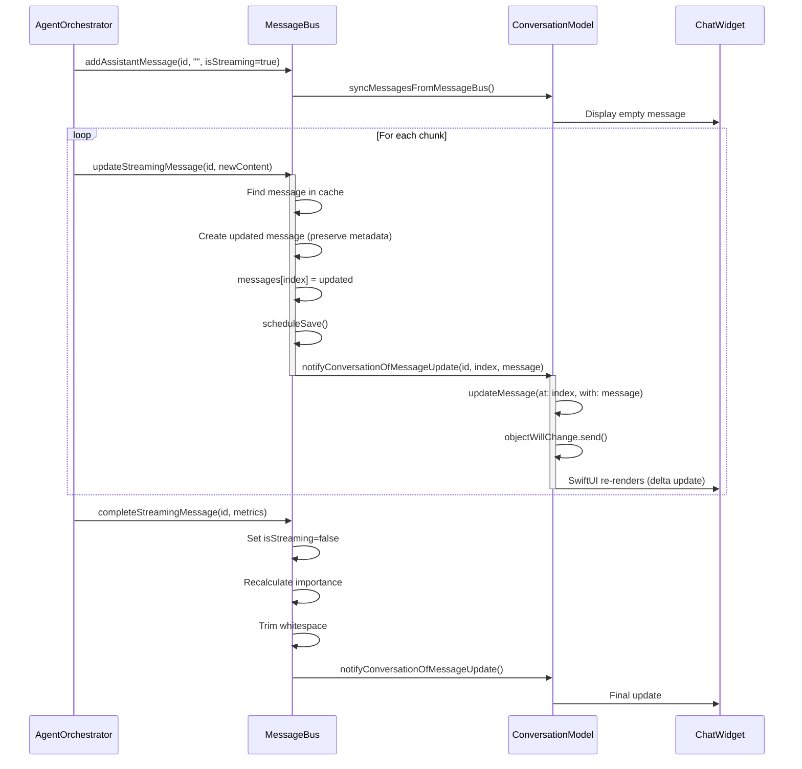
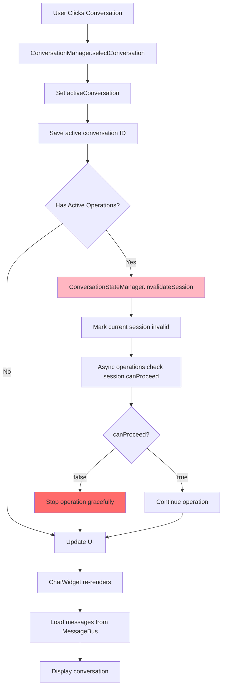
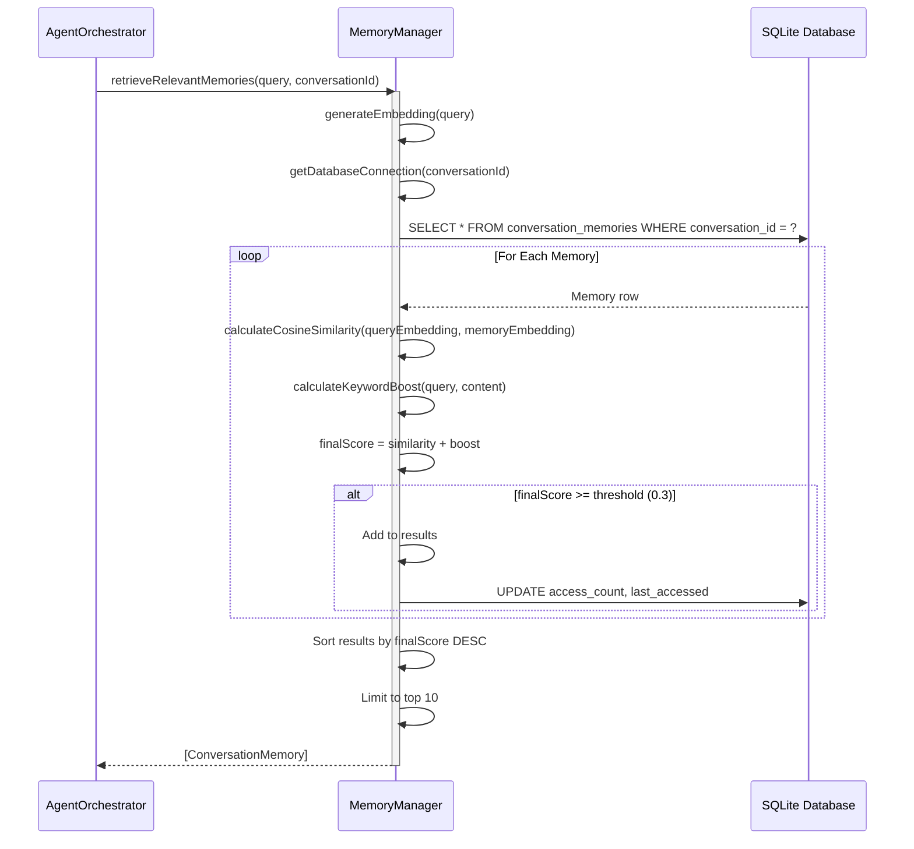

<!-- SPDX-License-Identifier: CC-BY-NC-4.0 -->
<!-- SPDX-FileCopyrightText: Copyright (c) 2025 Andrew Wyatt (Fewtarius) -->


# ConversationEngine Subsystem

**Version:** 2.3  
**Last Updated:** December 5, 2025

## Table of Contents

- [Overview](#overview)
- [Architecture](#architecture)
- [Key Components](#key-components)
- [Message Flow](#message-flow)
- [State Management](#state-management)
- [Memory System](#memory-system)
- [Public Interfaces](#public-interfaces)
- [Error Handling](#error-handling)
- [Integration Points](#integration-points)

---

## Overview

The **ConversationEngine** subsystem is SAM's conversation management and persistence layer. It handles conversation lifecycle, message routing, state management, and long-term memory integration using a message bus architecture for real-time updates.

### Purpose and Responsibilities

1. **Conversation Lifecycle**: Create, load, save, delete conversations
2. **Message Routing**: Single source of truth via MessageBus pattern
3. **State Management**: Runtime state tracking (processing, tool execution)
4. **Persistence**: Debounced writes to prevent excessive disk I/O
5. **Memory Integration**: Per-conversation memory databases
6. **Session Management**: Safe async operations with session validation
7. **Working Directory**: Per-conversation file system sandboxing

### Key Design Principles

- **Message Bus Pattern**: Single source of truth for messages
- **Debounced Persistence**: Batch writes every 500ms during streaming
- **Delta Sync**: Update individual messages without copying arrays
- **Memory Isolation**: Per-conversation databases prevent data leakage
- **Session Safety**: Prevent data corruption during conversation switches

---

## Architecture



---

## Key Components

### ConversationManager

**Location:** `Sources/ConversationEngine/ConversationManager.swift`

**Purpose:** Central coordinator for conversation lifecycle and integration with memory/MCP systems.

**Key Responsibilities:**
- Create, load, save, delete conversations
- Manage active conversation selection
- Coordinate memory system initialization
- Integrate MCP tools for agent capabilities
- Handle working directory management
- Debounced persistence to reduce disk I/O

**Public Methods:**

```swift
/// Create new conversation with sequential numbering
func createNewConversation()

/// Select conversation as active
func selectConversation(_ conversation: ConversationModel)

/// Delete conversation and optionally its working directory
func deleteConversation(_ conversation: ConversationModel, deleteWorkingDirectory: Bool = true) -> (workingDirectoryPath: String, isEmpty: Bool, deleted: Bool)

/// Rename conversation and update working directory
func renameConversation(_ conversation: ConversationModel, to newName: String)

/// Save conversations with debouncing (500ms delay)
func saveConversations()

/// Save immediately (bypasses debouncing) - for app termination
func saveConversationsImmediately()

/// Create session for safe async operations
func createSession(for conversationId: UUID) -> ConversationSession?

/// Execute MCP tool
func executeMCPTool(name: String, parameters: [String: Any], isExternalAPICall: Bool, isUserInitiated: Bool) async -> MCPToolResult?
```

**Integration Subsystems:**

- **MemoryManager**: Per-conversation SQLite databases
- **VectorRAGService**: Document import and semantic search
- **YaRNContextProcessor**: Context window management
- **MCPManager**: Tool registry and execution
- **ContextArchiveManager**: Long-term memory storage

---

### ConversationModel

**Location:** `Sources/ConversationEngine/ConversationModel.swift`

**Purpose:** Runtime conversation state with MessageBus integration.

**Key Properties:**

```swift
/// Unique identifier
let id: UUID

/// Conversation title (user-editable)
@Published var title: String

/// Messages array (synced from MessageBus)
@Published var messages: [EnhancedMessage]

/// MessageBus instance (single source of truth)
var messageBus: ConversationMessageBus?

/// Conversation settings
@Published var settings: ConversationSettings

/// Working directory for file operations
var workingDirectory: String

/// Pin status (prevents auto-deletion)
@Published var isPinned: Bool

/// Processing state
@Published var isProcessing: Bool
```

**MessageBus Integration:**

```swift
/// Initialize MessageBus (call after creation)
func initializeMessageBus(conversationManager: ConversationManager)

/// Sync messages from MessageBus (called by MessageBus on changes)
func syncMessagesFromMessageBus()

/// Delta sync - update single message (performance optimization)
func updateMessage(at index: Int, with message: EnhancedMessage)
```

**Conversation Settings:**

```swift
struct ConversationSettings {
    var selectedModel: String
    var temperature: Double
    var topP: Double
    var maxTokens: Int?
    var contextWindowSize: Int
    var selectedSystemPromptId: UUID?
    var enableReasoning: Bool
    var enableTools: Bool
    var autoApprove: Bool
    var enableTerminalAccess: Bool
    var scrollLockEnabled: Bool
    
    // Shared data settings
    var useSharedData: Bool
    var sharedTopicId: UUID?
    var sharedTopicName: String?
    
    // Stable Diffusion parameters
    var sdNegativePrompt: String
    var sdSteps: Int
    var sdGuidanceScale: Int
    var sdScheduler: String
    // ... etc
}
```

---

### ConversationMessageBus

**Location:** `Sources/ConversationEngine/ConversationMessageBus.swift`

**Purpose:** Single source of truth for conversation messages with debounced persistence.

**Key Features:**
- Fast lookup cache (UUID → index)
- Debounced saves (500ms delay during streaming)
- Delta sync (update individual messages)
- Automatic importance scoring
- Auto-pin first 3 user messages

**Public API:**

```swift
/// Add user message
func addUserMessage(content: String, timestamp: Date = Date(), isPinned: Bool? = nil) -> UUID

/// Add assistant message
func addAssistantMessage(content: String, contentParts: [MessageContentPart]? = nil, timestamp: Date = Date(), isStreaming: Bool = false, isPinned: Bool = false) -> UUID

/// Add tool message
func addToolMessage(name: String, status: ToolStatus, details: String? = nil, detailsArray: [String]? = nil, ...) -> UUID

/// Update streaming message (real-time)
func updateStreamingMessage(id: UUID, content: String)

/// Complete streaming message
func completeStreamingMessage(id: UUID, performanceMetrics: MessagePerformanceMetrics? = nil, processingTime: TimeInterval? = nil)

/// Update message (for tool completion)
func updateMessage(id: UUID, content: String? = nil, contentParts: [MessageContentPart]? = nil, status: ToolStatus? = nil, duration: TimeInterval? = nil)

/// Remove message
func removeMessage(id: UUID)

/// Toggle pin status
func togglePin(id: UUID)

/// Update importance score
func updateImportance(id: UUID, importance: Double)
```

**Message Retrieval:**

```swift
/// Get messages for API (filtered)
func getMessagesForAPI(limit: Int? = nil) -> [ChatMessage]

/// Get all messages for agent context
func getMessagesForAgent() -> [EnhancedMessage]

/// Get tool messages only
func getToolMessages() -> [EnhancedMessage]

/// Get specific message
func getMessage(id: UUID) -> EnhancedMessage?
```

**Importance Scoring Algorithm:**

```swift
private func calculateMessageImportance(text: String, isUser: Bool) -> Double {
    // Base: user=0.7, assistant=0.5
    var importance = isUser ? 0.7 : 0.5
    
    // Questions from assistant: 0.85
    if !isUser && (contains "?" || contains "what"/"which"/"how") {
        importance = max(importance, 0.85)
    }
    
    // Constraints/requirements: 0.9
    if contains "must"/"require"/"budget"/"limit" {
        importance = max(importance, 0.9)
    }
    
    // Decisions/confirmations: 0.85
    if contains "yes"/"proceed"/"approved" && text.count < 200 {
        importance = max(importance, 0.85)
    }
    
    // Small talk: 0.3
    if text.count < 50 && is trivial phrase {
        importance = 0.3
    }
    
    // Long user messages: +0.1 boost
    if isUser && text.count > 300 {
        importance = min(importance + 0.1, 1.0)
    }
    
    return importance
}
```

---

### ConversationSession

**Location:** `Sources/ConversationEngine/ConversationSession.swift`

**Purpose:** Snapshot of conversation context for safe async operations.

**Problem Solved:**  
When user switches conversations during async operations (tool execution, model inference), operations could write to wrong conversation. Sessions prevent this data leakage.

**Usage Pattern:**

```swift
// Create session at operation start
guard let session = conversationManager.createSession(for: conversationId) else {
    throw SessionError.conversationNotFound
}

// Validate session before each operation
try session.validate()  // Throws if conversation switched/deleted

// Access snapshotted context
let workingDir = session.workingDirectory
let terminal = session.terminalManager

// Session auto-invalidates when conversation deleted
```

**Properties:**

```swift
let conversationId: UUID
let workingDirectory: String
let terminalManager: AnyObject?
let createdAt: Date
private(set) var isValid: Bool

func validate() throws           // Throws SessionError.invalidated
func invalidate()                // Mark session invalid
var canProceed: Bool             // Check validity without throwing
var ageInSeconds: TimeInterval   // Session age
```

---

### ConversationStateManager

**Location:** `Sources/ConversationEngine/ConversationStateManager.swift`

**Purpose:** Track runtime state that should NOT persist to disk.

**State Types:**

```swift
struct ConversationRuntimeState {
    var status: RuntimeStatus               // idle, processing, streaming, error
    var activeTools: Set<String>           // Currently executing tools
    var modelLoaded: Bool                  // Local model status
    var terminalSessionId: String?         // Active PTY session
    var activeSessionId: UUID?             // Session validation
}

enum RuntimeStatus {
    case idle
    case processing(toolName: String?)
    case streaming
    case error(String)
}
```

**Public Methods:**

```swift
/// Update state with closure
func updateState(conversationId: UUID, _ update: (inout ConversationRuntimeState) -> Void)

/// Get current state
func getState(conversationId: UUID) -> ConversationRuntimeState?

/// Clear state (on deletion)
func clearState(conversationId: UUID)

/// Session management
func registerSession(_ session: ConversationSession, for conversationId: UUID)
func getSession(for conversationId: UUID) -> ConversationSession?
func invalidateSession(for conversationId: UUID)
```

---

### MemoryManager

**Location:** `Sources/ConversationEngine/MemoryManager.swift`

**Purpose:** Per-conversation memory storage using SQLite with semantic search.

**Key Features:**
- **Memory Isolation**: Each conversation has its own database
- **Semantic Search**: Cosine similarity + keyword boost
- **Importance Scoring**: Prioritize relevant memories
- **Access Tracking**: Statistics for memory management

**Database Location:**
```
~/Library/Application Support/SAM/conversations/
├── {conversationId}/
│   └── memory.db                  # SQLite database
```

**Schema:**

```sql
CREATE TABLE conversation_memories (
    id TEXT PRIMARY KEY,               -- UUID
    conversation_id TEXT NOT NULL,     -- Conversation UUID
    content TEXT NOT NULL,             -- Memory content
    content_type TEXT NOT NULL,        -- user_input, assistant_response, etc.
    embedding BLOB,                    -- Vector embedding (256-dim)
    importance REAL NOT NULL,          -- 0.0-1.0 importance score
    created_at INTEGER NOT NULL,       -- Unix timestamp
    access_count INTEGER DEFAULT 0,    -- Access frequency
    last_accessed INTEGER NOT NULL,    -- Last access time
    tags TEXT                          -- Comma-separated tags
);
```

**Public Methods:**

```swift
/// Store memory for conversation
func storeMemory(content: String, conversationId: UUID, contentType: MemoryContentType = .message, importance: Double = 0.5, tags: [String] = []) async throws -> UUID

/// Retrieve relevant memories (semantic search)
func retrieveRelevantMemories(for query: String, conversationId: UUID, limit: Int = 10, similarityThreshold: Double = 0.3) async throws -> [ConversationMemory]

/// Search across all conversations
func searchAllConversations(query: String, limit: Int = 10, similarityThreshold: Double = 0.3) async throws -> [ConversationMemory]

/// Get all memories for conversation
func getAllMemories(for conversationId: UUID) async throws -> [ConversationMemory]

/// Clear memories for conversation
func clearMemories(for conversationId: UUID) async throws

/// Delete conversation's database file
func deleteConversationDatabase(conversationId: UUID) throws

/// Get memory statistics
func getMemoryStatistics(for conversationId: UUID) async throws -> MemoryStatistics
```

**Similarity Algorithm:**

```
1. Generate embeddings (Apple NLEmbedding or hash-based fallback)
2. Calculate cosine similarity: dot(v1, v2) / (||v1|| * ||v2||)
3. Calculate keyword boost: Jaccard similarity * 0.5
4. Final score = cosine similarity + keyword boost
5. Filter by threshold (default: 0.3)
6. Sort by score descending
7. Return top N results
```

---

## Message Flow

### Message Creation and Persistence Flow



### Streaming Message Update Flow



---

## State Management

### Runtime State vs Persisted State

**Persisted State** (saved to disk):
- Conversation metadata (id, title, created, updated)
- Messages array
- Conversation settings
- Working directory path
- Pin status
- Shared topic configuration

**Runtime State** (NOT persisted):
- isProcessing flag
- activeTools set
- modelLoaded status
- terminalSessionId
- activeSessionId
- Streaming state

### Conversation Switching Flow



---

## Memory System

### Memory Isolation Architecture

Each conversation has its own SQLite database to prevent data leakage:

```
~/Library/Application Support/SAM/conversations/
├── {conversation-1-uuid}/
│   └── memory.db
├── {conversation-2-uuid}/
│   └── memory.db
└── {conversation-3-uuid}/
    └── memory.db
```

**Benefits:**
- Data isolation: Conversation A cannot access conversation B's memories
- Clean deletion: Delete conversation → delete its database
- Scalability: No global database lock contention
- Privacy: Sensitive data stays compartmentalized

### Memory Retrieval Flow



---

## Public Interfaces

### ConversationManager Public API

```swift
@MainActor
public class ConversationManager: ObservableObject {
    // Published state
    @Published public var conversations: [ConversationModel]
    @Published public var activeConversation: ConversationModel?
    @Published public var isReady: Bool
    @Published public var memoryInitialized: Bool
    @Published public var mcpInitialized: Bool
    
    // Subsystems
    public let memoryManager: MemoryManager
    public let vectorRAGService: VectorRAGService
    public let yarnContextProcessor: YaRNContextProcessor
    public let mcpManager: MCPManager
    public let stateManager: ConversationStateManager
    
    // Lifecycle
    public func createNewConversation()
    public func selectConversation(_ conversation: ConversationModel)
    public func deleteConversation(_ conversation: ConversationModel, deleteWorkingDirectory: Bool = true)
    public func renameConversation(_ conversation: ConversationModel, to newName: String)
    public func duplicateConversation(_ conversation: ConversationModel) -> ConversationModel
    
    // Persistence
    public func saveConversations()
    public func saveConversationsImmediately()
    public func cleanup()  // Called on app termination
    
    // Session management
    public func createSession(for conversationId: UUID) -> ConversationSession?
    public func getSession(for conversationId: UUID) -> ConversationSession?
    public func invalidateSession(for conversationId: UUID)
}
```

### ConversationMessageBus Public API

```swift
@MainActor
public class ConversationMessageBus: ObservableObject {
    @Published public private(set) var messages: [EnhancedMessage]
    
    // Message creation
    public func addUserMessage(content: String, timestamp: Date = Date(), isPinned: Bool? = nil) -> UUID
    public func addAssistantMessage(content: String, contentParts: [MessageContentPart]? = nil, timestamp: Date = Date(), isStreaming: Bool = false, isPinned: Bool = false) -> UUID
    public func addToolMessage(name: String, status: ToolStatus, details: String? = nil, ...) -> UUID
    
    // Message updates
    public func updateStreamingMessage(id: UUID, content: String)
    public func completeStreamingMessage(id: UUID, performanceMetrics: MessagePerformanceMetrics? = nil, processingTime: TimeInterval? = nil)
    public func updateMessage(id: UUID, content: String? = nil, contentParts: [MessageContentPart]? = nil, status: ToolStatus? = nil, duration: TimeInterval? = nil)
    
    // Message management
    public func removeMessage(id: UUID)
    public func togglePin(id: UUID)
    public func updateImportance(id: UUID, importance: Double)
    
    // Message retrieval
    public func getMessagesForAPI(limit: Int? = nil) -> [ChatMessage]
    public func getMessagesForAgent() -> [EnhancedMessage]
    public func getMessage(id: UUID) -> EnhancedMessage?
}
```

---

## Error Handling

### Conversation Errors

```swift
public enum ConversationError: LocalizedError {
    case conversationNotFound(UUID)
    case invalidWorkingDirectory(String)
    case persistenceFailed(String)
    case sessionInvalid
    
    public var errorDescription: String? {
        switch self {
        case .conversationNotFound(let id):
            return "Conversation \(id) not found"
        case .invalidWorkingDirectory(let path):
            return "Invalid working directory: \(path)"
        case .persistenceFailed(let reason):
            return "Failed to save conversation: \(reason)"
        case .sessionInvalid:
            return "Session invalidated (conversation switched or deleted)"
        }
    }
}
```

### Session Errors

```swift
public enum SessionError: Error, LocalizedError {
    case invalidated
    case conversationDeleted
    case conversationNotFound
    
    public var errorDescription: String? {
        switch self {
        case .invalidated:
            return "Session has been invalidated (conversation switched or deleted)"
        case .conversationDeleted:
            return "Conversation was deleted during operation"
        case .conversationNotFound:
            return "Conversation not found"
        }
    }
}
```

### Memory Errors

```swift
public enum MemoryError: Error, LocalizedError {
    case databaseNotInitialized
    case initializationFailed(String)
    case storageFailed(String)
    case retrievalFailed(String)
    case operationFailed(String)
}
```

---

## Integration Points

### APIFramework Integration

ConversationEngine provides conversation context to APIFramework:

```swift
// API server creates/finds conversation
let conversation = conversationManager.activeConversation

// API server adds messages via MessageBus
conversation.messageBus?.addUserMessage(content: userInput)

// API server updates streaming responses
conversation.messageBus?.updateStreamingMessage(id: messageId, content: chunk)
```

### MCPFramework Integration

ConversationEngine owns MCPManager and provides execution context:

```swift
// Execute MCP tool
let result = await conversationManager.executeMCPTool(
    name: "file_read",
    parameters: ["path": "/path/to/file"],
    isExternalAPICall: true,
    isUserInitiated: false
)

// Access conversation's working directory
let workingDir = conversationManager.getEffectiveWorkingDirectory(for: conversation)
```

### UI Integration

SwiftUI views observe conversation state:

```swift
struct ChatWidget: View {
    @ObservedObject var conversation: ConversationModel
    @EnvironmentObject var conversationManager: ConversationManager
    
    var body: some View {
        ScrollView {
            ForEach(conversation.messageBus?.messages ?? []) { message in
                MessageView(message: message)
            }
        }
        .onAppear {
            conversation.initializeMessageBus(conversationManager: conversationManager)
        }
    }
}
```

---

## File Locations

### Source Files
```
Sources/ConversationEngine/
├── ConversationManager.swift          # Central coordinator
├── ConversationModel.swift            # Runtime model
├── ConversationMessageBus.swift       # Message management
├── ConversationSession.swift          # Session safety
├── ConversationStateManager.swift     # Runtime state
├── MemoryManager.swift                # Memory system
└── ...
```

### Storage Locations
```
~/Library/Application Support/SAM/conversations/
├── active-conversation.json           # Currently active conversation ID
├── {conversation-uuid}/
│   ├── conversation.json              # Conversation data
│   ├── tasks.json                     # Agent todo list
│   └── memory.db                      # SQLite memory database
```

---

## Recent Changes (Last 24 Hours)

### December 3-5, 2025

#### Draft Message Persistence

**New Feature:** Draft messages now persist per conversation and across app restarts.

```swift
struct ConversationModel {
    // New: Draft message storage
    @Published var draftMessage: String = ""
    
    // Persisted to conversation.json
    var draftPersisted: String?
}
```

**Key Changes:**
- Draft messages saved when switching conversations
- Drafts restored when returning to conversation
- Stable Diffusion prompt persists across restarts
- Draft saved on app termination

#### Sidebar Improvements

**Collapsible Folders:**
- Folders now use DisclosureGroup for collapse/expand
- Folder state persists across sessions
- Unified sidebar styling

**Conversation Filter:**
- Type-to-filter in sidebar
- Instant filtering by conversation title
- Filter cleared when creating new conversation

**Uncategorized Section:**
- Collapsible section for conversations without folders
- Unified header styling

#### Reasoning Enabled by Default

- New conversations have reasoning enabled by default
- Configurable in conversation settings
- Applies to all new conversations

#### Keyboard Shortcuts

- **⌘↑** / **⌘↓**: Scroll conversation up/down
- Shortcuts work when focus is in chat input

#### UI Enhancements

- Sidebar opens expanded by default
- Tooltips on Model, Prompt, and Personality labels
- Inline markdown rendering in table cells
- Bold/italic/underline support in Markdown tables

---

## Additional Resources

- [Message Flow Documentation](../MESSAGE_FLOW_AND_TOOLS_REDESIGN.md)
- [Memory System Specification](../MEMORY_AND_INTELLIGENCE_SPECIFICATION.md)
- [Session Management Guide](../DEVELOPER_GUIDE.md#session-management)
