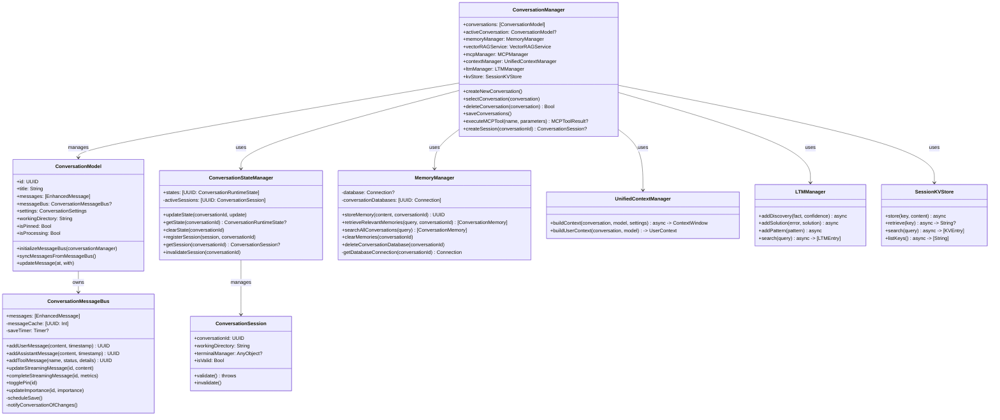
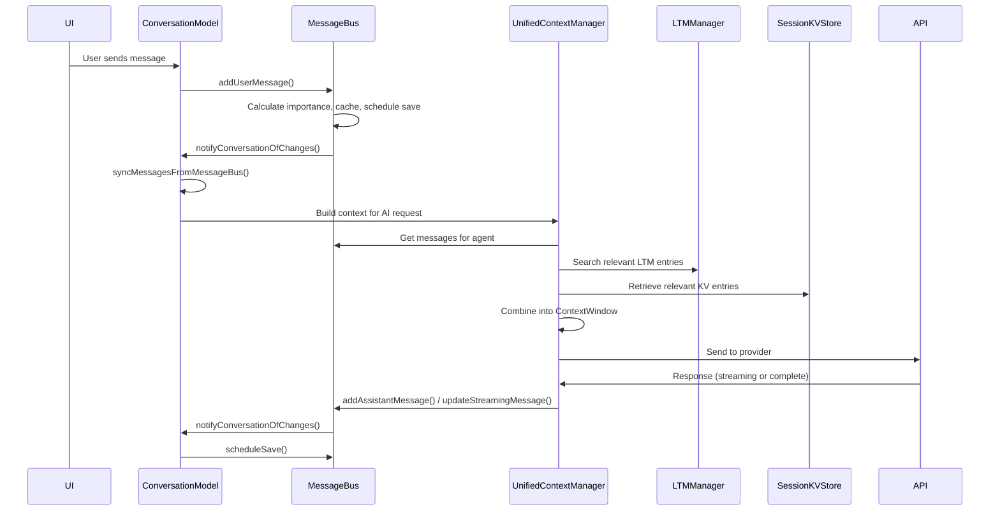
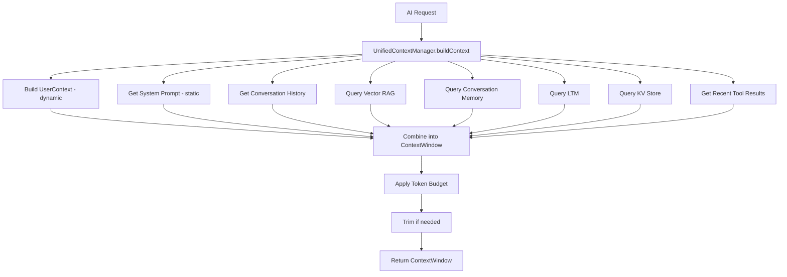

<!-- SPDX-License-Identifier: CC-BY-NC-4.0 -->
<!-- SPDX-FileCopyrightText: Copyright (c) 2025 Andrew Wyatt (Fewtarius) -->


# ConversationEngine Subsystem

**Version:** 3.0  
**Last Updated:** August 23, 2026  
**Location:** `Sources/ConversationEngine/`

---

## Overview

The **ConversationEngine** subsystem is SAM's conversation management and persistence layer. It handles conversation lifecycle, message routing, state management, and long-term memory integration using a message bus architecture for real-time updates.

### Purpose and Responsibilities

1. **Conversation Lifecycle**: Create, load, save, delete conversations
2. **Message Routing**: Single source of truth via MessageBus pattern
3. **State Management**: Runtime state tracking (processing, tool execution)
4. **Persistence**: Debounced writes to prevent excessive disk I/O
5. **Memory Integration**: Per-conversation memory databases + LTM + KV store
6. **Session Management**: Safe async operations with session validation
7. **Working Directory**: Per-conversation file system sandboxing
8. **Context Management**: Unified context window building with userContext for KV cache stability

### Key Design Principles

- **Message Bus Pattern**: Single source of truth for messages
- **Debounced Persistence**: Batch writes every 500ms during streaming
- **Delta Sync**: Update individual messages without copying arrays
- **Memory Isolation**: Per-conversation databases prevent data leakage
- **Session Safety**: Prevent data corruption during conversation switches
- **KV Cache Stability**: Dynamic content (date, conversation ID) moved to userContext
- **Unified Context Manager**: Single context builder replacing YaRN

---

## Architecture


```mermaid
classDiagram
    class ConversationManager {
        +conversations: [ConversationModel]
        +activeConversation: ConversationModel?
        +memoryManager: MemoryManager
        +vectorRAGService: VectorRAGService
        +mcpManager: MCPManager
        +contextManager: UnifiedContextManager
        +ltmManager: LTMManager
        +kvStore: SessionKVStore
        +createNewConversation()
        +selectConversation(conversation)
        +deleteConversation(conversation) Bool
        +saveConversations()
        +executeMCPTool(name, parameters) MCPToolResult?
        +createSession(conversationId) ConversationSession?
    }

    class ConversationModel {
        +id: UUID
        +title: String
        +messages: [EnhancedMessage]
        +messageBus: ConversationMessageBus?
        +settings: ConversationSettings
        +workingDirectory: String
        +isPinned: Bool
        +isProcessing: Bool
        +initializeMessageBus(conversationManager)
        +syncMessagesFromMessageBus()
        +updateMessage(at, with)
    }

    class ConversationMessageBus {
        +messages: [EnhancedMessage]
        -messageCache: [UUID: Int]
        -saveTimer: Timer?
        +addUserMessage(content, timestamp) UUID
        +addAssistantMessage(content, timestamp) UUID
        +addToolMessage(name, status, details) UUID
        +updateStreamingMessage(id, content)
        +completeStreamingMessage(id, metrics)
        +togglePin(id)
        +updateImportance(id, importance)
        -scheduleSave()
        -notifyConversationOfChanges()
    }

    class ConversationSession {
        +conversationId: UUID
        +workingDirectory: String
        +terminalManager: AnyObject?
        +isValid: Bool
        +validate() throws
        +invalidate()
    }

    class ConversationStateManager {
        +states: [UUID: ConversationRuntimeState]
        -activeSessions: [UUID: ConversationSession]
        +updateState(conversationId, update)
        +getState(conversationId) ConversationRuntimeState?
        +clearState(conversationId)
        +registerSession(session, conversationId)
        +getSession(conversationId) ConversationSession?
        +invalidateSession(conversationId)
    }

    class MemoryManager {
        -database: Connection?
        -conversationDatabases: [UUID: Connection]
        +storeMemory(content, conversationId) UUID
        +retrieveRelevantMemories(query, conversationId) [ConversationMemory]
        +searchAllConversations(query) [ConversationMemory]
        +clearMemories(conversationId)
        +deleteConversationDatabase(conversationId)
        -getDatabaseConnection(conversationId) Connection
    }

    class UnifiedContextManager {
        +buildContext(conversation, model, settings) async -> ContextWindow
        +buildUserContext(conversation, model) -> UserContext
    }

    class LTMManager {
        +addDiscovery(fact, confidence) async
        +addSolution(error, solution) async
        +addPattern(pattern) async
        +search(query) async -> [LTMEntry]
    }

    class SessionKVStore {
        +store(key, content) async
        +retrieve(key) async -> String?
        +search(query) async -> [KVEntry]
        +listKeys() async -> [String]
    }

    ConversationManager --> ConversationModel : manages
    ConversationManager --> MemoryManager : uses
    ConversationManager --> ConversationStateManager : uses
    ConversationManager --> UnifiedContextManager : uses
    ConversationManager --> LTMManager : uses
    ConversationManager --> SessionKVStore : uses
    ConversationModel --> ConversationMessageBus : owns
    ConversationStateManager --> ConversationSession : manages
```

---

## Key Components

### ConversationManager

**Location:** `Sources/ConversationEngine/ConversationManager.swift`

**Purpose:** Central coordinator for conversation lifecycle and integration with memory/MCP/context systems.

**Key Responsibilities:**
- Create, load, save, delete conversations
- Manage active conversation selection
- Coordinate memory system initialization (MemoryManager, LTMManager, KVStore)
- Integrate MCP tools for agent capabilities
- Handle working directory management
- Debounced persistence to reduce disk I/O
- Unified context management for AI requests

**Public Methods:**

```swift
/// Create new conversation with sequential numbering
func createNewConversation()

/// Select conversation as active
func selectConversation(_ conversation: ConversationModel)

/// Delete conversation and optionally its working directory
func deleteConversation(_ conversation: ConversationModel, deleteWorkingDirectory: Bool = true) -> (workingDirectoryPath: String, isEmpty: Bool, deleted: Bool)

/// Rename conversation and update working directory
func renameConversation(_ conversation: ConversationModel, to newName: String)

/// Save conversations with debouncing (500ms delay)
func saveConversations()

/// Save immediately (bypasses debouncing) - for app termination
func saveConversationsImmediately()

/// Create session for safe async operations
func createSession(for conversationId: UUID) -> ConversationSession?

/// Execute MCP tool
func executeMCPTool(name: String, parameters: [String: Any], isExternalAPICall: Bool, isUserInitiated: Bool) async -> MCPToolResult?

/// Build context for AI request (unified context manager)
func buildContext(for conversation: ConversationModel, model: String, settings: ConversationSettings) async -> ContextWindow
```

**Integration Subsystems:**

- **MemoryManager**: Per-conversation SQLite databases (conversation memory)
- **VectorRAGService**: Document import and semantic search
- **UnifiedContextManager**: Single context window builder (replaces YaRN)
- **LTMManager**: Long-term memory (discoveries, solutions, patterns)
- **SessionKVStore**: Persistent key-value store across sessions
- **MCPManager**: Tool registry and execution
- **ContextArchiveManager**: Context archival for long conversations

---

### ConversationModel

**Location:** `Sources/ConversationEngine/ConversationModel.swift`

**Purpose:** Runtime conversation state with MessageBus integration.

**Key Properties:**

```swift
/// Unique identifier
let id: UUID

/// Conversation title (user-editable)
@Published var title: String

/// Messages array (synced from MessageBus)
@Published var messages: [EnhancedMessage]

/// MessageBus instance (single source of truth)
var messageBus: ConversationMessageBus?

/// Conversation settings (includes UI panel states)
@Published var settings: ConversationSettings

/// Working directory for file operations
var workingDirectory: String

/// Pin status (prevents auto-deletion)
@Published var isPinned: Bool

/// Processing state
@Published var isProcessing: Bool
```

**Per-Conversation UI Settings (added 2026-06):**

```swift
struct ConversationSettings {
    // Model settings
    var selectedModel: String
    var temperature: Double
    var topP: Double
    var maxTokens: Int?
    var contextWindowSize: Int
    var selectedSystemPromptId: UUID?
    var enableReasoning: Bool
    var enableTools: Bool
    var autoApprove: Bool
    var scrollLockEnabled: Bool
    
    // Shared data settings
    var useSharedData: Bool
    var sharedTopicId: UUID?
    var sharedTopicName: String?
    
    // UI Panel States (persist per conversation)
    var showingToolCards: Bool = true
    var showingPerformance: Bool = false
    var showingCustomInstructions: Bool = false
    var showingMemoryPanel: Bool = false
    var showingVectorRAGPanel: Bool = false
    
    // Image generation parameters
    var sdNegativePrompt: String
    var sdSteps: Int
    var sdGuidanceScale: Int
    var sdScheduler: String
}
```

**MessageBus Integration:**

```swift
/// Initialize MessageBus (call after creation)
func initializeMessageBus(conversationManager: ConversationManager)

/// Sync messages from MessageBus (called by MessageBus on changes)
func syncMessagesFromMessageBus()

/// Delta sync - update single message (performance optimization)
func updateMessage(at index: Int, with message: EnhancedMessage)
```

---

### ConversationMessageBus

**Location:** `Sources/ConversationEngine/ConversationMessageBus.swift`

**Purpose:** Single source of truth for conversation messages with debounced persistence.

**Key Features:**
- Fast lookup cache (UUID -> index)
- Debounced saves (500ms delay during streaming)
- Delta sync (update individual messages)
- Automatic importance scoring
- Auto-pin first 3 user messages
- Think tag handling (strip` from streaming)

**Public API:**

```swift
/// Add user message
func addUserMessage(content: String, timestamp: Date = Date(), isPinned: Bool? = nil) -> UUID

/// Add assistant message
func addAssistantMessage(content: String, contentParts: [MessageContentPart]? = nil, timestamp: Date = Date(), isStreaming: Bool = false, isPinned: Bool = false) -> UUID

/// Add tool message
func addToolMessage(name: String, status: ToolStatus, details: String? = nil, detailsArray: [String]? = nil, ...) -> UUID

/// Update streaming message (real-time)
func updateStreamingMessage(id: UUID, content: String)

/// Complete streaming message
func completeStreamingMessage(id: UUID, performanceMetrics: MessagePerformanceMetrics? = nil, processingTime: TimeInterval? = nil)

/// Update message (for tool completion)
func updateMessage(id: UUID, content: String? = nil, contentParts: [MessageContentPart]? = nil, status: ToolStatus? = nil, duration: TimeInterval? = nil)

/// Remove message
func removeMessage(id: UUID)

/// Toggle pin status
func togglePin(id: UUID)

/// Update importance score
func updateImportance(id: UUID, importance: Double)
```

**Message Retrieval:**

```swift
/// Get messages for API (filtered)
func getMessagesForAPI(limit: Int? = nil) -> [ChatMessage]

/// Get all messages for agent context
func getMessagesForAgent() -> [EnhancedMessage]

/// Get tool messages only
func getToolMessages() -> [EnhancedMessage]

/// Get specific message
func getMessage(id: UUID) -> EnhancedMessage?
```

**Think Tag Handling (added 2026-07):**

```swift
/// Strips `` markers from content for empty bubble detection
func effectiveMessageContent(_ content: String) -> String {
    content
        .replacingOccurrences(of: "```", with: "")
        .replacingOccurrences(of: "```", with: "")
        .trimmingCharacters(in: .whitespacesAndNewlines)
}
```

---

### ConversationSession

**Location:** `Sources/ConversationEngine/ConversationSession.swift`

**Purpose:** Snapshot of conversation context for safe async operations.

**Problem Solved:**  
When user switches conversations during async operations (tool execution, model inference), operations could write to wrong conversation. Sessions prevent this data leakage.

**Usage Pattern:**

```swift
// Create session at operation start
guard let session = conversationManager.createSession(for: conversationId) else {
    throw SessionError.conversationNotFound
}

// Validate session before each operation
try session.validate()  // Throws if conversation switched/deleted

// Access snapshotted context
let workingDir = session.workingDirectory
let terminal = session.terminalManager

// Session auto-invalidates when conversation deleted
```

**Properties:**

```swift
let conversationId: UUID
let workingDirectory: String
let terminalManager: AnyObject?
let createdAt: Date
private(set) var isValid: Bool

func validate() throws           // Throws SessionError.invalidated
func invalidate()                // Mark session invalid
var canProceed: Bool             // Check validity without throwing
var ageInSeconds: TimeInterval   // Session age
```

---

### ConversationStateManager

**Location:** `Sources/ConversationEngine/ConversationStateManager.swift`

**Purpose:** Track runtime state that should NOT persist to disk.

**State Types:**

```swift
struct ConversationRuntimeState {
    var status: RuntimeStatus               // idle, processing, streaming, error
    var activeTools: Set<String>           // Currently executing tools
    var modelLoaded: Bool                  // Local model status
    var terminalSessionId: String?         // Active PTY session
    var activeSessionId: UUID?             // Session validation
}

enum RuntimeStatus {
    case idle
    case processing(toolName: String?)
    case streaming
    case error(String)
}
```

**Public Methods:**

```swift
/// Update state with closure
func updateState(conversationId: UUID, _ update: (inout ConversationRuntimeState) -> Void)

/// Get current state
func getState(conversationId: UUID) -> ConversationRuntimeState?

/// Clear state (on deletion)
func clearState(conversationId: UUID)

/// Session management
func registerSession(_ session: ConversationSession, for conversationId: UUID)
func getSession(for conversationId: UUID) -> ConversationSession?
func invalidateSession(for conversationId: UUID)
```

---

### MemoryManager (Conversation Memory)

**Location:** `Sources/ConversationEngine/MemoryManager.swift`

**Purpose:** Per-conversation memory storage using SQLite with semantic search.

**Key Features:**
- **Memory Isolation**: Each conversation has its own database
- **Semantic Search**: Cosine similarity + keyword boost
- **Importance Scoring**: Prioritize relevant memories
- **Access Tracking**: Statistics for memory management

**Database Location:**
```
~/Library/Application Support/SAM/conversations/
├── {conversationId}/
│   └── memory.db                  # SQLite database
```

**Schema:**

```sql
CREATE TABLE conversation_memories (
    id TEXT PRIMARY KEY,               -- UUID
    conversation_id TEXT NOT NULL,     -- Conversation UUID
    content TEXT NOT NULL,             -- Memory content
    content_type TEXT NOT NULL,        -- user_input, assistant_response, etc.
    embedding BLOB,                    -- Vector embedding (256-dim)
    importance REAL NOT NULL,          -- 0.0-1.0 importance score
    created_at INTEGER NOT NULL,       -- Unix timestamp
    access_count INTEGER DEFAULT 0,    -- Access frequency
    last_accessed INTEGER NOT NULL,    -- Last access time
    tags TEXT                          -- Comma-separated tags
);
```

**Public Methods:**

```swift
/// Store memory for conversation
func storeMemory(content: String, conversationId: UUID, contentType: MemoryContentType = .message, importance: Double = 0.5, tags: [String] = []) async throws -> UUID

/// Retrieve relevant memories (semantic search)
func retrieveRelevantMemories(for query: String, conversationId: UUID, limit: Int = 10, similarityThreshold: Double = 0.3) async throws -> [ConversationMemory]

/// Search across all conversations
func searchAllConversations(query: String, limit: Int = 10, similarityThreshold: Double = 0.3) async throws -> [ConversationMemory]

/// Get all memories for conversation
func getAllMemories(for conversationId: UUID) async throws -> [ConversationMemory]

/// Clear memories for conversation
func clearMemories(for conversationId: UUID) async throws

/// Delete conversation's database file
func deleteConversationDatabase(conversationId: UUID) throws

/// Get memory statistics
func getMemoryStatistics(for conversationId: UUID) async throws -> MemoryStatistics
```

---

### UnifiedContextManager (New: 2026-04)

**Location:** `Sources/ConversationEngine/UnifiedContextManager.swift`

**Purpose:** Single context window builder replacing YaRNContextProcessor. Moves dynamic content to userContext for KV cache stability.

**Key Responsibilities:**
- Build context window from multiple sources
- Separate static (system prompt, tools) from dynamic (date, conversation ID) content
- Manage context window sizing based on model limits
- Handle context archival retrieval

**Context Window Structure:**

```swift
struct ContextWindow {
    let systemPrompt: String           // Static: identity, tools, guidelines
    let userContext: UserContext       // Dynamic: date, location, conversation ID
    let conversationHistory: [ChatMessage]  // Filtered & trimmed messages
    let ragResults: [RAGChunk]         // Vector RAG document chunks
    let memoryResults: [MemoryEntry]   // Conversation memory + LTM
    let toolResults: [ToolResult]      // Recent tool execution outputs
    let totalTokens: Int               // Estimated token count
}
```

**UserContext (for KV Cache Stability):**

```swift
struct UserContext {
    let currentDate: String            // ISO8601 date
    let currentTime: String            // HH:mm timezone
    let conversationId: UUID           // For multi-conversation tracking
    let workingDirectory: String       // For file operations
    let userLocation: Location?        // For weather, local search
    let pinnedMessages: [ChatMessage]  // Always included
}
```

**Why userContext Separation?**
- KV cache in local models (MLX, CachyLLama) benefits from static prefix
- Dynamic content (date, conversation ID) changes every request
- Separating them allows KV cache reuse for static portions
- Reduces recomputation and improves inference speed

**Public Methods:**

```swift
/// Build complete context window for AI request
func buildContext(
    for conversation: ConversationModel,
    model: String,
    settings: ConversationSettings
) async -> ContextWindow

/// Build userContext (dynamic portion)
func buildUserContext(
    for conversation: ConversationModel,
    model: String
) -> UserContext

/// Get context window size for model
func getContextWindowSize(for model: String) -> Int
```

---

### LTMManager (New: 2026-03)

**Location:** `Sources/ConversationEngine/LTMManager.swift`

**Purpose:** Long-term memory management across conversations and sessions.

**Entry Types:**

```swift
enum LTMEntryType: String, Codable {
    case discovery    // Key insights and facts
    case solution     // Problem-solving approaches
    case pattern      // Recurring patterns and best practices
}

struct LTMEntry: Codable {
    let id: UUID
    let type: LTMEntryType
    let content: String
    let confidence: Double           // 0.0-1.0
    let corroborationCount: Int      // Independent confirmations
    let trustTier: TrustTier         // UNVERIFIED, TRUSTED
    let createdAt: Date
    let lastAccessed: Date
    let accessCount: Int
    let tags: [String]
    let sourceConversationId: UUID?
}

enum TrustTier: String, Codable {
    case unverified
    case trusted
}
```

**Public Methods:**

```swift
/// Add a discovery to LTM
func addDiscovery(fact: String, confidence: Double = 0.8, tags: [String] = [], sourceConversationId: UUID? = nil) async throws -> UUID

/// Add a solution to LTM
func addSolution(error: String, solution: String, examples: [String] = [], confidence: Double = 0.8) async throws -> UUID

/// Add a pattern to LTM
func addPattern(pattern: String, confidence: Double = 0.8, examples: [String] = []) async throws -> UUID

/// Add corroboration to existing entry (promotes to TRUSTED at 2+)
func addCorroboration(searchText: String) async throws

/// Search LTM entries
func search(query: String, limit: Int = 10, minConfidence: Double = 0.3) async throws -> [LTMEntry]

/// Get LTM statistics
func getStatistics() async throws -> LTMStatistics

/// Prune old entries (configurable retention)
func prune(maxAgeDays: Int = 90, maxDiscoveries: Int = 50, maxSolutions: Int = 50, maxPatterns: Int = 30) async throws -> PruneResult
```

**Auto-Pruning:**
- Default: 90 days, max 50 discoveries/solutions/patterns
- Runs on app launch and periodically
- Preserves TRUSTED entries

---

### SessionKVStore (New: 2026-03)

**Location:** `Sources/ConversationEngine/SessionKVStore.swift`

**Purpose:** Persistent key-value store replacing in-memory KV storage. Survives app restarts.

**Schema:**

```sql
CREATE TABLE kv_store (
    key TEXT PRIMARY KEY,
    content TEXT NOT NULL,
    created_at INTEGER NOT NULL,
    updated_at INTEGER NOT NULL,
    access_count INTEGER DEFAULT 0,
    last_accessed INTEGER NOT NULL,
    expires_at INTEGER  -- Optional TTL
);
```

**Public Methods:**

```swift
/// Store key-value pair
func store(key: String, content: String, ttl: TimeInterval? = nil) async throws

/// Retrieve value by key
func retrieve(key: String) async throws -> String?

/// Search keys by pattern
func search(query: String, limit: Int = 20) async throws -> [KVEntry]

/// List all keys
func listKeys() async throws -> [String]

/// Delete key
func delete(key: String) async throws

/// Get statistics
func getStatistics() async throws -> KVStatistics
```

**Integration:**
- Used by `memory_operations` tool (store, retrieve, search_kv, list_keys, delete_key)
- Accessible across all conversations (global scope)
- Thread-safe with actor isolation

---

### MessageValidator (New: 2026-03)

**Location:** `Sources/ConversationEngine/MessageValidator.swift`

**Purpose:** Validates and sanitizes messages before persistence and API transmission.

**Validation Rules:**
- **Size limits**: Max message size (configurable, default 1MB)
- **Encoding**: Ensure valid UTF-8
- **Structure**: Required fields present for message type
- **Tool calls**: Valid tool call structure (name, arguments, ID)
- **Alternation**: Enforce user/assistant alternation for API compatibility

**Public Methods:**

```swift
/// Validate message before storage
func validate(_ message: EnhancedMessage) throws -> ValidationResult

/// Sanitize message for API transmission
func sanitizeForAPI(_ message: EnhancedMessage) -> ChatMessage

/// Check conversation message alternation
func checkAlternation(_ messages: [EnhancedMessage]) -> [AlternationError]
```

---

## Message Flow

### Message Creation and Persistence Flow


```mermaid
sequenceDiagram
    participant UI
    participant CM as ConversationModel
    participant MB as MessageBus
    participant UC as UnifiedContextManager
    participant LTM as LTMManager
    participant KV as SessionKVStore
    
    UI->>CM: User sends message
    CM->>MB: addUserMessage()
    MB->>MB: Calculate importance, cache, schedule save
    MB->>CM: notifyConversationOfChanges()
    CM->>CM: syncMessagesFromMessageBus()
    CM->>UC: Build context for AI request
    UC->>MB: Get messages for agent
    UC->>LTM: Search relevant LTM entries
    UC->>KV: Retrieve relevant KV entries
    UC->>UC: Combine into ContextWindow
    UC->>API: Send to provider
    API->>UC: Response (streaming or complete)
    UC->>MB: addAssistantMessage() / updateStreamingMessage()
    MB->>CM: notifyConversationOfChanges()
    CM->>MB: scheduleSave()
```

### Context Building Flow


```mermaid
flowchart TD
    A[AI Request] --> B[UnifiedContextManager.buildContext]
    B --> C[Build UserContext - dynamic]
    B --> D[Get System Prompt - static]
    B --> E[Get Conversation History]
    B --> F[Query Vector RAG]
    B --> G[Query Conversation Memory]
    B --> H[Query LTM]
    B --> I[Query KV Store]
    B --> J[Get Recent Tool Results]
    C --> K[Combine into ContextWindow]
    D --> K
    E --> K
    F --> K
    G --> K
    H --> K
    I --> K
    J --> K
    K --> L[Apply Token Budget]
    L --> M[Trim if needed]
    M --> N[Return ContextWindow]
```

---

## Memory System Architecture

```
┌─────────────────────────────────────────────────────────────┐
│                    ConversationEngine                        │
├─────────────────────────────────────────────────────────────┤
│  Per-Conversation Memory (MemoryManager)                    │
│  ├── conversation_memories table                             │
│  ├── Vector embeddings (256-dim)                            │
│  ├── Importance scoring                                     │
│  └── Access tracking                                        │
├─────────────────────────────────────────────────────────────┤
│  Vector RAG (VectorRAGService)                              │
│  ├── Document chunks + embeddings                           │
│  ├── Per-conversation vector.db                             │
│  └── Similarity search (Apple NaturalLanguage)             │
├─────────────────────────────────────────────────────────────┤
│  Long-Term Memory (LTMManager)                              │
│  ├── Global ltm.db                                          │
│  ├── Discovery / Solution / Pattern entries                 │
│  ├── Trust tiers (UNVERIFIED -> TRUSTED)                    │
│  ├── Corroboration system                                   │
│  └── Auto-pruning (90 days, 50 per type)                   │
├─────────────────────────────────────────────────────────────┤
│  Session KV Store (SessionKVStore)                          │
│  ├── Global kv_store.db                                     │
│  ├── Persistent key-value pairs                             │
│  ├── Optional TTL support                                   │
│  └── Thread-safe actor isolation                            │
├─────────────────────────────────────────────────────────────┤
│  Context Archive (ContextArchiveManager)                    │
│  ├── Archived chunks with summaries                         │
│  ├── Key topics + timestamps + importance                   │
│  └── Semantic retrieval                                     │
└─────────────────────────────────────────────────────────────┘
```

---

## Data Storage

### Where Is Conversation Data Stored?

```
~/Library/Application Support/SAM/
├── ltm.db                        # Long-term memory database
├── kv_store.db                   # Session key-value store
├── conversations/
    └── {UUID}/
        ├── conversation.json     # Messages and metadata
        ├── tasks.json            # Agent todo lists
        ├── memory.db             # Per-conversation memory + embeddings
        ├── vector.db             # Vector RAG embeddings
        ├── archive.db            # Context archive chunks
        └── .vectorrag/           # Vector RAG index files
```

### Storage Size Estimates

| Component | Typical Size |
|-----------|--------------|
| Conversation JSON | 10KB - 1MB |
| Vector database (with docs) | 1MB - 50MB |
| LTM database | < 10MB |
| KV Store | < 1MB |
| Context Archive | 1MB - 10MB |
| **Total per active user** | 50MB - 500MB |

---

## Error Handling

### SessionError

```swift
enum SessionError: Error {
    case conversationNotFound
    case invalidated
    case expired
}
```

### MemoryError

```swift
enum MemoryError: Error {
    case databaseError(String)
    case embeddingFailed
    case invalidQuery
    case notFound
}
```

### ContextError

```swift
enum ContextError: Error {
    case tokenBudgetExceeded
    case modelNotFound
    case buildFailed(String)
}
```

---

## Integration Points

| Subsystem | Integration |
|-----------|-------------|
| **APIFramework** | ConversationManager.buildContext() called by AgentOrchestrator |
| **MCPFramework** | ConversationManager.executeMCPTool() for tool execution |
| **MLXIntegration** | Model context window sizes from ModelConfigurationManager |
| **ConfigurationSystem** | Settings, system prompts, model configs |
| **SharedData** | Shared Topics via conversation settings |
| **VoiceFramework** | Voice messages routed through MessageBus |

---

## Version History

| Version | Date | Changes |
|---------|------|---------|
| 3.0 | 2026-08-23 | Added UnifiedContextManager, LTMManager, SessionKVStore, MessageValidator; replaced YaRN; userContext separation |
| 2.3 | 2025-12-05 | Initial documentation |
| 2.0 | 2025-11-15 | MessageBus pattern, debounced persistence |
| 1.0 | 2025-10-01 | Initial implementation |

---

## See Also

- [Memory and Intelligence Specification](MEMORY_AND_INTELLIGENCE_SPECIFICATION.md) - Detailed memory architecture
- [Messaging Architecture](MESSAGING_ARCHITECTURE.md) - Message flow details
- [Shared Data](SHARED_DATA.md) - Shared Topics implementation
- [System Prompt Evolution](SYSTEM_PROMPT_EVOLUTION.md) - Prompt component history
- [Agent Orchestrator](AGENT_ORCHESTRATOR.md) - Context usage in workflows