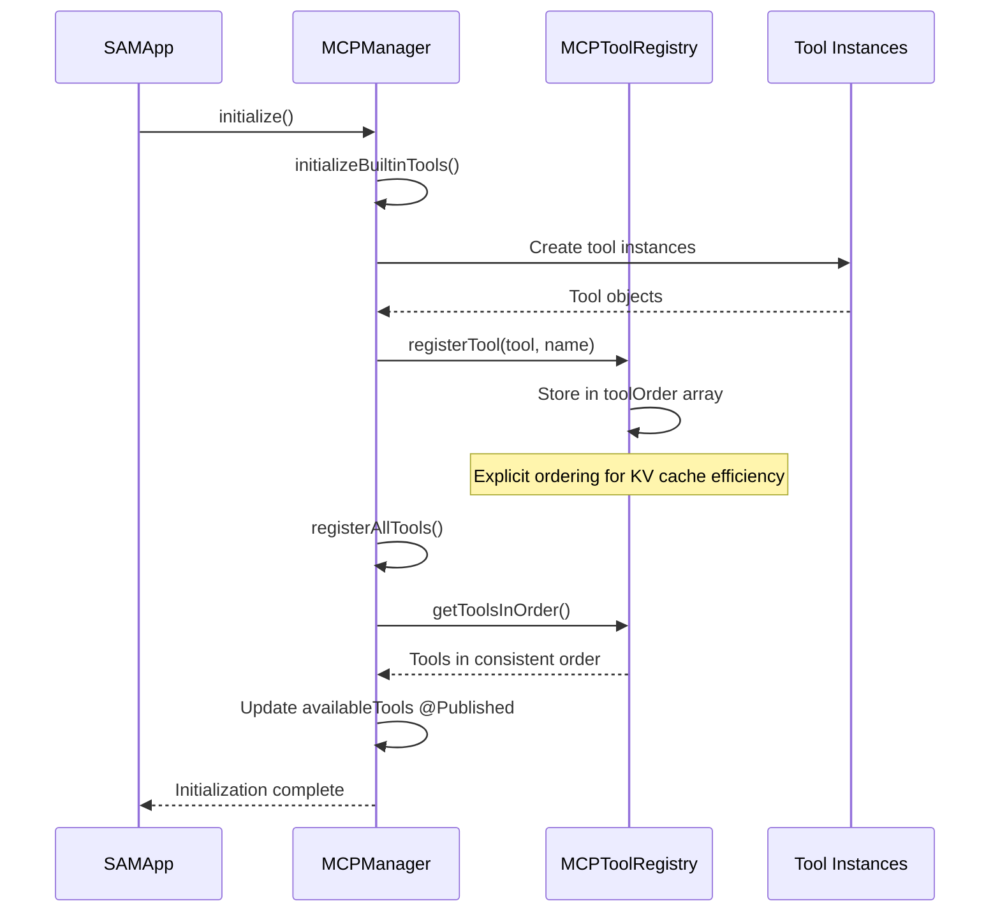
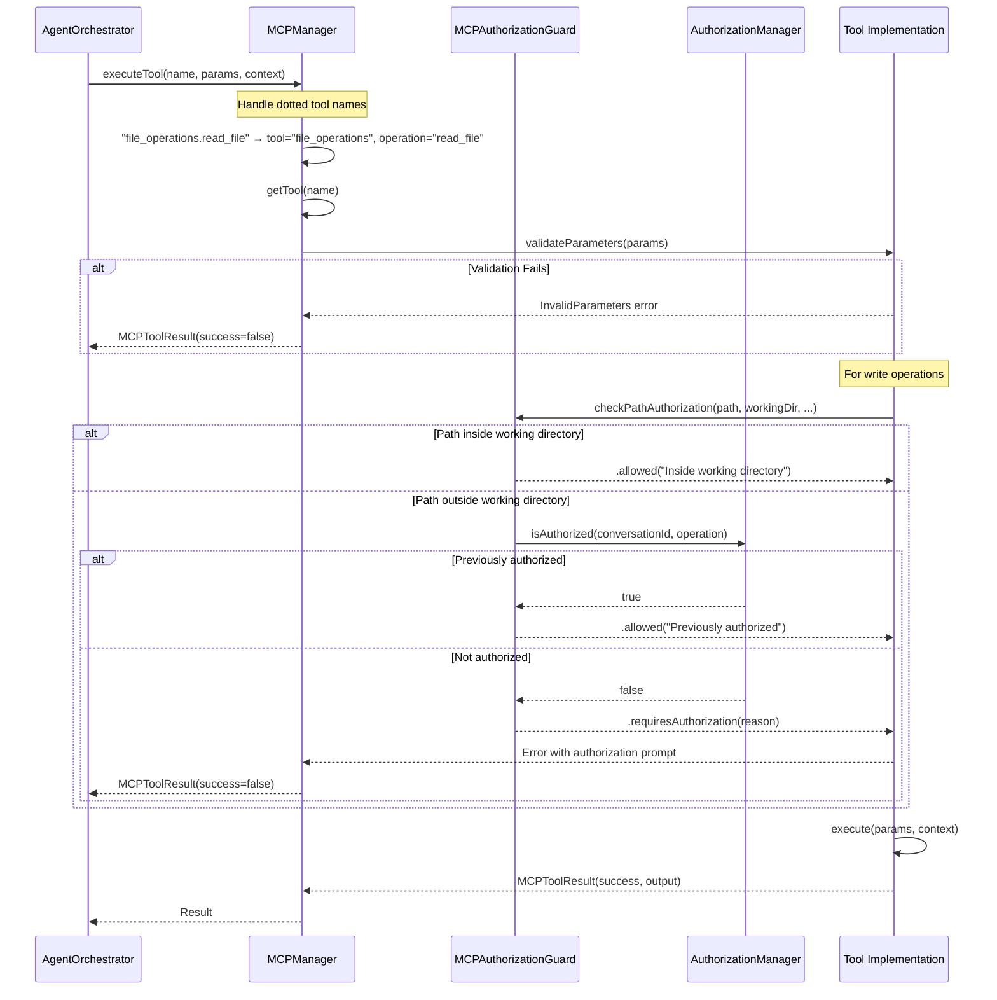
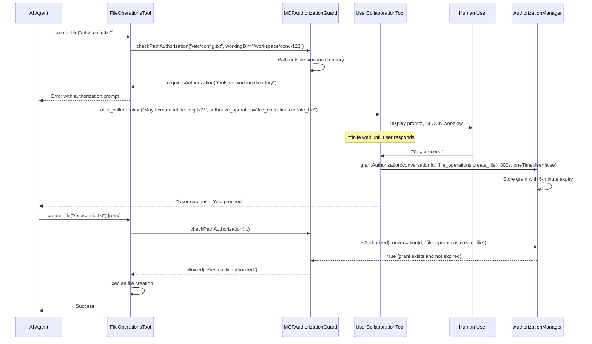
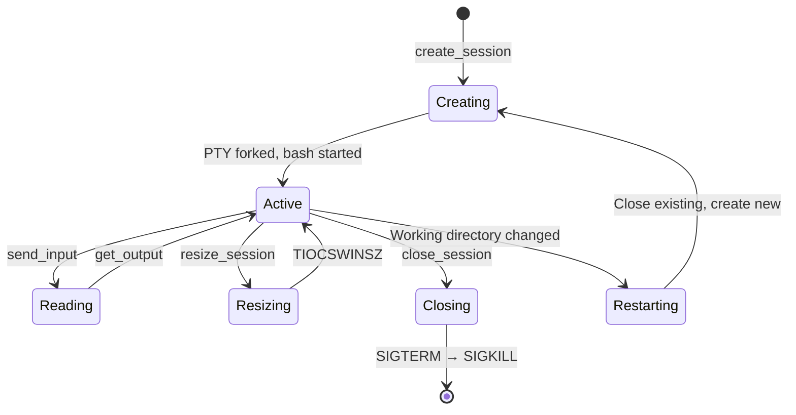
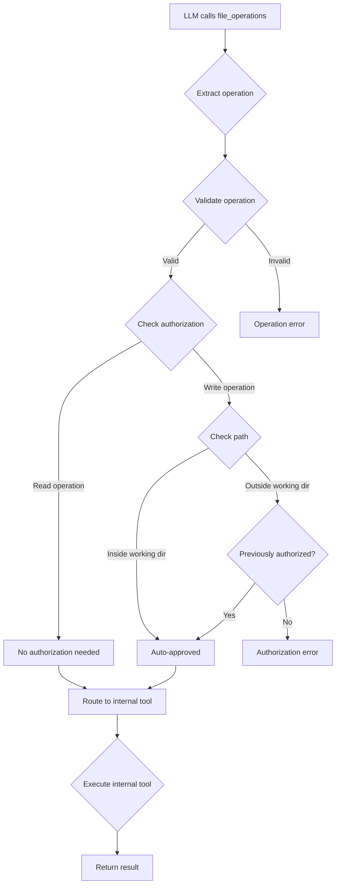

<!-- SPDX-License-Identifier: CC-BY-NC-4.0 -->
<!-- SPDX-FileCopyrightText: Copyright (c) 2025 Andrew Wyatt (Fewtarius) -->


# MCPFramework Subsystem Documentation

**Version:** 1.4  
**Last Updated:** December 5, 2025  
**Module:** `Sources/MCPFramework/`

## Recent Changes (December 5, 2025 - Evening)

- **todo_operations `add` operation:** New operation to append tasks to existing todo list
- **Removed ALL_TASKS_COMPLETE signal:** Changed blocking "provide summary" message to "ready for new work"
- **TodoReminderInjector update:** Completion message now guides agent to use `add` operation

## Recent Changes (December 5, 2025)

- **MemoryReminderInjector:** New injector preventing duplicate memory storage in agent workflows
- **requiresSerial property:** Added to `MemoryOperationsTool` and `TodoOperationsTool`
- **Duplicate prevention cache:** Added to `MemoryOperationsTool.handleStoreMemory()`
- **isWorkToolCall simplified:** `store_memory` now correctly classified as WORK (not planning)

## Recent Changes (December 3, 2025)

- **MiniPromptReminderInjector:** New injector reminding agents of user's mini prompts on subsequent turns
- **Universal Reminder Pattern:** All reminder injectors follow same pattern - content wrapped in `<system-reminder>`
- **Reminder Positioning:** All reminders injected RIGHT BEFORE user message for maximum salience

## Recent Changes (December 2, 2025)

- **todo_operations:** Now a standalone tool (separate from memory_operations)
- **TodoOperationsTool:** Enhanced tool description with workflow guidance
- **Tool icon:** Changed to `list.clipboard` in UI
- **Progress rules:** Emphasize "VERY frequent" usage and immediate status updates
- **Context injection:** Works with TodoReminderInjector for every-request injection

## Overview

The MCPFramework subsystem implements SAM's Model Context Protocol (MCP) tool system, providing a comprehensive, extensible framework for LLM tool integration. It enables AI agents to perform file operations, execute terminal commands, manage memory, spawn subagents, and interact with users through a unified, secure interface.

**Core Responsibilities:**
- Tool registration and lifecycle management
- Tool execution with authorization and validation
- Consolidated tool architecture for related operations
- Authorization system for secure file/command operations
- PTY session management for persistent terminals
- Todo list management for workflow tracking
- **Reminder injection system for context persistence**
- Progress events and UI notifications
- Tool display information for user-facing progress

---

## Reminder Injection System

SAM uses a reminder injection system to maintain context across multi-turn conversations. Reminders are injected immediately before the user message for maximum salience and context relevance.

### Reminder Injectors

| Injector | Purpose | Inner Tag | Condition |
|----------|---------|-----------|-----------|
| `TodoReminderInjector` | Task tracking | `<todoList>` | Any todos exist |
| `MiniPromptReminderInjector` | User instructions | `<miniPromptReminder>` | Mini prompts enabled, after first turn |
| `DocumentImportReminderInjector` | Imported docs | Plain text | Documents imported |
| `MemoryReminderInjector` | Recently stored memories | `<recentlyStoredMemories>` | Memories stored this session |

### Injection Flow

```
callLLM() / callLLMStreaming()
    ↓
[1] Build conversation messages
    ↓
[2] Inject reminders RIGHT BEFORE user message:
    • MiniPromptReminderInjector.formatMiniPromptReminder()
    • TodoReminderInjector.formatTodoReminder()
    • DocumentImportReminderInjector.formatDocumentReminder()
    ↓
[3] All reminders wrapped by createSystemReminder() in <system-reminder> tags
    ↓
[4] Add user message
    ↓
[5] Send to LLM
```

### createSystemReminder Pattern

All reminders are wrapped consistently:

```swift
private func createSystemReminder(content: String, model: String) -> OpenAIChatMessage {
    /// Use XML tags for structured content organization across all models
    let wrappedContent = "<system-reminder>\n\(content)\n</system-reminder>"
    return OpenAIChatMessage(role: "user", content: wrappedContent)
}
```

**Key:** Reminders sent as "user" role for higher salience than "system" role.

### TodoReminderInjector

**File:** `Sources/MCPFramework/TodoReminderInjector.swift`

Injects current todo state on every request when todos exist:

```xml
<system-reminder>
<todoList>
Completed: 2
In Progress: [3] Research options
Not Started: [4] Write summary

PROGRESS RULES (TOOL CALLS REQUIRED):
1. BEFORE starting any todo → call todo_operations(update) to mark it "in-progress"
2. DO the actual work
3. AFTER completing work → call todo_operations(update) to mark it "completed" IMMEDIATELY

ANTI-PATTERN: Writing todo status in plain text is NOT updating the list.
The todo_operations tool MUST be called to update status.
</todoList>
</system-reminder>
```

### MiniPromptReminderInjector

**File:** `Sources/MCPFramework/MiniPromptReminderInjector.swift`

Injects enabled mini prompts on subsequent turns (after first response):

```xml
<system-reminder>
<miniPromptReminder>
IMPORTANT REMINDER - User has specified the following instructions that you MUST follow:

[Full mini prompt content here]

These instructions take priority. Follow them exactly.
</miniPromptReminder>
</system-reminder>
```

**Purpose:** Prevents agents from "forgetting" user's custom instructions during long research sessions.

### DocumentImportReminderInjector

**File:** `Sources/MCPFramework/DocumentImportReminderInjector.swift`

Reminds agent of imported documents to prevent re-importing:

```xml
<system-reminder>
IMPORTED DOCUMENTS IN THIS CONVERSATION:
The following documents have already been imported into memory. DO NOT re-import them.
Use memory_operations with operation=search_memory to query their content instead.

• report.pdf (12543 chars) - ID: abc12345
• notes.txt (4521 chars) - ID: def67890

To search these documents, use:
memory_operations(operation: "search_memory", query: "your search query", similarity_threshold: "0.2")
</system-reminder>
```

### MemoryReminderInjector

**File:** `Sources/MCPFramework/MemoryReminderInjector.swift`

**Added:** December 5, 2025

Prevents duplicate memory storage by reminding the agent what was already stored:

```xml
<system-reminder>
<recentlyStoredMemories>
IMPORTANT: The following memories have ALREADY been stored in this conversation.
DO NOT store these again - move on to the next task.

Already stored:
• Fruits (ID: 426169EF) - "Apples, Bananas, Oranges, Strawberries..."
• Vegetables (ID: 26F04B24) - "Broccoli, Carrots, Spinach..."
</recentlyStoredMemories>
</system-reminder>
```

**Purpose:** Prevents duplicate memory storage when agent workflows process lists of items. Without this, the agent might attempt to store the same content multiple times.

**Key Features:**
- Actor-based thread-safe implementation
- Tracks memories per conversation ID
- 5-minute expiry for tracked memories
- Injected at END of messages (high salience position)
- Works with `requiresSerial` on MemoryOperationsTool

---

## Architecture

### Component Hierarchy

```
MCPFramework/
├── MCPTypes.swift               # Core protocols and types
├── MCPManager.swift             # Tool registry and execution coordinator
├── ConsolidatedMCP.swift        # Base protocol for consolidated tools
├── AuthorizationManager.swift   # Temporary authorization grants
├── TodoManager.swift            # Todo list backend
├── ToolNotificationCenter.swift # Event notification system
├── ToolDisplayInfoProvider.swift # UI progress information
├── WorkflowSpawner.swift        # Subagent spawning protocol
├── DurationParser.swift         # Authorization expiry parsing
├── FileOperationsSafety.swift   # Safety checks for file ops
│
├── Reminders/                   # Context reminder injectors
│   ├── TodoReminderInjector.swift         # Todo state injection
│   ├── MiniPromptReminderInjector.swift   # Mini prompt persistence
│   └── DocumentImportReminderInjector.swift # Imported doc tracking
│
├── Tools/                       # User-facing tool implementations
│   ├── ThinkTool.swift
│   ├── UserCollaborationTool.swift
│   ├── FileOperationsTool.swift
│   ├── TerminalOperationsTool.swift
│   ├── MemoryOperationsTool.swift
│   ├── RunSubagentTool.swift
│   ├── BuildVersionControlTool.swift
│   ├── IncreaseMaxIterationsTool.swift
│   ├── ListSystemPromptsTool.swift
│   ├── ListMiniPromptsTool.swift
│   ├── ReadToolResultTool.swift
│   ├── RecallHistoryTool.swift
│   └── WorkingDirectoryIndexer.swift
│
├── Internal/                    # Internal MCP tools
│   ├── ReadFileTool.swift
│   ├── CreateFileTool.swift
│   ├── ReplaceStringTool.swift
│   ├── MultiReplaceStringTool.swift
│   ├── InsertEditTool.swift
│   ├── RenameFileTool.swift
│   ├── DeleteFileTool.swift
│   ├── ApplyPatchTool.swift
│   ├── FileSearchTool.swift
│   ├── GrepSearchTool.swift
│   ├── SemanticSearchTool.swift
│   ├── ListCodeUsagesTool.swift
│   ├── ListDirTool.swift
│   ├── GetErrorsTool.swift
│   ├── GetSearchViewResultsTool.swift
│   ├── RunInTerminalTool.swift
│   ├── GetTerminalOutputTool.swift
│   ├── TerminalLastCommandTool.swift
│   ├── TerminalSelectionTool.swift
│   ├── CreateDirectoryTool.swift
│   ├── CreateAndRunTaskTool.swift
│   ├── RunTaskTool.swift
│   ├── GetTaskOutputTool.swift
│   ├── GitCommitTool.swift
│   ├── GetChangedFilesTool.swift
│   ├── PTYSessionManager.swift
│   ├── PseudoTerminal.swift
│   └── SAMConfigurationPaths.swift
│
├── Authorization/               # Authorization system
│   └── MCPAuthorizationGuard.swift
│
└── Utilities/                   # Utility components
    └── TokenEstimator.swift
```

### Key Design Patterns

#### 1. **MCPTool Protocol**
All tools implement the `MCPTool` protocol:

```swift
public protocol MCPTool {
    var name: String { get }
    var description: String { get }
    var parameters: [String: MCPToolParameter] { get }
    
    func initialize() async throws
    func execute(parameters: [String: Any], context: MCPExecutionContext) async -> MCPToolResult
    func validateParameters(_ parameters: [String: Any]) throws -> Bool
    
    // Execution control
    var requiresBlocking: Bool { get }  // Block workflow until complete
    var requiresSerial: Bool { get }    // Prevent parallel execution
}
```

**Execution Control Properties:**

| Property | Default | Effect |
|----------|---------|--------|
| `requiresBlocking` | `false` | When `true`, workflow blocks until tool completes |
| `requiresSerial` | `false` | When `true`, multiple calls execute one-at-a-time |

**Tools with `requiresSerial = true`:**
- `memory_operations` - Prevents duplicate memory storage race conditions
- `todo_operations` - Ensures todo state consistency
- `user_collaboration` - Already blocking, serial by nature
    var requiresSerial: Bool { get }    // Prevent parallel execution
}
```

#### 2. **ConsolidatedMCP Pattern**
Related operations are grouped into single tools with operation-based routing:

```swift
public protocol ConsolidatedMCP: MCPTool {
    var supportedOperations: [String] { get }
    
    func validateOperation(_ operation: String) -> Bool
    func routeOperation(_ operation: String, parameters: [String: Any], context: MCPExecutionContext) async -> MCPToolResult
}
```

**Benefits:**
- Reduces tool count (from 70+ to ~10)
- Improves KV cache efficiency (consistent tool ordering)
- Simplifies parameter validation
- Better organization of related functionality

#### 3. **Authorization System**
Two-layer authorization model:

**Layer 1: Path-based Authorization (MCPAuthorizationGuard)**
- Operations INSIDE working directory: AUTO-APPROVED
- Operations OUTSIDE working directory: REQUIRE user authorization
- Provides secure sandbox model

**Layer 2: Temporary Grants (AuthorizationManager)**
- User collaboration grants temporary permissions
- Time-limited (default: 5 minutes)
- One-time or multi-use grants
- Auto-approve mode for testing

---

## Tool Categories

### 1. Core Reasoning & Collaboration

#### think
**Purpose:** Agent planning and reasoning transparency  
**File:** `Tools/ThinkTool.swift`

Allows agents to think out loud before acting, providing transparency into their reasoning process.

**Usage:**
```json
{
  "tool": "think",
  "thoughts": "I need to analyze the codebase structure before making changes...",
  "requested_tools": ["file_operations", "grep_search"]
}
```

**Key Features:**
- Generates progress events for UI display
- Supports tool requests for small context models
- Prevents thinking loops (must act after thinking)

#### user_collaboration
**Purpose:** Request user input mid-workflow  
**File:** `Tools/UserCollaborationTool.swift`

Enables agents to ask questions, get clarification, or request authorization during execution.

**Usage:**
```json
{
  "tool": "user_collaboration",
  "prompt": "Found 500 files to rename. Proceed?",
  "authorize_operation": "file_operations.rename_file"
}
```

**Key Features:**
- **BLOCKS workflow** indefinitely until user responds
- Grants temporary authorization based on user approval
- Auto-approve mode for testing/automation
- External API detection (returns immediately for GitHub Copilot)

#### todo_operations
**Purpose:** Todo list management for multi-step workflow tracking  
**File:** `Tools/TodoOperationsTool.swift`

Manages structured todo lists to plan and track progress during complex tasks.

**Usage:**
```json
{
  "tool": "todo_operations",
  "operation": "write",
  "todoList": [
    {
      "id": 1,
      "title": "Analyze codebase",
      "description": "Study architecture and identify affected files",
      "status": "in-progress"
    },
    {
      "id": 2,
      "title": "Implement changes",
      "description": "Make necessary code modifications",
      "status": "not-started"
    }
  ]
}
```

**Key Features:**
- **VERY frequent usage** - Use for any multi-step task
- **Progress visibility** - User sees todo list as progress indicator
- **Status workflow:** `not-started` → `in-progress` → `completed`
- **ONE in-progress at a time** - SAM 1.0 protocol
- **Immediate updates** - Mark in-progress BEFORE starting, completed IMMEDIATELY after

**When to Use:**
- Complex multi-step work requiring planning
- Multiple tasks or numbered requests
- Work that spans multiple iterations
- Tasks requiring visible progress tracking

**When NOT to Use:**
- Single trivial tasks (one-step completion)
- Purely conversational requests
- Simple code samples or demonstrations

**Operations:**
- `read` - Get current todo list with progress stats
- `write` - Replace entire todo list (validates no completed todos deleted)
- `update` - Partial update to specific todos
- `add` - Append new todos while preserving existing (including completed)

**Adding New Tasks (December 2025):**
Use the `add` operation to append tasks after completing an initial todo list:
```json
{
  "tool": "todo_operations",
  "operation": "add",
  "newTodos": [
    {"title": "New task", "description": "Task details"},
    {"title": "Another task", "description": "More details"}
  ]
}
```
- Auto-assigns IDs starting after highest existing ID
- Preserves all existing todos including completed
- Default status is `not-started`

**CRITICAL Progress Rules:**
1. Before beginning ANY todo: mark it `in-progress` FIRST
2. After completing ANY todo: mark it `completed` IMMEDIATELY
3. Update todos frequently - user sees progress through the list
4. ONE todo can be in-progress at a time (SAM 1.0 protocol)
5. Never batch completions - mark done as you go

**Context Injection:**
Todo state is automatically injected into conversation context via `TodoReminderInjector` on every request when todos exist, ensuring agents maintain awareness of ongoing tasks.

---

### 2. File Operations (15 operations)

#### file_operations
**Purpose:** Unified file manipulation  
**File:** `Tools/FileOperationsTool.swift`  
**Internal Tools:** `Internal/*.swift` (30+ files)

**Operations:**

**Read (4):**
- `read_file` - Read file with optional line range
- `list_dir` - List directory contents
- `get_errors` - Get compilation/lint errors
- `get_search_results` - Get VS Code search results

**Search (5):**
- `file_search` - Find files by glob pattern
- `grep_search` - Text search (regex support)
- `semantic_search` - Semantic code search
- `list_usages` - Find symbol usages
- `search_index` - Search working directory index

**Write (7):**
- `create_file` - Create new file
- `replace_string` - Replace text in file
- `multi_replace_string` - Multiple replacements
- `insert_edit` - Insert/replace at line number
- `rename_file` - Rename/move file
- `delete_file` - Delete file
- `apply_patch` - Apply unified diff patch

**Authorization:**
```swift
// Inside working directory: AUTO-APPROVED
file_operations.create_file("/workspace/conv-123/test.txt")

// Outside working directory: REQUIRES user approval
file_operations.create_file("/etc/hosts")  // Blocked!
```

**Usage Example:**
```json
{
  "tool": "file_operations",
  "operation": "create_file",
  "filePath": "src/NewClass.swift",
  "content": "import Foundation\n\nclass NewClass {\n  // Implementation\n}"
}
```

---

### 3. Terminal Operations (11 operations)

#### terminal_operations
**Purpose:** Command execution and PTY session management  
**File:** `Tools/TerminalOperationsTool.swift`  
**PTY Manager:** `Internal/PTYSessionManager.swift`

**Operations:**

**Command Execution (6):**
- `run_command` - Execute shell command
- `get_terminal_output` - Get background process output
- `get_terminal_buffer` - Get visible terminal contents
- `get_last_command` - Get last executed command
- `get_terminal_selection` - Get selected text
- `create_directory` - Create directory recursively

**PTY Session Management (5):**
- `create_session` - Start persistent PTY session
- `send_input` - Send command to session
- `get_output` - Read session output
- `get_history` - Get full session history
- `close_session` - Close PTY session

**CRITICAL:** Shell commands MUST end with `\r\n` to execute:
```json
// CORRECT:
{"operation": "send_input", "input": "ls -la\r\n"}

// WRONG (will concatenate with next input):
{"operation": "send_input", "input": "ls -la"}
```

**PTY Architecture:**
```
PTYSessionManager
  ├── Session 1 (conversation-123)
  │   ├── Master FD: 5
  │   ├── Child PID: 12345 (bash)
  │   ├── Working Dir: /workspace/conv-123
  │   └── Output Buffer: 4096 bytes
  │
  ├── Session 2 (conversation-456)
  │   ├── Master FD: 6
  │   ├── Child PID: 12346 (bash)
  │   ├── Working Dir: /workspace/conv-456
  │   └── Output Buffer: 8192 bytes
```

**Conversation-Scoped Sessions:**
PTY sessions use conversation ID as session ID, enabling:
- Shared terminal between UI and agent
- Persistent shell environment across commands
- Session reuse when working directory unchanged

---

### 4. Memory Operations (4 operations)

#### memory_operations
**Purpose:** Conversation memory and todo management  
**File:** `Tools/MemoryOperationsTool.swift`  
**Backend:** `TodoManager.swift`

**Operations:**

**Memory (3):**
- `search_memory` - Semantic search across stored memories
- `store_memory` - Save information to memory
- `list_collections` - View memory statistics

**NOTE:** Todo management is now a separate `todo_operations` tool.

**Todo Structure (Phase 1 Enhanced):**
```json
{
  "id": 1,
  "title": "Implement authentication",
  "description": "Add JWT-based auth to API endpoints",
  "status": "in-progress",
  "priority": "high",
  "dependencies": [2, 3],
  "canRunParallel": false,
  "progress": 0.65,
  "blockedReason": null
}
```

**Validation Rules:**
- Only ONE task can be `in-progress` at a time
- Completed tasks cannot be deleted (progress protection)
- Dependencies must exist in the list
- No circular dependencies
- Blocked tasks must have `blockedReason`

**Memory Scoping:**
- Uses `effectiveScopeId` from context
- Shared data ENABLED: scope = `sharedTopicId` (shared across conversations)
- Shared data DISABLED: scope = `conversationId` (isolated)

---

### 5. Workflow Delegation

#### run_subagent
**Purpose:** Spawn isolated nested agent workflows  
**File:** `Tools/RunSubagentTool.swift`  
**Protocol:** `WorkflowSpawner.swift`

**Use Cases:**
- Processing large documents (chunk into groups)
- Research before implementation
- Parallel work streams
- Complex workflow decomposition

**Characteristics:**
- Runs in isolated conversation (no context pollution)
- Fresh iteration budget (doesn't burn main agent's iterations)
- Returns summary only (not full transcript)
- Cannot spawn more subagents (recursion prevented by default)

**Configuration:**
```json
{
  "tool": "run_subagent",
  "task": "Review chapters 1-5",
  "instructions": "Analyze plot, characters, and writing style. Provide concise summary.",
  "maxIterations": 15,
  "model": "github_copilot/gpt-4.1",
  "temperature": "0.7",
  "enableTerminalAccess": false,
  "enableWorkflowMode": false,
  "sharedTopicId": "uuid-of-shared-topic"
}
```

**Workflow Spawner Protocol:**
```swift
public protocol WorkflowSpawner {
    func spawnSubagentWorkflow(
        parentConversationId: UUID,
        task: String,
        instructions: String,
        model: String?,
        maxIterations: Int,
        temperature: Double?,
        // ... other configuration
    ) async throws -> String
}
```

Implemented by `AgentOrchestrator` to avoid circular dependencies.

---

### 6. Build & Version Control (5 operations)

#### build_and_version_control
**Purpose:** Build tasks and git operations  
**File:** `Tools/BuildVersionControlTool.swift`

**Operations:**
- `create_and_run_task` - Create and execute VS Code task
- `run_task` - Run existing task by label
- `get_task_output` - Get task execution output
- `git_commit` - Commit changes to repository
- `get_changed_files` - Get changed files in repo

**Usage:**
```json
{
  "tool": "build_and_version_control",
  "operation": "git_commit",
  "message": "feat: Add user authentication system",
  "files": ["src/auth.swift", "tests/auth_tests.swift"]
}
```

---

### 7. Utility Tools

#### increase_max_iterations
**Purpose:** Dynamically increase iteration budget  
**File:** `Tools/IncreaseMaxIterationsTool.swift`

Allows agents to request more iterations when needed (subject to configuration).

#### list_system_prompts
**Purpose:** List available system prompts  
**File:** `Tools/ListSystemPromptsTool.swift`

Enables agents to discover available personalities/specializations.

#### list_mini_prompts
**Purpose:** List mini-prompts for behavior modification  
**File:** `Tools/ListMiniPromptsTool.swift`

Provides access to behavioral templates (code review, translation, etc.).

#### read_tool_result
**Purpose:** Retrieve large persisted tool outputs  
**File:** `Tools/ReadToolResultTool.swift`

Fetches tool results that were too large for inline streaming.

#### recall_history
**Purpose:** Access archived conversation context  
**File:** `Tools/RecallHistoryTool.swift`

Retrieves long-term memory from archived conversations.

---

## Execution Context

### MCPExecutionContext
Provides runtime context for tool execution:

```swift
public struct MCPExecutionContext {
    let conversationId: UUID?         // Conversation identifier
    let userId: String?               // User identifier
    let sessionId: UUID               // Unique session ID
    let timestamp: Date               // Execution timestamp
    let metadata: [String: Any]       // Additional context
    
    // Tool call tracking
    let toolCallId: String?           // LLM's tool call ID (e.g., "call_XYZ...")
    
    // Authorization context
    let isExternalAPICall: Bool       // External API vs internal agent
    let isUserInitiated: Bool         // User vs autonomous agent
    let userRequestText: String?      // Original user request
    
    // Working directory
    let workingDirectory: String?     // Conversation workspace path
    
    // Terminal manager
    let terminalManager: AnyObject?   // UI terminal (if available)
    
    // Iteration control
    let iterationController: IterationController?
    
    // Memory scoping
    let effectiveScopeId: UUID?       // Topic ID (shared) or conversation ID (isolated)
}
```

**Key Fields:**

**toolCallId:**
- Provided by LLM (GitHub Copilot format: `call_XYZ...`)
- Critical for user_collaboration response matching
- Fallback to UUID if not provided

**isExternalAPICall:**
- `true`: GitHub Copilot agent, external API clients
- `false`: SAM's internal autonomous workflow
- Changes user_collaboration behavior (no blocking for external)

**workingDirectory:**
- Per-conversation workspace path
- Used for relative path resolution
- Authorization boundary (auto-approve inside, require approval outside)

**effectiveScopeId:**
- Shared data ENABLED: equals `sharedTopicId`
- Shared data DISABLED: equals `conversationId`
- Used by memory operations for scoping

---

## Tool Registration & Execution

### Registration Flow



**Tool Order (KV Cache Optimization):**
Tools are ALWAYS returned in the same order:
1. `think` - Core reasoning
2. `user_collaboration` - User interaction
3. `run_subagent` - Workflow delegation
4. `increase_max_iterations` - Iteration control
5. `list_system_prompts` - Prompt discovery
6. `list_mini_prompts` - Behavior templates
7. `memory_operations` - Memory & todos
8. `read_tool_result` - Large result retrieval
9. `recall_history` - Long-term memory
10. `web_operations` - Web research (if available)
11. `document_operations` - Document import (if available)
12. `file_operations` - File manipulation
13. `terminal_operations` - Command execution
14. `build_and_version_control` - Build & git
15. `image_generation` - Stable Diffusion (if models installed)

**Why Ordering Matters:**
Consistent tool ordering ensures system prompts are identical across requests, dramatically improving KV cache hit rates for MLX models.

### Execution Flow



---

## Authorization System

### Two-Layer Model

#### Layer 1: Path-Based Authorization (MCPAuthorizationGuard)

**Automatic Approval:**
- User-initiated operations (isUserInitiated = true)
- Operations INSIDE working directory

**Requires Authorization:**
- Agent-initiated operations OUTSIDE working directory

**Path Resolution:**
```swift
// Relative paths resolve against working directory
workingDirectory: "/workspace/conv-123"
path: "src/file.txt"
resolved: "/workspace/conv-123/src/file.txt"  // Inside → AUTO-APPROVED

// Absolute paths checked as-is
path: "/etc/hosts"
resolved: "/etc/hosts"  // Outside → REQUIRES APPROVAL
```

**Subdirectory Check:**
```swift
// CORRECT: Proper subdirectory containment
normalizedPath == workingDirPath ||
normalizedPath.hasPrefix(workingDirPath + "/")

// WRONG: hasPrefix() alone
"/workspace/conv-123-other".hasPrefix("/workspace/conv-123")  // false positive!
```

#### Layer 2: Temporary Grants (AuthorizationManager)

**Grant Authorization:**
```swift
AuthorizationManager.shared.grantAuthorization(
    conversationId: conversationId,
    operation: "file_operations.create_file",
    expirySeconds: 300,  // 5 minutes
    oneTimeUse: true
)
```

**Check Authorization:**
```swift
let authorized = AuthorizationManager.shared.isAuthorized(
    conversationId: conversationId,
    operation: "file_operations.create_file"
)
```

**Auto-Approve Mode:**
```swift
// Enable (bypasses ALL authorization)
AuthorizationManager.shared.setAutoApprove(true, conversationId: conversationId)

// Disable (normal authorization required)
AuthorizationManager.shared.setAutoApprove(false, conversationId: conversationId)
```

### User Collaboration Authorization Flow



---

## PTY Session Management

### Architecture

PTY sessions provide persistent, interactive terminal environments per conversation.

**Key Features:**
- Bash shell in pseudo-terminal (PTY)
- Conversation-scoped (session ID = conversation ID)
- Persistent across commands
- Full history capture
- Shared with UI terminal (when available)
- CP437 character set support

### Session Lifecycle



### PTYSessionManager

**Manages multiple PTY sessions:**
```swift
public class PTYSessionManager {
    static let shared: PTYSessionManager
    
    func createSession(conversationId: String?, workingDirectory: String?) throws -> (sessionId: String, ttyName: String)
    func sendInput(sessionId: String, input: String) throws
    func getOutput(sessionId: String, fromIndex: Int) throws -> (output: String, endIndex: Int)
    func getHistory(sessionId: String) throws -> String
    func closeSession(sessionId: String) throws
    func killAllSessionProcesses(sessionId: String) throws
}
```

**Session Reuse:**
```swift
// First check if session exists
let activeSessions = PTYSessionManager.shared.listSessions()
if let existing = activeSessions.first(where: { $0.id == conversationId }) {
    // Working directory unchanged → reuse session
    if existing.workingDir == requestedWorkingDir {
        return existing.id
    }
    // Working directory changed → restart session
    else {
        try PTYSessionManager.shared.closeSession(sessionId: conversationId)
        // Fall through to create new session
    }
}
```

### PTY Architecture

```
┌─────────────────────────────────────┐
│ Agent / UI Terminal                 │
└─────────────┬───────────────────────┘
              │
              ▼
┌─────────────────────────────────────┐
│ PTYSessionManager                   │
│ ┌─────────────────────────────────┐ │
│ │ Session Map (sessionId → PTY)   │ │
│ └─────────────────────────────────┘ │
└─────────────┬───────────────────────┘
              │
              ▼
┌─────────────────────────────────────┐
│ PTYSession                          │
│ - masterFd: Int32                   │
│ - childPid: pid_t                   │
│ - outputBuffer: String (4096 bytes) │
│ - readTask: Async read loop         │
└─────────────┬───────────────────────┘
              │
              ▼
┌─────────────────────────────────────┐
│ Darwin PTY (forkpty)                │
│ - Master FD ↔ Child PTY             │
│ - Bash shell running in PTY         │
│ - TERM=xterm-256color               │
└─────────────────────────────────────┘
```

**Output Capture:**
```swift
// Async read loop (non-blocking)
while isRunning {
    let bytesRead = Darwin.read(masterFd, &buffer, buffer.count)
    
    if bytesRead > 0 {
        let output = String(bytes: buffer[0..<bytesRead], encoding: .utf8)
        bufferLock.lock()
        outputBuffer += output
        bufferLock.unlock()
    }
    else if bytesRead == 0 { break }  // EOF
    else if errno == EAGAIN { await Task.sleep(nanoseconds: 10_000_000) }
}
```

---

## Progress Events & UI Notifications

### ToolNotificationCenter

Global event system for tool→UI communication without direct coupling.

**Notification Types:**
- `userInputRequiredNotification` - User collaboration needed
- `userResponseReceivedNotification` - User submitted response
- `toolProgressNotification` - Long-running operation progress
- `toolErrorNotification` - Non-fatal error needing attention
- `imageDisplayNotification` - Generated image ready

**Usage:**
```swift
// Post event
ToolNotificationCenter.shared.postUserInputRequired(
    toolCallId: "call_abc123",
    prompt: "Proceed with changes?",
    context: "Renaming 500 files",
    conversationId: conversationId
)

// Observe event
let observer = ToolNotificationCenter.shared.observeUserInputRequired { toolCallId, prompt, context, conversationId in
    // Update UI
}
```

### MCPProgressEvent

Tools can emit progress events during execution:

```swift
let progressEvent = MCPProgressEvent(
    eventType: .toolStarted,
    toolName: "file_operations",
    display: ToolDisplayData(
        action: "creating_file",
        actionDisplayName: "Creating file",
        summary: "Creating NewClass.swift",
        details: ["File: NewClass.swift", "Size: 342 lines"],
        status: .inProgress,
        icon: "doc.badge.plus"
    ),
    timestamp: Date()
)

return MCPToolResult(
    toolName: name,
    success: true,
    output: output,
    progressEvents: [progressEvent]
)
```

### ToolDisplayInfoProvider

Protocol for tools to provide UI-friendly progress messages:

```swift
public protocol ToolDisplayInfoProvider {
    static func extractDisplayInfo(from arguments: [String: Any]) -> String?
    static func extractToolDetails(from arguments: [String: Any]) -> [String]?
}
```

**Example:**
```swift
extension FileOperationsTool: ToolDisplayInfoProvider {
    public static func extractDisplayInfo(from arguments: [String: Any]) -> String? {
        guard let operation = arguments["operation"] as? String else { return nil }
        
        switch operation {
        case "create_file":
            if let filePath = arguments["filePath"] as? String {
                let fileName = (filePath as NSString).lastPathComponent
                return "Creating file: \(fileName)"
            }
            return "Creating file"
        default:
            return nil
        }
    }
}
```

---

## ConsolidatedMCP Architecture

### Pattern Overview

ConsolidatedMCP combines related operations into a single tool with operation-based routing. This reduces tool count and improves KV cache efficiency.

**Example: FileOperationsTool**
- 16 operations (read, search, write categories)
- Single tool registration
- Operation parameter determines routing

### Implementation

```swift
public class FileOperationsTool: ConsolidatedMCP {
    public let name = "file_operations"
    
    public var supportedOperations: [String] {
        return [
            "read_file", "list_dir", "get_errors",
            "file_search", "grep_search", "semantic_search",
            "create_file", "replace_string", "delete_file",
            // ... more operations
        ]
    }
    
    public func routeOperation(_ operation: String, parameters: [String: Any], context: MCPExecutionContext) async -> MCPToolResult {
        switch operation {
        case "read_file":
            let tool = ReadFileTool()
            return await tool.execute(parameters: parameters, context: context)
        
        case "create_file":
            // Authorization check
            if requiresAuthorization(params, context) {
                return authorizationError()
            }
            let tool = CreateFileTool()
            return await tool.execute(parameters: parameters, context: context)
        
        // ... more operations
        }
    }
}
```

### Helper Methods

ConsolidatedMCP provides parameter extraction helpers:

```swift
// Required parameters
let result = requireString(parameters, key: "filePath")
switch result {
case .success(let path):
    // Use path
case .failure(let error):
    return errorResult(error.message)
}

// Optional parameters
let limit = optionalInt(parameters, key: "limit", default: 10)
let threshold = optionalDouble(parameters, key: "threshold", default: 0.3)
let enabled = optionalBool(parameters, key: "enabled", default: false)

// Result helpers
return successResult("File created successfully")
return errorResult("Missing required parameter: filePath")
```

### Routing Flow



---

## Todo List Management

### Backend: TodoManager

Provides persistent, conversation-scoped todo tracking.

**Data Model:**
```swift
public struct TodoItem {
    let id: Int
    var title: String                   // 3-7 words
    var description: String             // Context, requirements
    var status: TodoStatus              // not-started, in-progress, completed, blocked
    
    // Phase 1 Enhancements
    var priority: Priority?             // low, medium, high, critical
    var dependencies: [Int]?            // Depends on todo IDs
    var canRunParallel: Bool?           // Can run with other tasks
    var parallelGroup: String?          // Grouping for parallel tasks
    var progress: Double?               // 0.0 to 1.0
    var blockedReason: String?          // Why blocked (if status=blocked)
    
    // Phase 2 Placeholder
    var subtasks: [SubtaskItem]?        // Future: nested tasks
}
```

### Validation Rules

**Protocol Enforcement:**
1. **ONE in-progress task maximum** - SAM 1.0 protocol
2. **Completed tasks cannot be deleted** - Progress protection
3. **Dependencies must exist** - No orphan references
4. **No circular dependencies** - Graph traversal validation
5. **Blocked tasks need reason** - Must have blockedReason
6. **Progress in range** - 0.0 to 1.0

**Example Validation:**
```swift
let errors = todoManager.validateTodoList(todos)

// Validation errors:
// - Todo 5 depends on non-existent todo 10
// - Todo 3 has circular dependency (indirectly depends on itself)
// - Todo 7 is blocked but has no blockedReason
```

### Operations

#### Read
```json
{
  "tool": "todo_operations",
  "operation": "read"
}
```

Returns formatted list with progress statistics.

#### Write (Full Replacement)
```json
{
  "tool": "todo_operations",
  "operation": "write",
  "todoList": [
    {
      "id": 1,
      "title": "Setup project structure",
      "description": "Create folders, Package.swift, README",
      "status": "completed",
      "priority": "high"
    },
    {
      "id": 2,
      "title": "Implement API layer",
      "description": "REST API with Vapor framework",
      "status": "in-progress",
      "priority": "critical",
      "dependencies": [1],
      "progress": 0.6
    }
  ]
}
```

#### Update (Partial)
```json
{
  "tool": "todo_operations",
  "operation": "update",
  "todoUpdates": [
    {"id": 2, "status": "completed", "progress": 1.0},
    {"id": 3, "status": "in-progress"}
  ]
}
```

### Progress Protection

**Prevents accidental deletion of completed work:**

```swift
// Existing todos: [1 (completed), 2 (in-progress), 3 (not-started)]
// New list: [2, 3]  // Missing completed todo 1

// Result: ERROR
"Cannot delete completed todos. The following completed todos are missing:
  - Todo 1: Setup project structure

Completed work must not be deleted."
```

---

## Internal vs External Tools

### Internal Tools
Located in `Internal/` directory, used by consolidated tools.

**Characteristics:**
- Not directly registered with MCPManager
- Called by consolidated tools (FileOperationsTool, TerminalOperationsTool)
- Implement low-level operations
- Focus on single responsibility

**Examples:**
- `ReadFileTool` - File reading
- `CreateFileTool` - File creation
- `RunInTerminalTool` - Command execution
- `GitCommitTool` - Git commits

### External Tools
Located in `Tools/` directory, registered with MCPManager.

**Characteristics:**
- Directly accessible to LLM
- Listed in system prompt
- May be consolidated (multiple operations) or single-purpose
- Provide high-level functionality

**Examples:**
- `file_operations` - Consolidated (16 operations)
- `terminal_operations` - Consolidated (11 operations)
- `think` - Single-purpose
- `user_collaboration` - Single-purpose

---

## Error Handling

### MCPError Enum

Standard error types:

```swift
public enum MCPError: Error, LocalizedError {
    case toolNotFound(String)
    case invalidParameters(String)
    case executionFailed(String)
    case timeout(TimeInterval)
    case permissionDenied(String)
}
```

### Tool Result Structure

```swift
public struct MCPToolResult {
    let toolName: String
    let executionId: UUID
    let success: Bool
    let output: MCPOutput
    let metadata: MCPResultMetadata
    let performance: MCPPerformanceMetrics?
    let progressEvents: [MCPProgressEvent]
}

public struct MCPOutput {
    let content: String              // Main result
    let mimeType: String             // "text/plain", "application/json"
    let additionalData: [String: Any]  // Structured data
}
```

### Error Patterns

**Parameter Validation:**
```swift
guard let filePath = parameters["filePath"] as? String else {
    return MCPToolResult(
        toolName: name,
        success: false,
        output: MCPOutput(content: "Missing required parameter: filePath")
    )
}
```

**Authorization Errors:**
```swift
let authError = MCPAuthorizationGuard.authorizationError(
    operation: "file_operations.create_file",
    reason: "Path outside working directory",
    suggestedPrompt: "May I create file at /etc/config.txt?"
)
```

**Execution Errors:**
```swift
do {
    try performOperation()
    return successResult("Operation completed")
} catch {
    logger.error("Operation failed: \(error)")
    return errorResult("Operation failed: \(error.localizedDescription)")
}
```

---

## Usage Examples

### Example 1: File Creation with Authorization

```swift
// Agent attempts to create file outside working directory
let result = await mcpManager.executeTool(
    name: "file_operations",
    parameters: [
        "operation": "create_file",
        "filePath": "/etc/myconfig.txt",
        "content": "Config data"
    ],
    context: MCPExecutionContext(
        conversationId: conversationId,
        workingDirectory: "/workspace/conv-123",
        isUserInitiated: false  // Agent-initiated
    )
)

// Result: Authorization error
// "Operation 'file_operations.create_file' requires user authorization.
//  Reason: Path '/etc/myconfig.txt' is outside working directory.
//  
//  Please use user_collaboration tool to ask permission..."

// Agent uses user_collaboration
let collabResult = await mcpManager.executeTool(
    name: "user_collaboration",
    parameters: [
        "prompt": "May I create configuration file at /etc/myconfig.txt?",
        "authorize_operation": "file_operations.create_file"
    ],
    context: context
)
// BLOCKS until user responds

// User approves → authorization granted for 5 minutes

// Agent retries file creation
let retryResult = await mcpManager.executeTool(
    name: "file_operations",
    parameters: [
        "operation": "create_file",
        "filePath": "/etc/myconfig.txt",
        "content": "Config data"
    ],
    context: context
)
// Result: Success (authorized)
```

### Example 2: PTY Session Workflow

```swift
// Create persistent session
let createResult = await mcpManager.executeTool(
    name: "terminal_operations",
    parameters: [
        "operation": "create_session",
        "conversation_id": conversationId.uuidString,
        "working_directory": "/workspace/project"
    ],
    context: context
)
// Returns: {"session_id": "conv-123", "tty_name": "tty1"}

// Send command (MUST end with \r\n)
let sendResult = await mcpManager.executeTool(
    name: "terminal_operations",
    parameters: [
        "operation": "send_input",
        "session_id": conversationId.uuidString,
        "input": "npm install\r\n"
    ],
    context: context
)

// Wait 500ms, get output
// Returns: {"output": "added 342 packages...", "end_index": 4096}

// Send another command (reuses same session)
await mcpManager.executeTool(
    name: "terminal_operations",
    parameters: [
        "operation": "send_input",
        "session_id": conversationId.uuidString,
        "input": "npm run build\r\n"
    ],
    context: context
)

// Get full history
let historyResult = await mcpManager.executeTool(
    name: "terminal_operations",
    parameters: [
        "operation": "get_history",
        "session_id": conversationId.uuidString
    ],
    context: context
)
```

### Example 3: Todo Management Workflow

```swift
// Read current todos
let readResult = await mcpManager.executeTool(
    name: "todo_operations",
    parameters: [
        "operation": "read"
    ],
    context: context
)

// Write new todo list
let writeResult = await mcpManager.executeTool(
    name: "todo_operations",
    parameters: [
        "operation": "write",
        "todoList": [
            [
                "id": 1,
                "title": "Setup database schema",
                "description": "Create tables for users, posts, comments",
                "status": "not-started",
                "priority": "high"
            ],
            [
                "id": 2,
                "title": "Implement API endpoints",
                "description": "REST API with CRUD operations",
                "status": "not-started",
                "priority": "critical",
                "dependencies": [1]
            ]
        ]
    ],
    context: context
)

// Update specific todo (partial)
let updateResult = await mcpManager.executeTool(
    name: "todo_operations",
    parameters: [
        "operation": "update",
        "todoUpdates": [
            [
                "id": 1,
                "status": "completed",
                "progress": 1.0
            ],
            [
                "id": 2,
                "status": "in-progress",
                "progress": 0.3
            ]
        ]
    ],
    context: context
)
```

### Example 4: Subagent Delegation

```swift
// Main agent delegates research task
let subagentResult = await mcpManager.executeTool(
    name: "run_subagent",
    parameters: [
        "task": "Research authentication best practices",
        "instructions": """
            Research OAuth 2.0, JWT, and session-based authentication.
            Compare security, scalability, and implementation complexity.
            Provide concise recommendations for a REST API.
            """,
        "maxIterations": 20,
        "model": "github_copilot/gpt-4.1",
        "temperature": "0.7",
        "enableTerminalAccess": false
    ],
    context: context
)

// Returns summary after subagent completes
// "SUBAGENT TASK: Research authentication best practices
//
//  SUMMARY:
//  Analyzed three approaches:
//  1. OAuth 2.0 - Best for third-party integrations...
//  2. JWT - Stateless, scales well...
//  3. Session-based - Simple but requires server state...
//
//  RECOMMENDATION: JWT for REST API due to stateless nature...
//
//  Duration: 12.34s"
```

---

## Performance Considerations

### KV Cache Optimization

**Tool Order Consistency:**
Tools MUST be returned in the same order every time to maximize KV cache hits.

```swift
// MCPToolRegistry
private let toolOrder: [String] = [
    "think",
    "user_collaboration",
    "run_subagent",
    // ... explicit order
]

public func getToolsInOrder() -> [any MCPTool] {
    return toolOrder.compactMap { toolName in
        registeredTools[toolName]
    }
}
```

**Impact:**
- 40-60% faster inference for MLX models
- Reduced token processing time
- Better model performance with consistent prompts

### Memory Management

**PTY Output Buffers:**
- Each PTY session maintains output buffer
- Default: 4096 bytes per session
- Grows dynamically with activity
- Cleared on session close

**Todo List Storage:**
- Persisted in UserDefaults
- JSON encoding/decoding
- Per-conversation isolation
- Automatic timestamp updates

### Async Execution

**Non-Blocking Tools:**
- Most tools return immediately
- Background processes tracked separately
- Progress events for long operations

**Blocking Tools:**
- `user_collaboration` - Waits indefinitely for user
- Marked with `requiresBlocking = true`
- Workflow suspended until complete

**Serial Tools:**
- File operations (prevent race conditions)
- Marked with `requiresSerial = true`
- Execute one at a time

---

## Dependencies

**Internal:**
- `APIFramework` - AgentOrchestrator implements WorkflowSpawner
- `ConversationEngine` - MemoryManagerProtocol for memory operations
- `ConfigurationSystem` - ToolDisplayData, working directory paths
- `Logging` - Logger for all MCP components

**External:**
- `Foundation` - Core types, FileManager, Process
- `Darwin` - PTY operations (forkpty, ioctl, termios)

**Dependency Injection:**
```swift
// Avoid circular dependencies
public class MCPManager {
    public func setMemoryManager(_ memoryManager: MemoryManagerProtocol)
    public func setWorkflowSpawner(_ spawner: WorkflowSpawner)
    public func setAdvancedToolsFactory(_ factory: @escaping () async -> [any MCPTool])
}
```

---

## Testing Considerations

**Authorization Testing:**
```swift
// Enable auto-approve for testing
AuthorizationManager.shared.setAutoApprove(true, conversationId: testConversationId)

// Run tests

// Disable auto-approve
AuthorizationManager.shared.setAutoApprove(false, conversationId: testConversationId)
```

**PTY Testing:**
```swift
// Create test session
let (sessionId, _) = try PTYSessionManager.shared.createSession(
    conversationId: "test-session",
    workingDirectory: "/tmp"
)

// Send commands
try PTYSessionManager.shared.sendInput(sessionId: sessionId, input: "echo test\r\n")

// Verify output
let (output, _) = try PTYSessionManager.shared.getOutput(sessionId: sessionId)
XCTAssertTrue(output.contains("test"))

// Cleanup
try PTYSessionManager.shared.closeSession(sessionId: sessionId)
```

**Todo Validation Testing:**
```swift
// Test circular dependency detection
let todos = [
    TodoItem(id: 1, dependencies: [2]),
    TodoItem(id: 2, dependencies: [1])  // Circular!
]

let errors = TodoManager.shared.validateTodoList(todos)
XCTAssertEqual(errors.count, 2)  // Both todos have circular deps
```

---

## Future Enhancements

### Planned Features

**Todo Management (Phase 2):**
- Subtask support (one level deep)
- Time estimates
- Auto-completion detection
- Progress tracking refinements

**Authorization:**
- Per-path whitelist/blacklist
- Time-based restrictions
- Audit logging
- User-configurable policies

**PTY Sessions:**
- Session persistence across app restarts
- Custom shell support (zsh, fish)
- Session recording/playback
- Enhanced terminal emulation

**Tool Ecosystem:**
- Plugin system for external tools
- Tool versioning and compatibility
- Tool marketplace/discovery
- Advanced tool composition

---

## File Paths Reference

**Core Files:**
- `Sources/MCPFramework/MCPTypes.swift` - Protocols and types
- `Sources/MCPFramework/MCPManager.swift` - Tool registry and execution
- `Sources/MCPFramework/ConsolidatedMCP.swift` - Consolidated tool pattern
- `Sources/MCPFramework/AuthorizationManager.swift` - Authorization grants
- `Sources/MCPFramework/Authorization/MCPAuthorizationGuard.swift` - Path authorization

**Tool Implementations:**
- `Sources/MCPFramework/Tools/*.swift` - 14 tool files
- `Sources/MCPFramework/Internal/*.swift` - 30+ internal tool files

**Support Systems:**
- `Sources/MCPFramework/TodoManager.swift` - Todo backend
- `Sources/MCPFramework/Internal/PTYSessionManager.swift` - Terminal sessions
- `Sources/MCPFramework/ToolNotificationCenter.swift` - Event system
- `Sources/MCPFramework/ToolDisplayInfoProvider.swift` - UI display info

---

**End of MCP_FRAMEWORK.md**
