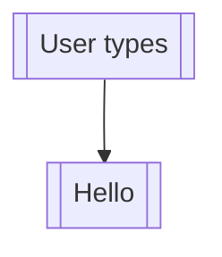
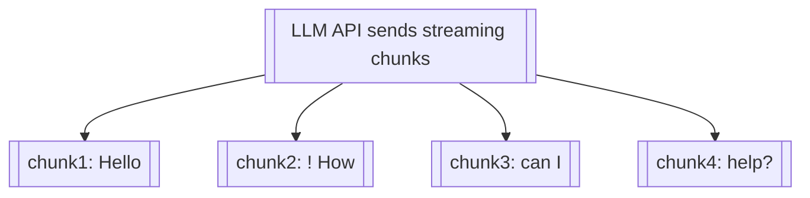

<!-- SPDX-License-Identifier: CC-BY-NC-4.0 -->
<!-- SPDX-FileCopyrightText: Copyright (c) 2025 Andrew Wyatt (Fewtarius) -->


# SAM Messaging Architecture

**Version:** 2.0  
**Last Updated:** November 28, 2025  
**Author:** GitHub Copilot

---

## Table of Contents

1. [Overview](#overview)
2. [Architecture Principles](#architecture-principles)
3. [Core Components](#core-components)
4. [Complete Data Flow](#complete-data-flow)
5. [Message Types](#message-types)
6. [State Management](#state-management)
7. [Performance Optimizations](#performance-optimizations)
8. [Critical Patterns](#critical-patterns)
9. [Common Issues](#common-issues)
10. [Testing & Debugging](#testing--debugging)

---

## Overview

SAM's messaging architecture implements a **single source of truth** pattern with **unidirectional data flow** to eliminate bidirectional synchronization issues and race conditions.

### Key Design Goals

- **Instant Reactivity:** UI updates <100ms after state changes
- **No Race Conditions:** Single source of truth, unidirectional flow
- **Persistence:** Non-blocking, debounced saves to disk
- **Scalability:** Handle 40+ TPS (tokens per second) streaming
- **Debuggability:** Extensive diagnostic logging

---

## Architecture Principles

### 1. Single Source of Truth

```
ConversationMessageBus.messages  ← SINGLE SOURCE OF TRUTH
         ↓
    ChatWidget.messages (computed property, read-only)
         ↓
    UI renders messages
```

**ANTI-PATTERN:**
```
ConversationModel.messages ⟷ ConversationMessageBus.messages  ← BIDIRECTIONAL (WRONG!)
```

### 2. Unidirectional Data Flow

```
AgentOrchestrator → MessageBus → ChatWidget → ToolExecutionCard
    (create)        (store)      (render)        (display)
```

**Rule:** Data flows ONE WAY. UI components NEVER modify message state.

### 3. @MainActor Isolation

All message-related components run on MainActor:

```swift
@MainActor
public class ConversationMessageBus: ObservableObject { ... }

@MainActor
public class ConversationModel: ObservableObject { ... }

// ChatWidget is a View, implicitly @MainActor
public struct ChatWidget: View { ... }
```

**Why:** Eliminates threading issues, guarantees synchronous UI updates.

### 4. ObservableObject + @Published Pattern

```swift
@MainActor
public class ConversationMessageBus: ObservableObject {
    @Published public private(set) var messages: [EnhancedMessage] = []
    //         ↑                    ↑
    //      Reactive            Read-only (setter private)
}
```

**How it works:**
1. Modify `messages` array
2. `@Published` wrapper fires `objectWillChange.send()`
3. SwiftUI re-evaluates views observing this object
4. UI updates automatically

---

## Core Components

### 1. ConversationMessageBus (@MainActor, ObservableObject)

**Purpose:** Central message store and coordinator

**Responsibilities:**
- Store messages in-memory (`@Published var messages`)
- Provide message CRUD operations
- Trigger non-blocking persistence
- Sync to ConversationModel (for persistence)
- Cache message indices for O(1) lookup

**Key Methods:**

```swift
// Add new message (streaming or complete)
func appendMessage(_ message: EnhancedMessage)

// Update existing message (during streaming)
func updateMessage(id: UUID, content: String, ...)

// Add tool execution message
func addToolMessage(id: UUID, name: String, status: ToolStatus, ...)

// Streaming updates (throttled to 30 FPS for performance)
func streamDelta(to messageId: UUID, content: String)

// Load from disk (on conversation open)
func loadInitialMessages()
```

**Performance Features:**
- **Fast lookup:** `messageCache: [UUID: Int]` maps message ID → array index (O(1))
- **Debounced saves:** Batch disk writes every 500ms during streaming
- **Throttled syncs:** Limit ConversationModel syncs to 1000/sec (1ms intervals)
- **Delta syncs:** Update single message instead of copying entire array

### 2. ConversationModel (@MainActor, ObservableObject)

**Purpose:** Persistent conversation container

**Responsibilities:**
- Own ConversationMessageBus instance
- Store conversation metadata (title, settings, etc.)
- Subscribe to MessageBus changes
- Provide JSON serialization

**Key Properties:**

```swift
@MainActor
public class ConversationModel: ObservableObject {
    public let id: UUID
    public var title: String
    public var settings: ConversationSettings
    
    // MessageBus instance (owned by conversation)
    public var messageBus: ConversationMessageBus?
    
    // COMPUTED: Messages synced FROM MessageBus
    @Published public var messages: [EnhancedMessage] = []
    
    // Sync from MessageBus
    public func syncMessagesFromMessageBus() {
        guard let messageBus = self.messageBus else { return }
        messages = messageBus.messages
        objectWillChange.send()
    }
}
```

**CRITICAL:** `messages` is synced FROM MessageBus, not the other way around!

### 3. ChatWidget (View, implicitly @MainActor)

**Purpose:** Main chat UI component

**Responsibilities:**
- Observe MessageBus for changes
- Render message list
- Handle user input
- Route messages to appropriate view components

**Key Properties:**

```swift
public struct ChatWidget: View {
    let activeConversation: ConversationModel?
    @ObservedObject private var messageBus: ConversationMessageBus
    
    // COMPUTED PROPERTY: Always read from MessageBus
    private var messages: [EnhancedMessage] {
        messageBus.messages  ← SINGLE SOURCE OF TRUTH
    }
    
    var body: some View {
        ForEach(messages) { message in
            // Render message based on type
        }
    }
}
```

**CRITICAL:** `messages` is computed property, NOT `@State`!

### 4. Message Views (MessageView, ToolExecutionCard, etc.)

**Purpose:** Render individual messages

**Responsibilities:**
- Display message content
- Handle user interactions (copy, export, expand)
- Show loading/streaming states

**Message Routing:**

```swift
struct MessageView: View {
    let message: EnhancedMessage
    
    var body: some View {
        switch message.type {
        case .user:
            UserMessageBubble(message: message)
        case .assistant:
            AssistantMessageBubble(message: message)
        case .toolExecution:
            ToolExecutionCard(message: message)
        case .thinking:
            ThinkingCard(message: message)
        case .systemStatus:
            SystemStatusCard(message: message)
        }
    }
}
```

### 5. AgentOrchestrator (@MainActor)

**Purpose:** Coordinate AI agents and tool execution

**Responsibilities:**
- Call LLM APIs
- Execute tools (parallel or sequential)
- Create messages via MessageBus
- Stream responses in real-time
- Handle user collaboration

**Message Creation Pattern:**

```swift
// User message
conversation.messageBus?.appendMessage(EnhancedMessage(
    id: UUID(),
    type: .user,
    content: userInput,
    isFromUser: true
))

// Assistant message (streaming)
let assistantId = UUID()
conversation.messageBus?.appendMessage(EnhancedMessage(
    id: assistantId,
    type: .assistant,
    content: "",
    isStreaming: true
))

// Stream deltas
for chunk in streamingResponse {
    conversation.messageBus?.streamDelta(to: assistantId, content: chunk)
}

// Mark complete
conversation.messageBus?.finalizeMessage(id: assistantId)

// Tool message
conversation.messageBus?.addToolMessage(
    id: UUID(),
    name: "image_generation",
    status: .running,
    details: [],
    toolCallId: execution.toolCallId
)
```

---

## Complete Data Flow

### User Sends Message

```

```

### LLM Streams Response

```

```

### Tool Execution Flow

```
```mermaid
flowchart TD
  A[[LLM responds with tool_calls in response]]
  B[[tool_calls: [{]]
  C[[id: call_123,]]
  D[[name: image_generation,]]
  E[[arguments: { prompt: a cat }]]
  F[[}]]]
  A --> B
  A --> C
  A --> D
  A --> E
  A --> F
```
```

---

## Message Types

### EnhancedMessage Structure

```swift
public struct EnhancedMessage: Identifiable, Codable, Equatable {
    // Core identity
    public let id: UUID
    public let timestamp: Date
    public var lastModified: Date?
    
    // Message type and content
    public var type: MessageType  // .user, .assistant, .toolExecution, etc.
    public var content: String
    public var isFromUser: Bool
    
    // Streaming state
    public var isStreaming: Bool
    
    // Tool execution metadata
    public var toolName: String?
    public var toolIcon: String?
    public var toolStatus: ToolStatus?  // .running, .success, .error
    public var toolDuration: TimeInterval?
    public var toolDetails: [String]?
    public var toolMetadata: [String: String]?
    public var toolDisplayData: ToolDisplayData?
    public var toolCallId: String?
    public var parentToolName: String?
    
    // Reasoning/thinking content (for o1 models)
    public var reasoningContent: String?
    
    // Multi-modal support
    public var contentParts: [MessageContentPart]?
    
    // Image generation results
    public var imageURLs: [URL]?
}
```

### Message Types Enum

```swift
public enum MessageType: String, Codable {
    case user           // User input
    case assistant      // LLM response
    case toolExecution  // Tool call/result (includes subagent, memory ops, etc.)
    case thinking       // Reasoning tokens (o1 models)
    case systemStatus   // System notifications
}
```

**CRITICAL:** All tool-related messages use `.toolExecution` type!

### Tool Status Enum

```swift
public enum ToolStatus: String, Codable {
    case running   // Tool currently executing
    case success   // Tool completed successfully
    case error     // Tool failed
}
```

### Message Lifecycle States

```
```mermaid
flowchart TD
  A[[CREATED │ ← appendMessage()]]
```
```

---

## State Management

### State Ownership

```
ConversationMessageBus
├─ messages: [EnhancedMessage]  ← PRIMARY STATE (owned)
├─ messageCache: [UUID: Int]    ← INDEX CACHE (owned)
└─ persistenceQueue             ← SAVE QUEUE (owned)

ConversationModel
├─ messageBus: MessageBus       ← OWNS INSTANCE
├─ messages: [EnhancedMessage]  ← SYNCED COPY (for persistence)
├─ title: String                ← CONVERSATION METADATA (owned)
└─ settings: Settings           ← SETTINGS (owned)

ChatWidget
├─ messageBus: MessageBus       ← OBSERVES (@ObservedObject)
├─ messages: [Message]          ← COMPUTED PROPERTY (read-only)
└─ activeConversation: Model    ← OBSERVES (for metadata)
```

### State Synchronization Rules

**✅ CORRECT:**
```swift
// MessageBus → ConversationModel (one-way sync)
conversation.syncMessagesFromMessageBus() {
    messages = messageBus.messages  // Copy for persistence
}

// ChatWidget reads from MessageBus (computed property)
private var messages: [EnhancedMessage] {
    messageBus.messages  // Always fresh
}
```

**❌ WRONG:**
```swift
// NEVER sync ConversationModel → MessageBus
messageBus.messages = conversation.messages  // BIDIRECTIONAL (BAD!)

// NEVER store messages in ChatWidget state
@State private var messages: [EnhancedMessage]  // STALE DATA (BAD!)
```

### Persistence Strategy

**Non-blocking, debounced saves:**

```swift
private func scheduleSave() {
    saveTimer?.invalidate()
    saveTimer = Timer.scheduledTimer(
        withTimeInterval: 0.5,  // 500ms debounce
        repeats: false
    ) { _ in
        self.saveToConversation()
    }
}

private func saveToConversation() {
    persistenceQueue.async {  // Background thread
        guard let conversation = self.conversation else { return }
        
        // Sync messages to conversation
        await MainActor.run {
            conversation.syncMessagesFromMessageBus()
        }
        
        // Save conversation JSON to disk
        try? conversationManager.saveConversation(conversation)
    }
}
```

**Why debounce:**
- Prevents disk I/O on every streaming chunk (40+ writes/sec)
- Batches saves during rapid updates
- Max 2 saves/second during streaming

**When to force immediate save:**
- Conversation closes
- App terminates
- Tool execution completes
- User explicitly saves

---

## Performance Optimizations

### 1. Message Index Cache

**Problem:** Finding message by ID in array is O(n)

**Solution:** Maintain index cache

```swift
private var messageCache: [UUID: Int] = [:]

func appendMessage(_ message: EnhancedMessage) {
    messages.append(message)
    messageCache[message.id] = messages.count - 1  // O(1) lookup
}

func getMessage(id: UUID) -> EnhancedMessage? {
    guard let index = messageCache[id] else { return nil }
    return messages[index]  // O(1) access
}
```

**Rebuild cache when:**
- Loading messages from disk
- Array is sorted/reordered
- Messages are deleted (indices change)

### 2. Streaming Throttle (30 FPS)

**Problem:** 40 TPS streaming causes 40 UI updates/second → UI churn

**Solution:** Throttle updates to 30 FPS (33ms intervals)

```swift
func streamDelta(to messageId: UUID, content: String) {
    let now = Date()
    
    // Throttle: Only update if 33ms passed since last update
    if let last = lastDeltaSyncTime, 
       now.timeIntervalSince(last) < 0.033 {
        // Too soon, skip this update
        return
    }
    
    lastDeltaSyncTime = now
    
    // Update message
    if let index = messageCache[messageId] {
        messages[index].content = content
        objectWillChange.send()
    }
}
```

**Result:**
- Smooth streaming at 30 FPS (human perception limit)
- Reduced CPU/GPU usage
- No visual stuttering

### 3. Debounced Persistence (500ms)

**Problem:** Saving on every chunk causes excessive disk I/O

**Solution:** Batch saves every 500ms

```swift
private var saveTimer: Timer?

func scheduleSave() {
    saveTimer?.invalidate()  // Cancel pending save
    saveTimer = Timer.scheduledTimer(
        withTimeInterval: 0.5,
        repeats: false
    ) { _ in
        self.saveToConversation()
    }
}
```

**Result:**
- Max 2 disk writes/second during streaming
- Reduced SSD wear
- Lower CPU usage

### 4. Tool Hierarchy Caching

**Problem:** Building parent-child tool relationships is O(n²)

**Solution:** Cache and only rebuild on messages change

```swift
@State private var cachedToolHierarchy: [UUID: [EnhancedMessage]] = [:]

.onChange(of: messages) { _, newMessages in
    cachedToolHierarchy = buildToolHierarchy(messages: newMessages)
}

// Use cached hierarchy in view
ForEach(messages) { message in
    if message.isToolMessage {
        ToolMessageWithChildren(
            message: message,
            children: cachedToolHierarchy[message.id] ?? []
        )
    }
}
```

**Result:**
- Hierarchy built once per messages change
- No recalculation during typing, scrolling, etc.

### 5. Stable View IDs (Anti-Flicker)

**Problem:** Using content hash in view ID causes recreation on content change

**Solution:** Use stable UUID-based IDs

```swift
// WRONG: View recreated on every content change
.id("\(message.id)-\(message.content.hashValue)")

// CORRECT: Stable ID throughout message lifecycle
.id(message.id.uuidString)
```

**Result:**
- No bubble collapse/expand flicker during streaming
- Smooth content updates within existing view
- Better performance (no view recreation)

### 6. Forced @Published Trigger for Tool Messages

**Problem:** `@Published` doesn't always detect array mutations

**Solution:** Reassign array to force value change

```swift
messages.append(message)
messages = messages  // Force @Published to trigger
```

**Why needed:** SwiftUI detects VALUE changes, not CONTENT changes

---

## Critical Patterns

### Pattern 1: Tool Message Creation

**ALWAYS use this pattern for tool messages:**

```swift
// Step 1: Create message with EMPTY content, running status
let toolMessageId = messageBus.addToolMessage(
    id: UUID(),
    name: "image_generation",
    status: .running,      // CRITICAL: Start as running
    details: [],
    toolDisplayData: nil,
    toolCallId: execution.toolCallId
)

// Step 2: Execute tool in background
let result = await executeTool(name: "image_generation", args: args)

// Step 3: Update message with results
messageBus.updateMessage(
    id: toolMessageId,
    content: result.output,     // Fill in content NOW
    status: result.success ? .success : .error,
    duration: result.duration
)
```

**CRITICAL:** Don't wait for tool to complete before creating message!

### Pattern 2: Streaming Response

**ALWAYS use this pattern for streaming:**

```swift
// Step 1: Create empty message, mark as streaming
let assistantId = UUID()
messageBus.appendMessage(EnhancedMessage(
    id: assistantId,
    type: .assistant,
    content: "",
    isStreaming: true  // CRITICAL: Mark as streaming
))

// Step 2: Stream chunks (throttled automatically)
for await chunk in stream {
    messageBus.streamDelta(to: assistantId, content: chunk)
}

// Step 3: Finalize (mark streaming complete)
messageBus.finalizeMessage(id: assistantId)
```

### Pattern 3: Message Filtering in UI

**ALWAYS use this pattern for filtering:**

```swift
let isEmpty = message.content.isEmpty && 
              message.type != .toolExecution &&  // NEVER filter tool cards
              (message.type != .thinking || (message.reasoningContent == nil || message.reasoningContent!.isEmpty)) &&
              (message.contentParts == nil || message.contentParts!.isEmpty)

if !isEmpty {
    // Render message
}
```

**CRITICAL:** Tool execution messages MUST be exempt from empty filter!

### Pattern 4: ObservedObject + Computed Property

**ALWAYS use this pattern in views:**

```swift
public struct ChatWidget: View {
    @ObservedObject private var messageBus: ConversationMessageBus
    
    // Computed property, NOT @State
    private var messages: [EnhancedMessage] {
        messageBus.messages  ← SINGLE SOURCE OF TRUTH
    }
    
    var body: some View {
        ForEach(messages) { message in
            // Render
        }
    }
}
```

**CRITICAL:** Use `@ObservedObject` + computed property, NOT `@State`!

---

## Common Issues

### Issue 1: Messages Not Appearing

**Symptom:** New messages don't appear in UI

**Causes:**
1. `@State` instead of `@ObservedObject`
2. Empty message filter blocking toolExecution
3. `@Published` not firing

**Diagnosis:**
```bash
# Check if message added to array
grep "CHAT_RENDER_LOOP" sam_server.log | grep <messageId>

# Check if objectWillChange fired
grep "IMMEDIATE_RENDER" sam_server.log | grep <messageId>
```

**Fix:**
- Use `@ObservedObject` + computed property
- Exempt toolExecution from isEmpty filter
- Force @Published with array reassignment

### Issue 2: Messages Appearing Late (Delayed)

**Symptom:** Tool cards appear 2-6 seconds after creation

**Causes:**
1. Empty filter blocking render
2. Async Task delaying sync
3. View filtering out message

**Diagnosis:**
```bash
# Check timing between creation and render
grep "IMMEDIATE_RENDER\|TOOL_CARD_RENDERED" sam_server.log | \
  grep <messageId>

# Expect < 100ms delta
```

**Fix:**
- Exempt toolExecution from isEmpty filter
- Use synchronous sync (not Task { @MainActor })
- Verify message passes all filters

### Issue 3: Streaming Flickering

**Symptom:** Message bubbles collapse/expand during streaming

**Causes:**
1. Content hash in view ID
2. View recreated on content change

**Diagnosis:**
```swift
// Check if view ID includes content
.id("\(message.id)-\(message.content.hashValue)")  // BAD!
```

**Fix:**
```swift
// Use stable ID
.id(message.id.uuidString)  // GOOD!
```

### Issue 4: Missing Tool Output

**Symptom:** Tool cards show "Operation completed successfully" instead of actual output

**Causes:**
1. SUCCESS messages filtered as "progress indicators"
2. Content not displayed in Output section

**Diagnosis:**
```swift
// Check if SUCCESS messages are filtered
let isProgressMessage = message.content.hasPrefix("SUCCESS: ")
if !isProgressMessage {
    // Show output  ← SUCCESS never shown!
}
```

**Fix:**
```swift
// Only filter "→ " progress indicators
let isProgressIndicator = message.content.hasPrefix("→ ")
if !isProgressIndicator {
    MarkdownText(message.content)  // Shows SUCCESS
}
```

### Issue 5: Tool Card Titles Changing

**Symptom:** Title changes from "Image Generation" to "SUCCESS: ..."

**Causes:**
1. Content parsing prioritized over toolName
2. Title extracted from SUCCESS message

**Diagnosis:**
```swift
// Check getOperationDisplayName priority
if content.hasPrefix("SUCCESS: ") {
    return extractedAction  // Parses content FIRST
}
return getToolDisplayName(toolName)  // Never reached!
```

**Fix:**
```swift
// Prefer toolName over content parsing
if let toolName = toolName {
    return getToolDisplayName(toolName)  // Use this FIRST
}
// Content parsing only as fallback
```

---

## Testing & Debugging

### Diagnostic Logging

**Enable verbose logging:**

```swift
// MessageBus
logger.debug("IMMEDIATE_RENDER: Forced array reassignment id=\(id)")
logger.debug("IMMEDIATE_SYNC: Syncing synchronously id=\(id)")

// ChatWidget  
logger.info("[CHAT_RENDER_LOOP] Processing msg=\(id), len=\(len), type=\(type)")
logger.info("[FILTER_CHECK] msg=\(id), willRender=\(willRender)")

// ToolExecutionCard
logger.error("TOOL_CARD_RENDERED: tool=\(toolName) id=\(id)")
```

**Search logs:**
```bash
# Full message lifecycle
grep "IMMEDIATE_RENDER\|IMMEDIATE_SYNC\|RENDER_LOOP\|TOOL_CARD_RENDERED" sam_server.log

# Specific message
grep "<message-id-prefix>" sam_server.log

# Timing analysis
grep "TS:[0-9]" sam_server.log | grep <tool-call-id>
```

### Performance Monitoring

**Measure render timing:**

```swift
// MessageBus
let perfStart = CFAbsoluteTimeGetCurrent()
defer {
    InternalOperationMonitor.shared.record("MessageBus.appendMessage",
                                    duration: CFAbsoluteTimeGetCurrent() - perfStart)
}
```

**Expected timings:**
- `MessageBus.appendMessage`: < 1ms
- `ConversationModel.syncMessagesFromMessageBus`: < 5ms
- Tool card render (IMMEDIATE_RENDER → TOOL_CARD_RENDERED): < 100ms
- Streaming chunk update: < 33ms (30 FPS)

### Test Checklist

**Message Creation:**
- [ ] User messages appear instantly (<100ms)
- [ ] Tool messages appear instantly, even when empty
- [ ] Streaming messages update smoothly (no flicker)
- [ ] Messages persist after app restart

**Tool Execution:**
- [ ] Tool cards appear when execution STARTS (not completes)
- [ ] Tool card titles stay stable (don't change to content)
- [ ] SUCCESS messages appear in Output section
- [ ] Error tool cards auto-expand
- [ ] Tool duration displays correctly

**Performance:**
- [ ] Streaming at 40 TPS doesn't lag UI
- [ ] No excessive disk I/O during streaming
- [ ] Tool hierarchy builds quickly
- [ ] Large conversations (100+ messages) scroll smoothly

---

## Related Documentation

- `docs/TOOL_CARD_ARCHITECTURE.md` - Detailed tool card documentation
- `docs/MESSAGE_CREATION_FLOW.md` - Legacy message flow documentation
- `Sources/ConversationEngine/ConversationMessageBus.swift` - Core message bus
- `Sources/ConversationEngine/ConversationModel.swift` - Conversation container
- `Sources/UserInterface/Chat/ChatWidget.swift` - Main chat UI
- `Sources/UserInterface/Chat/MessageView.swift` - Message rendering
- `Sources/APIFramework/AgentOrchestrator.swift` - Message creation

---

## Future Improvements

### 1. Incremental Loading

Load messages in chunks for large conversations:

```swift
func loadMessages(offset: Int, limit: Int) -> [EnhancedMessage]
```

### 2. Message Pagination

Render only visible messages + buffer:

```swift
@State private var visibleRange: Range<Int>
```

### 3. Optimistic Updates

Show user messages immediately, retry on failure:

```swift
func appendMessage(_ message: EnhancedMessage, optimistic: Bool = false)
```

### 4. Message Diffing

Only re-render changed messages:

```swift
func diff(old: [EnhancedMessage], new: [EnhancedMessage]) -> [Change]
```

### 5. Structured Tool Results

Replace string parsing with structured data:

```swift
message.toolResult = ToolResult(
    success: true,
    outputs: [.image(url), .text(content)],
    metadata: [:]
)
```

---

## Conclusion

SAM's messaging architecture prioritizes:

1. **Single Source of Truth** - Eliminates sync issues
2. **Unidirectional Flow** - Data flows one way (create → store → render)
3. **Instant Reactivity** - UI updates <100ms via @Published/@ObservedObject
4. **Performance** - Throttling, caching, debouncing for smooth UX
5. **Debuggability** - Extensive logging for diagnosing issues

**Remember:** Messages flow FROM MessageBus TO UI, never backwards!

**Key Takeaway:** Tool messages are created EMPTY and filled in later - all filtering and rendering logic must account for this lifecycle.
