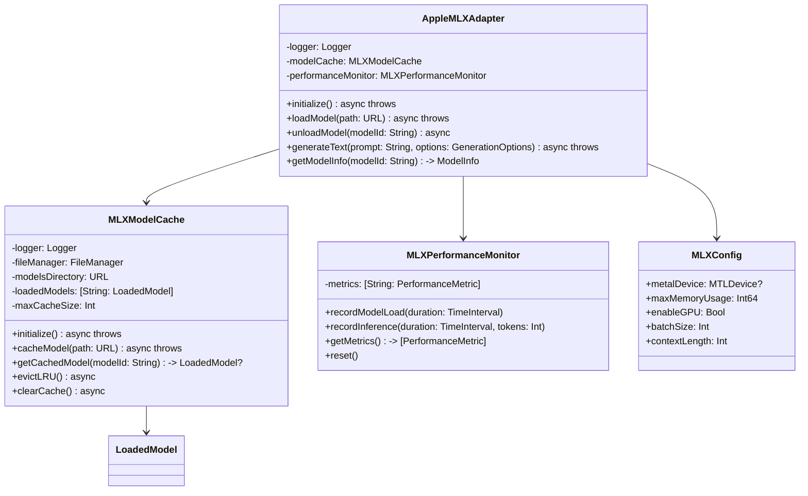
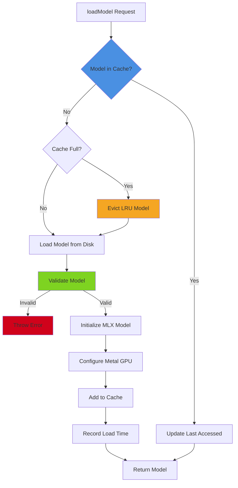
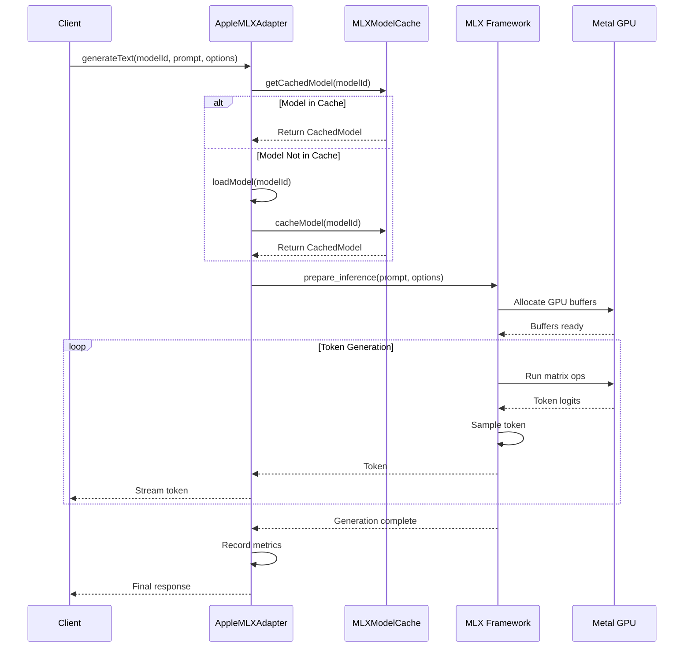

<!-- SPDX-License-Identifier: CC-BY-NC-4.0 -->
<!-- SPDX-FileCopyrightText: Copyright (c) 2025 Andrew Wyatt (Fewtarius) -->


# MLX Integration

**Version:** 2.2  
**Last Updated:** December 1, 2025  
**Location:** `Sources/MLXIntegration/`

## Overview

The MLX Integration provides a Swift wrapper around Apple's MLX framework for efficient on-device machine learning inference. It manages MLX model lifecycle, caching, performance monitoring, and Metal GPU acceleration for local language models.

**Key Responsibilities:**
- MLX framework Swift bindings
- Model caching and lifecycle management
- Metal GPU acceleration configuration
- Performance monitoring and optimization
- Memory management for large models
- Model loading and unloading
- Inference request handling

**Design Philosophy:**
- Minimal overhead Swift wrapper over MLX
- Efficient memory management (lazy loading, LRU cache)
- Metal-first architecture (GPU by default, CPU fallback)
- Performance monitoring at every layer
- Graceful degradation on errors

---

## Architecture



---

## Core Components

### AppleMLXAdapter

**File:** `AppleMLXAdapter.swift`  
**Type:** Main facade for MLX operations  
**Purpose:** Primary interface for MLX model loading and inference

**Key Features:**
- Lazy model loading (load on first use)
- Automatic model caching
- Performance tracking
- Metal GPU acceleration
- Error handling and recovery

**Public Interface:**

```swift
@MainActor
public class AppleMLXAdapter {
    public static let shared = AppleMLXAdapter()
    
    private let logger = Logger(label: "com.sam.mlx")
    private let modelCache = MLXModelCache()
    private let performanceMonitor = MLXPerformanceMonitor()
    private var config: MLXConfig
    
    // Initialization
    public func initialize() async throws
    
    // Model Management
    public func loadModel(path: URL, modelId: String) async throws -> LoadedModel
    public func unloadModel(modelId: String) async
    public func isModelLoaded(modelId: String) -> Bool
    public func getModelInfo(modelId: String) -> ModelInfo?
    
    // Inference
    public func generateText(
        modelId: String,
        prompt: String,
        options: GenerationOptions
    ) async throws -> String
    
    public func generateTextStreaming(
        modelId: String,
        prompt: String,
        options: GenerationOptions,
        onToken: @escaping (String) -> Void
    ) async throws
    
    // Configuration
    public func updateConfig(_ config: MLXConfig)
    public func getConfig() -> MLXConfig
}
```

**Generation Options:**

```swift
public struct GenerationOptions {
    public var temperature: Double = 0.7
    public var topP: Double = 0.9
    public var maxTokens: Int = 512
    public var stopSequences: [String] = []
    public var repetitionPenalty: Double = 1.0
    public var seed: Int? = nil
}
```

**Usage Example:**

```swift
let adapter = AppleMLXAdapter.shared
try await adapter.initialize()

// Load model
let model = try await adapter.loadModel(
    path: URL(fileURLWithPath: "~/Library/Caches/sam/models/mlx-model"),
    modelId: "llama-3-8b"
)

// Generate text
let options = GenerationOptions(temperature: 0.7, maxTokens: 256)
let response = try await adapter.generateText(
    modelId: "llama-3-8b",
    prompt: "Hello, how are you?",
    options: options
)

// Clean up when done
await adapter.unloadModel(modelId: "llama-3-8b")
```

---

### MLXModelCache

**File:** `MLXModelCache.swift`  
**Purpose:** Manage in-memory cache of loaded MLX models

**Key Features:**
- LRU eviction policy
- Configurable cache size
- Model validation before caching
- SHA-256 model verification
- Automatic eviction on memory pressure

**Cache Structure:**

```swift
private struct CachedModel {
    let modelId: String
    let path: URL
    let mlxModel: Any  // Actual MLX model object
    let metadata: ModelMetadata
    let loadedAt: Date
    var lastAccessedAt: Date
    var accessCount: Int
}
```

**Public Interface:**

```swift
public class MLXModelCache {
    private let logger = Logger(label: "com.sam.mlx.cache")
    private let fileManager = FileManager.default
    
    private var modelsDirectory: URL?
    private var cache: [String: CachedModel] = [:]
    private let maxCacheSize: Int = 3  // Max models in memory
    
    // Initialization
    public func initialize() async throws
    
    // Caching
    public func cacheModel(path: URL, modelId: String) async throws -> CachedModel
    public func getCachedModel(modelId: String) -> CachedModel?
    public func evictModel(modelId: String) async
    public func evictLRU() async  // Evict least recently used
    public func clearCache() async
    
    // Validation
    func validateModel(at path: URL) throws -> Bool
    func calculateChecksum(for path: URL) throws -> String
}
```

**LRU Eviction Logic:**

```swift
private func evictLRU() async {
    guard cache.count >= maxCacheSize else { return }
    
    // Find least recently used model
    let lru = cache.values.min { 
        $0.lastAccessedAt < $1.lastAccessedAt 
    }
    
    if let modelToEvict = lru {
        logger.info("Evicting LRU model: \(modelToEvict.modelId)")
        await evictModel(modelId: modelToEvict.modelId)
    }
}
```

---

### MLXPerformanceMonitor

**File:** `MLXPerformanceMonitor.swift`  
**Purpose:** Track and report MLX performance metrics

**Tracked Metrics:**
- Model load time (initialization duration)
- Inference latency (time per request)
- Token generation rate (tokens/second)
- Memory usage (peak and current)
- GPU utilization (Metal performance)
- Cache hit rate

**Public Interface:**

```swift
public class MLXPerformanceMonitor {
    private var metrics: [String: PerformanceMetric] = [:]
    
    // Recording
    public func recordModelLoad(modelId: String, duration: TimeInterval)
    public func recordInference(modelId: String, duration: TimeInterval, tokens: Int)
    public func recordMemoryUsage(bytes: Int64)
    public func recordGPUUtilization(percent: Double)
    
    // Retrieval
    public func getMetrics(for modelId: String) -> PerformanceMetric?
    public func getAllMetrics() -> [String: PerformanceMetric]
    public func getAverageInferenceTime() -> TimeInterval
    public func getTokensPerSecond() -> Double
    
    // Management
    public func reset()
    public func resetForModel(_ modelId: String)
}
```

**Performance Metric:**

```swift
public struct PerformanceMetric {
    public var modelId: String
    public var loadTime: TimeInterval
    public var inferenceCount: Int
    public var totalInferenceTime: TimeInterval
    public var totalTokensGenerated: Int
    public var averageTokensPerSecond: Double
    public var peakMemoryUsage: Int64
    public var averageGPUUtilization: Double
    
    public var averageInferenceTime: TimeInterval {
        totalInferenceTime / Double(max(inferenceCount, 1))
    }
}
```

---

### MLXConfig

**File:** `MLXConfig.swift`  
**Purpose:** Configuration for MLX runtime behavior

**Configuration Options:**

```swift
public struct MLXConfig {
    // Metal/GPU Configuration
    public var enableGPU: Bool = true
    public var metalDevice: MTLDevice? = MTLCreateSystemDefaultDevice()
    public var preferredDeviceType: MLXDeviceType = .gpu
    
    // Memory Management
    public var maxMemoryUsage: Int64 = 8 * 1024 * 1024 * 1024  // 8GB
    public var enableMemoryMapping: Bool = true
    public var maxCacheSize: Int = 3  // Max models in memory
    
    // Performance
    public var batchSize: Int = 1
    public var maxContextLength: Int = 4096
    public var enableKVCache: Bool = true
    
    // Inference
    public var defaultTemperature: Double = 0.7
    public var defaultTopP: Double = 0.9
    public var defaultMaxTokens: Int = 512
}

public enum MLXDeviceType {
    case gpu
    case cpu
    case auto  // Select based on availability
}
```

---

## Metal GPU Integration

### Device Selection

```swift
private func selectMetalDevice() -> MTLDevice? {
    switch config.preferredDeviceType {
    case .gpu:
        return MTLCreateSystemDefaultDevice()
    case .cpu:
        return nil  // Force CPU
    case .auto:
        // Check if Metal is available
        if let device = MTLCreateSystemDefaultDevice() {
            logger.info("Using Metal GPU: \(device.name)")
            return device
        } else {
            logger.warning("Metal GPU not available, falling back to CPU")
            return nil
        }
    }
}
```

### Performance Optimization

**GPU Acceleration:**
- Matrix operations run on Metal GPU
- Automatic batching for efficiency
- KV cache for faster inference
- Memory-mapped model weights

**Fallback Strategy:**
1. Try Metal GPU (preferred)
2. If unavailable, use CPU with reduced batch size
3. Log performance warnings if using CPU

---

## Model Loading Flow



---

## Inference Flow



---

## Memory Management

### Lazy Loading
- Models loaded on first use (not at startup)
- Automatic unloading when memory pressure detected
- LRU eviction for cache management

### Memory Mapping
- Large model weights memory-mapped from disk
- Reduces RAM usage for multi-GB models
- OS handles paging automatically

### Cache Management

```swift
// Monitor memory usage
func checkMemoryPressure() async {
    let currentUsage = getMemoryUsage()
    
    if currentUsage > config.maxMemoryUsage * 0.8 {
        logger.warning("Memory pressure detected, evicting LRU model")
        await modelCache.evictLRU()
    }
}
```

---

## Error Handling

### Common Errors

```swift
public enum MLXError: LocalizedError {
    case modelNotFound(String)
    case invalidModelFormat(String)
    case loadFailure(String)
    case inferenceFailure(String)
    case metalNotAvailable
    case outOfMemory
    case modelValidationFailed(String)
    
    public var errorDescription: String? {
        switch self {
        case .modelNotFound(let path):
            return "Model not found at path: \(path)"
        case .invalidModelFormat(let reason):
            return "Invalid model format: \(reason)"
        case .loadFailure(let message):
            return "Failed to load model: \(message)"
        case .inferenceFailure(let message):
            return "Inference failed: \(message)"
        case .metalNotAvailable:
            return "Metal GPU not available on this device"
        case .outOfMemory:
            return "Insufficient memory to load model"
        case .modelValidationFailed(let reason):
            return "Model validation failed: \(reason)"
        }
    }
}
```

### Recovery Strategies

```swift
func loadModelWithRetry(path: URL, modelId: String, retries: Int = 3) async throws -> LoadedModel {
    var lastError: Error?
    
    for attempt in 1...retries {
        do {
            return try await loadModel(path: path, modelId: modelId)
        } catch MLXError.outOfMemory {
            // Try to free memory and retry
            logger.warning("Out of memory on attempt \(attempt), evicting cache")
            await modelCache.evictLRU()
            lastError = error
        } catch {
            throw error  // Don't retry other errors
        }
    }
    
    throw lastError ?? MLXError.loadFailure("Failed after \(retries) attempts")
}
```

---

## Integration with Other Subsystems

### APIFramework
- LocalModelManager calls MLXAdapter to load local models
- Model registry includes MLX model metadata
- Inference requests routed through MLXAdapter

### ConversationEngine
- AgentOrchestrator requests inference via MLXAdapter
- Streaming responses sent via MessageBus
- Performance metrics tracked per conversation

### ConfigurationSystem
- MLXConfig stored in ApplicationPreferences
- Model paths configured in WorkingDirectoryConfiguration
- Cache settings managed by ConfigurationManager

---

## Best Practices

### 1. Initialize Once
```swift
// ❌ WRONG: Multiple initializations
let adapter1 = AppleMLXAdapter()
let adapter2 = AppleMLXAdapter()

// ✅ RIGHT: Use singleton
let adapter = AppleMLXAdapter.shared
try await adapter.initialize()
```

### 2. Unload Models When Done
```swift
// Generate text
let response = try await adapter.generateText(...)

// Clean up
await adapter.unloadModel(modelId: "llama-3-8b")
```

### 3. Monitor Performance
```swift
let monitor = MLXPerformanceMonitor()

// Record metrics
monitor.recordInference(modelId: "model-1", duration: 2.5, tokens: 128)

// Check performance
let avgTime = monitor.getAverageInferenceTime()
let tokensPerSec = monitor.getTokensPerSecond()
logger.info("Average: \(avgTime)s, \(tokensPerSec) tokens/sec")
```

### 4. Handle Errors Gracefully
```swift
do {
    let model = try await adapter.loadModel(...)
} catch MLXError.metalNotAvailable {
    logger.warning("Metal not available, using CPU")
    // Update config to use CPU
    config.preferredDeviceType = .cpu
} catch MLXError.outOfMemory {
    logger.error("Out of memory, try smaller model")
    // Suggest model alternatives
} catch {
    logger.error("Unexpected error: \(error)")
}
```

---

## Performance Characteristics

### Typical Metrics (Apple Silicon M1/M2/M3)

| Model Size | Load Time | Tokens/Second | Memory Usage |
|------------|-----------|---------------|--------------|
| 7B params  | 2-4s      | 25-40         | 4-6 GB       |
| 13B params | 4-8s      | 15-25         | 8-12 GB      |
| 34B params | 10-20s    | 8-15          | 18-24 GB     |

**Optimization Tips:**
- Use Metal GPU (10x faster than CPU)
- Enable KV cache for faster multi-turn conversations
- Keep context length reasonable (4096 is sweet spot)
- Use memory mapping for 13B+ models

---

## File Locations

### Models Directory
```
~/Library/Caches/sam/models/
├── lmstudio-community/
│   ├── Llama-3.2-3B-Instruct-4bit-MLX/
│   ├── Meta-Llama-3.1-8B-Instruct-4bit-MLX/
│   └── other-mlx-models/
└── .managed/
    └── model_registry.json
```

### Model Structure
```
Llama-3.2-3B-Instruct-4bit-MLX/
├── config.json          # Model configuration
├── tokenizer.json       # Tokenizer config
├── weights.safetensors  # Model weights
└── tokenizer_config.json
```

---

## Recent Changes

### December 1, 2025
- Created comprehensive MLX integration documentation
- Documented Metal GPU acceleration
- Explained model caching and LRU eviction
- Added performance monitoring details

---

## See Also

- [API Framework](API_FRAMEWORK.md) - Model registry integration
- [Conversation Engine](CONVERSATION_ENGINE.md) - Inference requests
- [Configuration System](CONFIGURATION_SYSTEM.md) - MLX configuration
- [Model Loading Flow](../flows/model_loading_flow.md)
