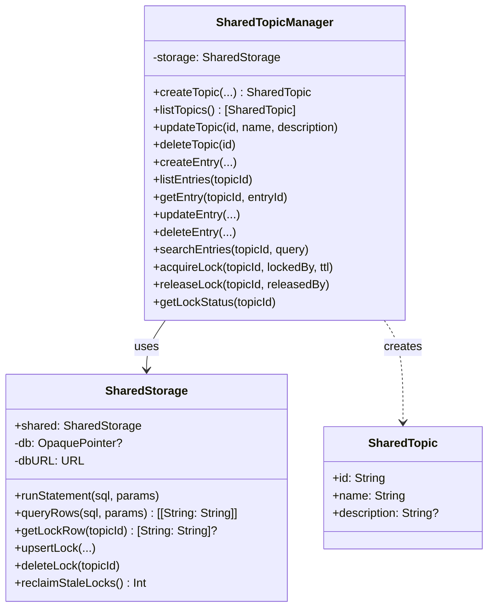
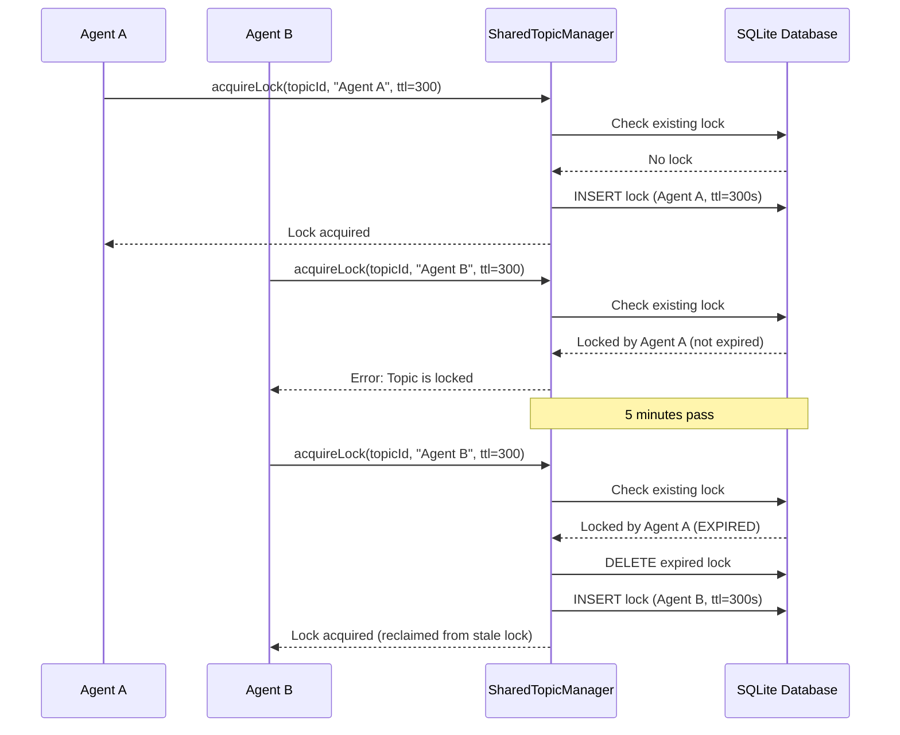

<!-- SPDX-License-Identifier: CC-BY-NC-4.0 -->
<!-- SPDX-FileCopyrightText: Copyright (c) 2025 Andrew Wyatt (Fewtarius) -->


# SharedData Subsystem

**Version:** 2.2  
**Last Updated:** December 1, 2025

## Overview

The **SharedData** subsystem provides SQLite-backed storage and management for shared topics - collaborative workspaces that multiple conversations can read from and write to.

### Purpose and Responsibilities

1. **Shared Topic Storage**: SQLite database for persistent shared data
2. **Topic Management**: Create, update, delete, list shared topics
3. **Entry Management**: Add, update, delete, search entries within topics
4. **Lock Management**: Optimistic locking for concurrent access
5. **File Directory Management**: Per-topic file directories
6. **Audit Trail**: Track all operations for compliance/debugging

---

## Architecture



---

## Database Schema

### Topics Table

```sql
CREATE TABLE topics (
    id TEXT PRIMARY KEY,                    -- UUID
    name TEXT NOT NULL,                     -- User-friendly topic name
    ownerUserId TEXT,                       -- Creator/owner
    description TEXT,                        -- Optional description
    acl TEXT,                               -- Access control list (future)
    createdAt DATETIME DEFAULT CURRENT_TIMESTAMP,
    updatedAt DATETIME DEFAULT CURRENT_TIMESTAMP
);
```

### Entries Table

```sql
CREATE TABLE entries (
    id TEXT PRIMARY KEY,                    -- UUID
    topicId TEXT NOT NULL,                  -- Foreign key to topics
    key TEXT,                               -- Optional key for lookup
    content TEXT,                           -- Entry content
    vectors BLOB,                           -- Vector embeddings (future)
    contentType TEXT,                       -- "text", "markdown", "json"
    createdBy TEXT,                         -- Who created this entry
    createdAt DATETIME DEFAULT CURRENT_TIMESTAMP,
    updatedAt DATETIME DEFAULT CURRENT_TIMESTAMP,
    FOREIGN KEY(topicId) REFERENCES topics(id)
);
```

### Locks Table

```sql
CREATE TABLE locks (
    topicId TEXT PRIMARY KEY,               -- One lock per topic
    lockedBy TEXT,                          -- Who holds the lock
    lockToken TEXT,                         -- Lock token (unused currently)
    acquiredAt DATETIME,                    -- When lock was acquired
    ttlSeconds INTEGER                      -- Time-to-live in seconds
);
```

### Audit Table

```sql
CREATE TABLE audit (
    id TEXT PRIMARY KEY,                    -- UUID
    topicId TEXT,                           -- Related topic
    action TEXT,                            -- "create_topic", "create_entry", etc.
    performedBy TEXT,                       -- Who performed the action
    details TEXT,                           -- Additional details (JSON or plain text)
    timestamp DATETIME DEFAULT CURRENT_TIMESTAMP
);
```

---

## File System Integration

### Topic Files Directory

Each shared topic gets a dedicated files directory:

**Location:** `~/workspaces/{topicName}/`

**Example:**
```
~/workspaces/
├── research-project/                       # Shared topic "Research Project"
│   ├── data.csv
│   ├── analysis.py
│   └── report.md
└── team-notes/                             # Shared topic "Team Notes"
    ├── meeting_notes.md
    └── action_items.json
```

**Directory Creation:**
- Created automatically when topic is created
- Name sanitized (slashes replaced with dashes)
- Renamed automatically when topic name changes
- Deleted automatically when topic is deleted

---

## Public Interfaces

### SharedTopicManager

**Topic Operations:**

```swift
/// Create new shared topic
func createTopic(
    id: String = UUID().uuidString,
    name: String,
    description: String? = nil,
    ownerUserId: String? = nil,
    acl: String? = nil
) throws -> SharedTopic

/// List all topics
func listTopics() throws -> [SharedTopic]

/// Update topic name/description
func updateTopic(id: UUID, name: String, description: String?) throws

/// Delete topic and all associated data
func deleteTopic(id: UUID) throws
```

**Entry Operations:**

```swift
/// Create entry in topic
func createEntry(
    topicId: String,
    entryId: String = UUID().uuidString,
    key: String? = nil,
    content: String,
    contentType: String? = nil,
    createdBy: String? = nil
) throws

/// List all entries in topic
func listEntries(topicId: String) throws -> [[String: String]]

/// Get specific entry
func getEntry(topicId: String, entryId: String) throws -> [String: String]?

/// Update entry
func updateEntry(
    topicId: String,
    entryId: String,
    key: String? = nil,
    content: String,
    contentType: String? = nil,
    updatedBy: String? = nil
) throws

/// Delete entry
func deleteEntry(topicId: String, entryId: String, deletedBy: String?) throws

/// Search entries by query
func searchEntries(topicId: String, query: String) throws -> [[String: String]]
```

**Lock Operations:**

```swift
/// Acquire lock on topic
func acquireLock(topicId: String, lockedBy: String, ttlSeconds: Int?) throws

/// Release lock on topic
func releaseLock(topicId: String, releasedBy: String) throws

/// Get lock status
func getLockStatus(topicId: String) throws -> [String: String]?
```

---

## Lock Management

### Optimistic Locking

**Purpose:** Prevent concurrent modifications to shared topics

**Lock Lifecycle:**



### Lock Expiration

**TTL-based expiration:**
- Locks have time-to-live (default: 300 seconds)
- Expired locks are automatically reclaimed
- `acquiredAt + ttlSeconds < NOW` = expired

**Stale Lock Reclamation:**

```swift
/// Clean up expired locks
let reclaimedCount = try storage.reclaimStaleLocks()
// Returns number of locks reclaimed
```

---

## Audit Trail

Every operation is logged to the `audit` table:

```swift
private func logAudit(
    topicId: String,
    action: String,
    performedBy: String,
    details: String
) throws {
    let id = UUID().uuidString
    let sql = "INSERT INTO audit (id, topicId, action, performedBy, details) VALUES (?, ?, ?, ?, ?)"
    try storage.runStatement(sql, params: [id, topicId, action, performedBy, details])
}
```

**Audited Actions:**
- `create_topic`
- `update_topic`
- `delete_topic`
- `create_entry`
- `update_entry`
- `delete_entry`
- `acquire_lock`
- `release_lock`

---

## File Locations

### Source Files
```
Sources/SharedData/
├── SharedStorage.swift              # SQLite wrapper
└── SharedTopicManager.swift         # Topic/entry/lock management
```

### Database Location
```
~/Library/Application Support/SAM/
└── shared_memory.db                 # SQLite database
```

### Topic Files
```
~/workspaces/
└── {topic-name}/                    # Per-topic files directory
```

---

## Usage Examples

### Creating a Shared Topic

```swift
let manager = SharedTopicManager()

let topic = try manager.createTopic(
    name: "Research Project",
    description: "Shared research data and analysis",
    ownerUserId: "user123"
)
// Creates ~/workspaces/Research-Project/ directory
```

### Adding Entries

```swift
// Add text entry
try manager.createEntry(
    topicId: topic.id,
    key: "findings",
    content: "Discovered significant correlation between X and Y",
    contentType: "text",
    createdBy: "agent_1"
)

// Add JSON entry
try manager.createEntry(
    topicId: topic.id,
    key: "config",
    content: #"{"threshold": 0.85, "enabled": true}"#,
    contentType: "json",
    createdBy: "agent_2"
)
```

### Searching Entries

```swift
// Search for "correlation"
let results = try manager.searchEntries(topicId: topic.id, query: "correlation")
// Returns entries where key or content contains "correlation"
```

### Lock Workflow

```swift
// Agent A acquires lock
try manager.acquireLock(topicId: topic.id, lockedBy: "agent_a", ttlSeconds: 300)

// Agent A modifies topic
try manager.createEntry(topicId: topic.id, content: "New data")

// Agent A releases lock
try manager.releaseLock(topicId: topic.id, releasedBy: "agent_a")
```

---

## Integration with Conversations

Conversations can reference shared topics via `sharedTopicId`:

```swift
// In ConversationSettings
struct ConversationSettings {
    ...
    var sharedTopicId: UUID?  // Link to shared topic
}
```

**Workflow:**
1. User creates shared topic via UI
2. Multiple conversations link to same topic
3. Agents can read/write entries in shared topic
4. All agents see the same data

---

## Related Documentation

- [MCP Tools User Guide](../MCP_TOOLS_USER_GUIDE.md)
- [Shared Topics API](../SHARED_TOPICS_API.md)
- [ConversationEngine Subsystem](CONVERSATION_ENGINE.md)
