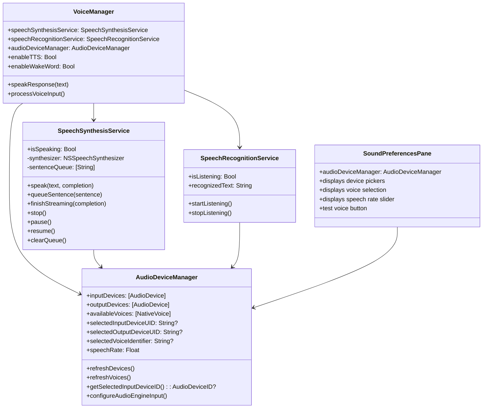
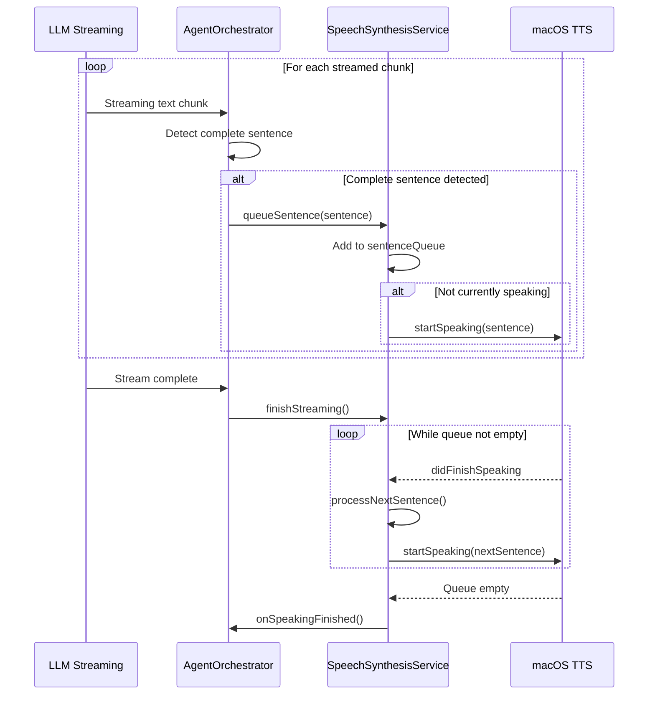

<!-- SPDX-License-Identifier: CC-BY-NC-4.0 -->
<!-- SPDX-FileCopyrightText: Copyright (c) 2025 Andrew Wyatt (Fewtarius) -->


# Sound Subsystem

**Component:** `Sources/VoiceFramework/`  
**Purpose:** Audio device management, text-to-speech synthesis, and voice input/output  
**Last Updated:** December 5, 2025

---

## Table of Contents

- [Overview](#overview)
- [Architecture](#architecture)
- [Audio Device Manager](#audio-device-manager)
- [Speech Synthesis Service](#speech-synthesis-service)
- [Streaming TTS](#streaming-tts)
- [Preferences Integration](#preferences-integration)
- [Public Interfaces](#public-interfaces)
- [Recent Changes](#recent-changes)

---

## Overview

The Sound subsystem provides comprehensive audio capabilities for SAM, including text-to-speech synthesis, audio device management, and voice preferences. It uses native macOS APIs (NSSpeechSynthesizer, CoreAudio) for optimal performance and natural-sounding speech.

### Key Features

- **Native macOS TTS**: NSSpeechSynthesizer for natural-sounding voices
- **Streaming TTS**: Speak sentences as they are generated during LLM streaming
- **Audio Device Management**: Input/output device selection with automatic detection
- **Voice Selection**: Browse and select from available system voices
- **Speech Rate Control**: Adjustable speaking speed (0.5x to 1.5x)
- **Preferences Persistence**: Settings saved via UserDefaults

---

## Architecture

### Component Diagram



### Component Responsibilities

| Component | Responsibility | File |
|-----------|---------------|------|
| **AudioDeviceManager** | Device enumeration, voice discovery, settings persistence | AudioDeviceManager.swift |
| **SpeechSynthesisService** | Text-to-speech synthesis, streaming TTS, markdown stripping | SpeechSynthesisService.swift |
| **SpeechRecognitionService** | Voice input, wake word detection | SpeechRecognitionService.swift |
| **VoiceManager** | Coordination between speech services | VoiceManager.swift |
| **SoundPreferencesPane** | UI for audio/voice configuration | SoundPreferencesPane.swift |

---

## Audio Device Manager

**File:** `Sources/VoiceFramework/AudioDeviceManager.swift`

The AudioDeviceManager provides a unified interface for enumerating and selecting audio devices on macOS using CoreAudio APIs.

### Device Discovery

```swift
/// Available input devices (microphones)
@Published public private(set) var inputDevices: [AudioDevice] = []

/// Available output devices (speakers)
@Published public private(set) var outputDevices: [AudioDevice] = []

/// Refresh the list of available audio devices
public func refreshDevices() {
    inputDevices = getAudioDevices(isInput: true)
    outputDevices = getAudioDevices(isInput: false)
}
```

### Voice Discovery

Uses NSSpeechSynthesizer for reliable voice enumeration:

```swift
/// Available system voices (native macOS voices)
@Published public private(set) var availableVoices: [NativeVoice] = []

/// Refresh voices using native macOS API
public func refreshVoices() {
    let voices = NSSpeechSynthesizer.availableVoices
    availableVoices = voices.compactMap { voiceName in
        let attrs = NSSpeechSynthesizer.attributes(forVoice: voiceName)
        guard let name = attrs[.name] as? String,
              let language = attrs[.localeIdentifier] as? String else {
            return nil
        }
        return NativeVoice(id: voiceName.rawValue, name: name, language: language)
    }
    .filter { $0.language.hasPrefix("en") }  // English voices only
    .sorted { $0.name < $1.name }
}
```

### Settings Persistence

All audio settings persist via UserDefaults:

| Setting | Key | Type |
|---------|-----|------|
| Input Device | `sam.audio.inputDeviceUID` | String? |
| Output Device | `sam.audio.outputDeviceUID` | String? |
| Voice | `sam.audio.voiceIdentifier` | String? |
| Speech Rate | `sam.audio.speechRate` | Float |

### Device Change Listener

Automatically refreshes device list when hardware changes:

```swift
AudioObjectAddPropertyListener(
    AudioObjectID(kAudioObjectSystemObject),
    &propertyAddress,
    { (_, _, _, clientData) -> OSStatus in
        let manager = Unmanaged<AudioDeviceManager>.fromOpaque(clientData!).takeUnretainedValue()
        Task { @MainActor in
            manager.refreshDevices()
        }
        return noErr
    },
    selfPtr
)
```

---

## Speech Synthesis Service

**File:** `Sources/VoiceFramework/SpeechSynthesisService.swift`

The SpeechSynthesisService provides text-to-speech capabilities using NSSpeechSynthesizer for natural-sounding macOS voices.

### Basic Speech

```swift
/// Speak text aloud with optional completion handler
public func speak(_ text: String, completion: (() -> Void)? = nil) {
    // Stop any existing speech
    synthesizer?.stopSpeaking()
    
    // Update voice in case settings changed
    updateSynthesizerVoice()
    
    // Strip markdown formatting for cleaner speech
    let cleanText = stripMarkdown(text)
    
    // Start speaking
    isSpeaking = true
    onSpeakingStarted?()
    synthesizer?.startSpeaking(cleanText)
}
```

### Markdown Stripping

Before speaking, the service removes markdown formatting:

```swift
private func stripMarkdown(_ text: String) -> String {
    var cleaned = text
    
    // Remove code blocks
    cleaned = cleaned.replacingOccurrences(of: "```[^`]*```", with: "code block", options: .regularExpression)
    
    // Remove inline code
    cleaned = cleaned.replacingOccurrences(of: "`([^`]+)`", with: "$1", options: .regularExpression)
    
    // Remove bold/italic
    cleaned = cleaned.replacingOccurrences(of: "\\*\\*([^*]+)\\*\\*", with: "$1", options: .regularExpression)
    
    // Remove headers, links, etc.
    ...
}
```

### Speech Rate Configuration

Speech rate is configured as a multiplier applied to the base rate:

```swift
let baseRate: Float = 180  // Words per minute (normal speed)
synthesizer?.rate = baseRate * rateMultiplier  // rateMultiplier from AudioDeviceManager
```

---

## Streaming TTS

The most significant feature is streaming TTS - speaking sentences as they arrive during LLM streaming responses.

### Architecture



### Queue-Based Speaking

```swift
/// Sentence queue for streaming TTS
private var sentenceQueue: [String] = []
private var isProcessingQueue = false

/// Queue a sentence for streaming TTS
public func queueSentence(_ sentence: String) {
    let cleanText = stripMarkdown(sentence.trimmingCharacters(in: .whitespacesAndNewlines))
    guard !cleanText.isEmpty else { return }
    
    sentenceQueue.append(cleanText)
    
    // Start processing queue if not already speaking
    if !isProcessingQueue {
        processNextSentence()
    }
}

/// Process the next sentence in the queue
private func processNextSentence() {
    guard !sentenceQueue.isEmpty else {
        isProcessingQueue = false
        
        // Check if streaming is complete
        if let completion = streamingCompletionHandler {
            onSpeakingFinished?()
            completion()
            streamingCompletionHandler = nil
        }
        return
    }
    
    isProcessingQueue = true
    let sentence = sentenceQueue.removeFirst()
    
    updateSynthesizerVoice()
    isSpeaking = true
    synthesizer?.startSpeaking(sentence)
}
```

### Streaming Completion

```swift
/// Mark streaming as complete - will call completion after queue finishes
public func finishStreaming(completion: (() -> Void)? = nil) {
    streamingCompletionHandler = completion
    
    // If queue is empty and not speaking, call completion immediately
    if sentenceQueue.isEmpty && !isSpeaking {
        onSpeakingFinished?()
        streamingCompletionHandler?()
        streamingCompletionHandler = nil
    }
}
```

### Delegate Handling

```swift
nonisolated public func speechSynthesizer(_ sender: NSSpeechSynthesizer, didFinishSpeaking finishedSpeaking: Bool) {
    Task { @MainActor in
        isSpeaking = false
        
        // Check if there are more sentences in the queue
        if !sentenceQueue.isEmpty {
            processNextSentence()
        } else if isProcessingQueue {
            // Queue is empty - notify finished
            onSpeakingFinished?()
            isProcessingQueue = false
            
            if let completion = streamingCompletionHandler {
                completion()
                streamingCompletionHandler = nil
            }
        }
    }
}
```

---

## Preferences Integration

**File:** `Sources/UserInterface/Preferences/SoundPreferencesPane.swift`

The Sound preferences pane provides UI for configuring audio devices and TTS settings.

### UI Components

1. **Input Device Picker**: Select microphone for voice input
2. **Output Device Picker**: Select speakers for TTS output
3. **Voice Selection**: Choose from available system voices
4. **Speech Rate Slider**: Adjust speaking speed (0.5x - 1.5x)
5. **Test Voice Button**: Preview selected voice and rate

### Shared AudioDeviceManager

The preferences pane uses a shared AudioDeviceManager instance so changes immediately affect TTS:

```swift
// In SoundPreferencesPane
@EnvironmentObject var audioDeviceManager: AudioDeviceManager

// In SpeechSynthesisService
public func setAudioDeviceManager(_ manager: AudioDeviceManager) {
    self.audioDeviceManager = manager
    updateSynthesizerVoice()
}
```

---

## Public Interfaces

### AudioDeviceManager

```swift
@MainActor
public class AudioDeviceManager: ObservableObject {
    // Device lists
    @Published public private(set) var inputDevices: [AudioDevice]
    @Published public private(set) var outputDevices: [AudioDevice]
    @Published public private(set) var availableVoices: [NativeVoice]
    
    // Selected devices (nil = system default)
    @Published public var selectedInputDeviceUID: String?
    @Published public var selectedOutputDeviceUID: String?
    @Published public var selectedVoiceIdentifier: String?
    @Published public var speechRate: Float  // 0.5 - 1.5
    
    // Methods
    public func refreshDevices()
    public func refreshVoices()
    public func getSelectedInputDeviceID() -> AudioDeviceID?
    public func getSelectedOutputDeviceID() -> AudioDeviceID?
    public func configureAudioEngineInput(_ audioEngine: AVAudioEngine, deviceID: AudioDeviceID?)
}
```

### SpeechSynthesisService

```swift
@MainActor
public class SpeechSynthesisService: NSObject, ObservableObject {
    @Published public private(set) var isSpeaking: Bool
    
    // Callbacks
    public var onSpeakingStarted: (() -> Void)?
    public var onSpeakingFinished: (() -> Void)?
    
    // Configuration
    public func setAudioDeviceManager(_ manager: AudioDeviceManager)
    
    // Basic speech
    public func speak(_ text: String, completion: (() -> Void)?)
    public func stop()
    public func pause()
    public func resume()
    
    // Streaming TTS
    public func queueSentence(_ sentence: String)
    public func finishStreaming(completion: (() -> Void)?)
    public func clearQueue()
    public var hasQueuedSentences: Bool
}
```

### Data Types

```swift
public struct AudioDevice: Identifiable, Hashable {
    public let id: AudioDeviceID
    public let name: String
    public let uid: String
    public let isInput: Bool
    public let isOutput: Bool
}

public struct NativeVoice: Identifiable, Hashable {
    public let id: String       // Voice identifier
    public let name: String     // Display name
    public let language: String // Locale identifier
    public var displayName: String { "\(name) (\(language))" }
}
```

---

##
---

## Related Documentation

- [Message Flow](../flows/message_flow.md) - How streaming TTS integrates with message streaming
- [Features Overview](../../website/docs/end-user/features-overview.md) - User-facing voice features
- [Configuration System](./CONFIGURATION_SYSTEM.md) - Settings architecture
