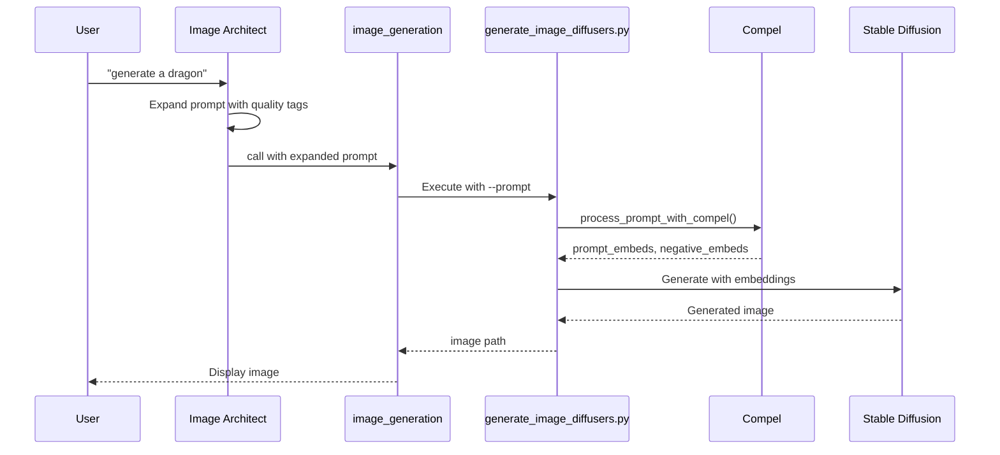

<!-- SPDX-License-Identifier: CC-BY-NC-4.0 -->
<!-- SPDX-FileCopyrightText: Copyright (c) 2025 Andrew Wyatt (Fewtarius) -->


# Stable Diffusion Integration Subsystem

**Component:** `Sources/StableDiffusionIntegration/`  
**Purpose:** Text-to-image and image-to-image generation using Stable Diffusion models  
**Last Updated:** December 11, 2025

---

## Table of Contents

- [Overview](#overview)
- [Architecture](#architecture)
- [Model Types](#model-types)
- [Generation Engines](#generation-engines)
- [Model Discovery & Registration](#model-discovery--registration)
- [Generation Pipeline](#generation-pipeline)
- [Device & Dtype Selection](#device--dtype-selection)
- [Scheduler System](#scheduler-system)
- [Download Services](#download-services)
- [File System Structure](#file-system-structure)
- [Recent Changes](#recent-changes)
- [Public Interfaces](#public-interfaces)
- [Error Handling](#error-handling)
- [Usage Examples](#usage-examples)

---

## Overview

The StableDiffusionIntegration subsystem provides comprehensive image generation capabilities using Stable Diffusion models. It supports multiple model architectures (SD 1.5, SDXL, Z-Image), two generation engines (CoreML and Python diffusers), and integrated model downloading from CivitAI and HuggingFace.

### Key Features

- **Dual Engine Support**: CoreML (fast, Apple Silicon) and Python diffusers (full features)
- **Remote Generation**: ALICE provider for remote GPU servers (AMD, NVIDIA)
- **Multiple Model Types**: SD 1.5, SD 2.x, SDXL, Z-Image, FLUX
- **Text-to-Image & Image-to-Image**: Generate from prompts or modify existing images
- **Scheduler Flexibility**: 10+ sampling schedulers with engine-specific optimization
- **Integrated Downloads**: Browse and download from CivitAI and HuggingFace
- **Model Management**: Automatic detection, registration, and organization
- **LoRA Support**: Load and manage Low-Rank Adaptation models
- **Upscaling**: Built-in RealESRGAN upscaling (2x/4x)

---

## Architecture

### Component Responsibilities

| Component | Responsibility | File |
|-----------|---------------|------|
| **StableDiffusionOrchestrator** | Unified generation interface, engine selection, upscaling coordination | StableDiffusionOrchestrator.swift |
| **StableDiffusionModelManager** | Model discovery, validation, metadata management | StableDiffusionModelManager.swift |
| **PythonDiffusersService** | Python-based generation, scheduler flexibility, img2img | PythonDiffusersService.swift |
| **StableDiffusionService** | CoreML-based generation, Apple Silicon optimization | StableDiffusionService.swift |
| **HuggingFaceService** | HuggingFace API, hierarchical downloads, file categorization | HuggingFaceService.swift |
| **CivitAIService** | CivitAI API, model search, NSFW filtering | CivitAIService.swift |
| **UpscalingService** | RealESRGAN upscaling, tile-based processing | UpscalingService.swift |
| **LoRAManager** | LoRA file management, metadata, compatibility checking | LoRAManager.swift |
| **ImageGenerationTool** | MCP tool interface, parameter validation, user interaction | ImageGenerationTool.swift |
| **ALICEProvider** | Remote GPU server communication (ALICE servers) | Sources/APIFramework/ALICEProvider.swift |

---

## Model Types

### Stable Diffusion 1.5 (SD 1.5)

**Resolution:** 512×512  
**Components:** TextEncoder, Unet, VAEDecoder  
**Use Cases:** General-purpose, fast generation

**Directory Structure (CoreML):**
```
models/stable-diffusion/sd-v1-5/
├── original/compiled/
│   ├── TextEncoder.mlmodelc
│   ├── Unet.mlmodelc
│   ├── VAEDecoder.mlmodelc
│   ├── vocab.json
│   └── merges.txt
```

### Stable Diffusion XL (SDXL)

**Resolution:** 1024×1024  
**Components:** TextEncoder, TextEncoder2, Unet, VAEDecoder  
**Use Cases:** High-quality, detailed images

**Detection:** Presence of `TextEncoder2.mlmodelc`

**Directory Structure (CoreML):**
```
models/stable-diffusion/sdxl-base/
├── compiled/
│   ├── TextEncoder.mlmodelc
│   ├── TextEncoder2.mlmodelc  ← SDXL-specific
│   ├── Unet.mlmodelc
│   ├── VAEDecoder.mlmodelc
│   ├── vocab.json
│   └── merges.txt
```

### Z-Image / FLUX / Flow-Matching Models

**Resolution:** 1024×1024  
**Pipeline:** Flow-matching (non-CFG)  
**Components:** transformer/, text_encoder/, vae/  
**Use Cases:** Fast generation (4-8 steps), modern architecture

**Directory Structure (Python):**
```
models/stable-diffusion/z-image-turbo/
├── model_index.json
├── transformer/
│   └── diffusion_pytorch_model.safetensors
├── text_encoder/
│   └── model.safetensors
├── vae/
│   └── diffusion_pytorch_model.safetensors
└── scheduler/
    └── scheduler_config.json
```

**Critical Differences from Standard SD:**
- Z-Image uses `guidance_scale=0` (no classifier-free guidance)
- Requires 4-8 steps (vs 20-100 for standard SD)
- Uses `bfloat16` on MPS (vs `float32` for SD/SDXL)
- Uses flow-matching schedulers (FlowMatchEuler, FlowMatchHeun)
- 2x faster on MPS with bfloat16: 33.6s/step vs 76.5s/step on CPU

---

## Generation Engines

### CoreML Engine

**File:** `Sources/StableDiffusionIntegration/StableDiffusionService.swift`

**Optimized for:** Apple Silicon (M1/M2/M3)  

**Advantages:**
- Native Metal acceleration
- Fast inference (2-3s/image for SD 1.5)
- Low memory usage
- No Python dependency

**Limitations:**
- Limited scheduler options (DPM++ Karras, PNDM)
- No img2img support
- Requires .mlmodelc format

**Typical Performance:**
- SD 1.5: 2-3 seconds per image
- SDXL: 8-12 seconds per image

### Python Diffusers Engine

**Files:** 
- `Sources/StableDiffusionIntegration/PythonDiffusersService.swift`
- `scripts/generate_image_diffusers.py`

**Optimized for:** Flexibility, full feature set

**Advantages:**
- 10+ schedulers (DPM++, Euler, DDIM, etc.)
- Image-to-image support
- Model format flexibility (.safetensors, diffusers format)
- Dynamic pipeline detection (Z-Image, FLUX, etc.)

**Limitations:**
- Slower than CoreML (4-8s/image for SD 1.5)
- Requires Python environment
- Higher memory usage

**Typical Performance:**
- SD 1.5: 4-8 seconds per image (MPS)
- SDXL: 20-30 seconds per image (MPS)
- Z-Image: 33.6 seconds/step (MPS, bfloat16)

### ALICE Remote Engine

**File:** `Sources/APIFramework/ALICEProvider.swift`

**Optimized for:** Remote GPU servers (AMD, NVIDIA Linux servers, Steam Deck)

**Advantages:**
- Offload GPU work to remote servers
- Support for AMD GPUs (not supported locally)
- Network-based generation from any device

**Limitations:**
- Requires ALICE server running on network
- Network latency for image transfer
- Server must remain accessible during generation

**Configuration:**
- URL: `http://{server}:8090/v1` (typically)
- API Key: Optional, depends on server configuration
- Settings: Preferences → Stable Diffusion → Settings

**Model ID Format:**
- Picker: `alice-sd-model-name` (dash-separated)
- ALICE server: `sd/model-name` (slash-separated)

**API Endpoints:**
- `GET /health` - Server health check
- `GET /v1/models` - List available models
- `POST /v1/chat/completions` - Generate images

---

## Model Discovery & Registration

**File:** `Sources/StableDiffusionIntegration/StableDiffusionModelManager.swift`

### Discovery Logic

The model manager scans `~/Library/Caches/sam/models/stable-diffusion/` and validates each directory:

1. **Skip** `downloads/` directory (staging only)
2. **Check** for multi-part models (`model_index.json`)
3. **Check** for single-file models (`.safetensors`)
4. **Check** for CoreML models (`.mlmodelc` files)
5. **Detect** pipeline type from `model_index.json`
6. **Determine** available engines (CoreML, Python, or both)

### Pipeline Type Detection

```swift
private func detectPipelineType(from directory: URL) -> String {
    let modelIndexPath = directory.appendingPathComponent("model_index.json")
    
    guard FileManager.default.fileExists(atPath: modelIndexPath.path) else {
        return "StableDiffusion"  // Default
    }
    
    // Read _class_name from JSON
    // Examples: "ZImagePipeline", "StableDiffusionXLPipeline", "FluxPipeline"
    let json = try? JSONSerialization.jsonObject(...)
    let className = json?["_class_name"] as? String
    
    // Extract base type: "ZImagePipeline" → "ZImage"
    return className?.replacingOccurrences(of: "Pipeline", with: "") ?? "StableDiffusion"
}
```

### Model Metadata

```swift
public struct ModelInfo {
    let id: String                   // Directory name
    let name: String                 // Display name from metadata
    let path: URL                    // Path to CoreML resources or root
    let variant: String              // "SD 1.5", "SDXL", etc.
    let sizeGB: Double
    let safetensorsPath: URL?        // For Python engine
    let hasCoreML: Bool              // Has .mlmodelc files
    let hasSafeTensors: Bool         // Has .safetensors files
    let coreMLPath: URL?             // Path to compiled/ directory
    let pipelineType: String         // "StableDiffusion", "ZImage", etc.
    
    var availableEngines: [String] {
        var engines: [String] = []
        if hasCoreML { engines.append("coreml") }
        if hasSafeTensors { engines.append("python") }
        return engines
    }
}
```

---

## Generation Pipeline

See `docs/flows/sd_generation_flow.md` for complete flow diagrams.

### Swift → Python Bridge

**File:** `Sources/StableDiffusionIntegration/PythonDiffusersService.swift`

```swift
public func generateImage(
    prompt: String,
    modelName: String,
    scheduler: PythonScheduler,
    steps: Int,
    guidanceScale: Float,
    width: Int,
    height: Int,
    seed: Int?,
    imageCount: Int,
    inputImage: String? = nil,
    strength: Double = 0.75,
    device: String = "auto",
    outputPath: URL
) async throws -> GenerationResult {
    // 1. Find model file (.safetensors or directory)
    let modelPath = try findModelFile(modelName: modelName)
    
    // 2. Build command arguments
    var args = [
        scriptPath,
        "-m", modelPath.path,
        "-p", prompt,
        "-s", scheduler.rawValue,
        "--steps", String(steps),
        "--guidance", String(guidanceScale),
        "--width", String(width),
        "--height", String(height),
        "--device", device
    ]
    
    // Add optional parameters
    if let negPrompt = negativePrompt {
        args.append(contentsOf: ["-n", negPrompt])
    }
    if let seedValue = seed {
        args.append(contentsOf: ["--seed", String(seedValue)])
    }
    if let inputImg = inputImage {
        args.append(contentsOf: ["-i", inputImg, "--strength", String(strength)])
    }
    
    // 3. Execute Python script
    let process = Process()
    process.executableURL = URL(fileURLWithPath: pythonPath)
    process.arguments = args
    try process.run()
    process.waitUntilExit()
    
    // 4. Parse JSON result
    let result = parseJSONOutput(outputData)
    
    return GenerationResult(
        imagePaths: result.imagePaths,
        metadata: result.metadata
    )
}
```

### Python Generation Script

**File:** `scripts/generate_image_diffusers.py`

Key features:
- Dynamic pipeline detection via `model_index.json`
- Automatic dtype selection (bfloat16 for Z-Image, float32 for SD/SDXL)
- Memory-efficient loading with CPU offloading
- FP8 weight remapping for quantized models
- Scheduler compatibility validation

---

## Device & Dtype Selection

### Device Selection (Python)

**File:** `scripts/generate_image_diffusers.py` (lines 350-365)

```python
if device == "auto":
    if torch.backends.mps.is_available():
        device = "mps"
        print("Auto-selected: Apple Silicon (MPS) acceleration")
    elif torch.cuda.is_available():
        device = "cuda"
        print("Auto-selected: CUDA GPU acceleration")
    else:
        device = "cpu"
        print("Auto-selected: CPU")
elif device == "mps" and not torch.backends.mps.is_available():
    print("Warning: MPS requested but not available, falling back to CPU")
    device = "cpu"
```

### Dtype Selection (Critical for Image Quality)

**File:** `scripts/generate_image_diffusers.py`

**This is critical for preventing black images!**

```python
# MPS precision notes:
# - float16: Causes black images due to precision issues
# - bfloat16: ONLY works for Z-Image/flow-matching models on MPS
# - float32: Required for standard SD 1.x/2.x and SDXL models on MPS

is_zimage = "zimage" in model_type.lower() or "qwen" in model_type.lower()

if device == "mps":
    if is_zimage:
        # Z-Image can use bfloat16 on MPS (2x faster!)
        dtype = torch.bfloat16
        print("NOTE: Using bfloat16 on MPS (optimal for Z-Image)")
    else:
        # Standard SD/SDXL MUST use float32 on MPS
        dtype = torch.float32
        print("NOTE: Using float32 on MPS (required for standard SD models)")
elif device == "cuda":
    dtype = torch.bfloat16 if torch.cuda.is_bf16_supported() else torch.float16
else:
    # CPU: Use float16 for large models (memory optimization)
    dtype = torch.float16 if use_low_memory else torch.float32
```

### SDXL-Specific Float32 Conversion (Critical Fix)

**File:** `scripts/generate_image_diffusers.py` (lines 654-680)

SDXL models have multiple components (UNet + 2 text encoders + VAE) that ALL must be float32 on MPS:

```python
# Detect SDXL models (have dual text encoders)
is_sdxl = hasattr(pipe, 'tokenizer_2') and pipe.tokenizer_2 is not None

# Fix black images on MPS: SDXL and standard SD models need float32 precision
# MPS has precision issues with float16 in diffusion models causing black images
if device == "mps" and not is_zimage:
    if is_sdxl:
        # SDXL: Convert ALL components (UNet, text encoders, VAE) to float32
        print("NOTE: Converting SDXL pipeline to float32 for MPS compatibility")
        if hasattr(pipe, 'unet') and pipe.unet is not None:
            pipe.unet = pipe.unet.to(dtype=torch.float32)
        if hasattr(pipe, 'text_encoder') and pipe.text_encoder is not None:
            pipe.text_encoder = pipe.text_encoder.to(dtype=torch.float32)
        if hasattr(pipe, 'text_encoder_2') and pipe.text_encoder_2 is not None:
            pipe.text_encoder_2 = pipe.text_encoder_2.to(dtype=torch.float32)
        if hasattr(pipe, 'vae') and pipe.vae is not None:
            pipe.vae = pipe.vae.to(dtype=torch.float32)
    elif hasattr(pipe, 'vae'):
        # Standard SD 1.x/2.x: VAE needs float32 on MPS
        print("NOTE: Converting VAE to float32 for MPS compatibility")
        pipe.vae = pipe.vae.to(dtype=torch.float32)
```

**Why this matters:**
- ❌ **float16 on MPS** → Black images (precision loss)
- ❌ **bfloat16 on MPS for SD/SDXL** → Black images
- ❌ **Only converting VAE on SDXL** → Still black images (UNet/text encoders need float32 too)
- ✅ **All components float32 on MPS for SD/SDXL** → Correct images
- ✅ **bfloat16 on MPS for Z-Image** → 2x faster than CPU (33.6s/step vs 76.5s/step)

### MPS Limitations

**Known Issues on Apple Silicon (MPS device):**

1. **SDE Schedulers Not Supported**
   - `dpm++_sde` and `dpm++_sde_karras` produce all-black images
   - Root cause: VAE decode issues with SDE-generated latents on MPS
   - Solution: Disabled in UI, error if attempted
   - Alternatives: `euler` (SDXL), `dpm++_karras` (SD 1.5)

2. **Float16 Precision Issues**
   - MUST use float32 for all standard SD and SDXL models
   - Float16 causes NaN/inf values → black pixels
   - Only Z-Image/flow-matching models can use bfloat16

3. **Attention Slicing Required for SDXL**
   - Enabled early in pipeline to prevent memory spikes
   - Reduces memory usage but slightly slower

**Verified Working Configurations:**
- ✅ SD 1.5 + `euler` or `dpm++_karras` + float32 VAE
- ✅ SDXL + `euler` or `dpm++_karras` + all components float32
- ✅ Z-Image + `flow_match_euler` + bfloat16
- ❌ Any model + SDE schedulers on MPS

---

## Scheduler System

### Available Schedulers by Engine

| Scheduler | CoreML | Python | Best For |
|-----------|:------:|:------:|----------|
| **DPM++ 2M Karras** | ✅ | ✅ | General use, high quality (recommended default) |
| **Euler** | ❌ | ✅ | Fast, simple (recommended for SDXL) |
| **Euler Ancestral** | ❌ | ✅ | Creative variations |
| **DDIM** | ❌ | ✅ | Deterministic |
| **DDIM Uniform** | ❌ | ✅ | Uniform timesteps |
| **PNDM** | ✅ | ✅ | Legacy compatibility |
| **LMS** | ❌ | ✅ | Linear multistep |
| **FlowMatch Euler** | ❌ | ✅ | Z-Image/FLUX only |
| **FlowMatch Heun** | ❌ | ✅ | Z-Image/FLUX only |

**Note:** SDE schedulers (DPM++ SDE, DPM++ SDE Karras) have been removed due to incompatibility with Apple Silicon (MPS). They produce all-black images on macOS. See "MPS Limitations" section below.

### Scheduler Auto-Correction

**File:** `Sources/StableDiffusionIntegration/ImageGenerationTool.swift`

```swift
// Auto-fallback: If scheduler not compatible with engine, use engine default
var schedulerWasCorrected = false
let originalScheduler = scheduler

if !scheduler.isAvailable(for: engine) {
    schedulerWasCorrected = true
    switch engine {
    case .coreML:
        scheduler = .dpmppKarras  // CoreML default
    case .python:
        scheduler = .euler  // Python default (changed from dpmpp_sde_karras)
    }
    logger.warning("Scheduler '\(originalScheduler.displayName)' not available")
}
```

This prevents common errors where agents select incompatible scheduler/engine combinations.

---

## Download Services

### HuggingFace Service

**File:** `Sources/StableDiffusionIntegration/HuggingFaceService.swift`

#### Hierarchical Downloads

Z-Image and other variant models reference base models to reduce download size:

```swift
public func categorizeHierarchicalFiles(
    variantModel: HFModel,
    variantFiles: [HFFile],
    baseModel: HFModel,
    baseFiles: [HFFile]
) -> (variantFiles: [HFFile], baseFiles: [HFFile]) {
    // 1. Download ALL essential files from variant
    // 2. Download components from base that DON'T exist in variant
    // 3. Download root configs from base if not in variant
    
    // Example: Z-Image Turbo
    // From variant: transformer/ (2.8 GB)
    // From base: text_encoder/, vae/ (reused)
    // Savings: ~60% (2.8 GB vs 7 GB full)
}
```

### CivitAI Service

**File:** `Sources/StableDiffusionIntegration/CivitAIService.swift`

#### NSFW Filtering

Multi-layered detection:
1. Model-level `nsfw` flag
2. Tag scanning (`nsfw`, `adult`, `explicit`, etc.)
3. Name/description keyword scanning
4. Image `nsfwLevel` >= 2

```swift
public func isNSFW() -> Bool {
    // 1. Check model flag
    if nsfw == true { return true }
    
    // 2. Check tags
    let nsfwKeywords = ["nsfw", "adult", "nude", ...]
    if tags?.contains(where: { /* keyword match */ }) { return true }
    
    // 3. Check image nsfwLevel
    if modelVersions?.contains(where: { /* nsfwLevel >= 2 */ }) { return true }
    
    return false
}
```

---

## File System Structure

```
~/Library/Caches/sam/
├── models/
│   └── stable-diffusion/
│       ├── {model-name}/               # Model directory
│       │   ├── model_index.json        # Multi-part model index
│       │   ├── model.safetensors       # Single-file model (optional)
│       │   ├── transformer/            # Transformer weights (Z-Image, FLUX)
│       │   ├── unet/                   # UNet weights (SD, SDXL)
│       │   ├── text_encoder/           # Text encoder
│       │   ├── vae/                    # VAE decoder
│       │   ├── compiled/               # CoreML compiled (SDXL)
│       │   ├── original/compiled/      # CoreML compiled (SD 1.x/2.x)
│       │   └── .sam_metadata.json      # SAM metadata
│       └── loras/                      # LoRA files
│           ├── {lora-name}.safetensors
│           └── .metadata/
│               └── {lora-name}.json
├── staging/
│   └── stable-diffusion/               # Downloaded .safetensors (before conversion)
│       └── {model-name}.safetensors
└── images/                             # Generated images
    └── sd_{timestamp}.png
```

---

## Recent Changes

### December 3-5, 2025

#### 1. ALICE Remote Stable Diffusion Integration

**Files:** `Sources/APIFramework/ALICEProvider.swift`, `Sources/StableDiffusionIntegration/StableDiffusionModelManager.swift`

**Change:** Added support for remote GPU generation via ALICE servers:
- Connect to ALICE servers on the local network (AMD, NVIDIA Linux servers, Steam Deck)
- Models appear in picker with "ALICE" location indicator
- Model ID conversion: picker shows `alice-sd-model-name`, ALICE server expects `sd/model-name`
- Automatic model list refresh when ALICE models load at startup
- Configuration in Preferences → Stable Diffusion → Settings

**Benefits:**
- Generate images on remote AMD GPUs (not supported locally)
- Offload generation from Mac to dedicated server
- Useful for Steam Deck or Linux server setups

#### 2. Diffusers Models in Provider Hot Reload

**Files:** `Sources/StableDiffusionIntegration/StableDiffusionModelManager.swift`

**Change:** Diffusers (Python) models now included in provider hot reload, ensuring new models appear immediately.

#### 3. CoreML Validation Improvements

**Files:** `Sources/StableDiffusionIntegration/StableDiffusionModelManager.swift`

**Change:** Comprehensive CoreML validation to prevent merges.txt errors - validates all required files exist before reporting model as CoreML-compatible.

### December 1, 2025

#### 1. bfloat16/float32 Dtype Selection

**File:** `scripts/generate_image_diffusers.py` (lines 440-475)

**Change:** Intelligent dtype selection based on model type and device:
- Z-Image on MPS: `bfloat16` (2x faster than CPU)
- SD/SDXL on MPS: `float32` (prevents black images)

**Impact:** Z-Image generation speed improved from 76.5s/step (CPU) to 33.6s/step (MPS).

#### 2. Scheduler Switching Moved to UI

**Files:** StableDiffusionPreferencesPane.swift, ChatWidget.swift

**Change:** Scheduler changes now happen in UI when model is selected, not silently in Python backend.

**User Control Principle:** All setting changes must be visible to user.

#### 3. MPS Optimization for Apple Silicon

**Changes:**
- Automatic MPS detection
- Memory-efficient attention slicing
- CPU offloading for large models
- Optimal dtype per model type

**Performance:**
- SD 1.5 on MPS: 4-8s/image
- SDXL on MPS: 20-30s/image
- Z-Image on MPS: 33.6s/step (bfloat16)

---

## Public Interfaces

### StableDiffusionOrchestrator

```swift
public struct GenerationConfig {
    let prompt: String
    let negativePrompt: String?
    let modelName: String
    let scheduler: UnifiedScheduler
    let steps: Int
    let guidanceScale: Float
    let width: Int
    let height: Int
    let seed: Int?
    let imageCount: Int
    let engine: GenerationEngine
    let enableUpscaling: Bool
    let inputImage: String?
    let strength: Double
    let device: String
}

public func generateImages(config: GenerationConfig) async throws -> GenerationResult
```

### ImageGenerationTool (MCP)

```json
{
  "prompt": "a photo of a cat",
  "negative_prompt": "blurry, low quality",
  "model": "dreamshaper-8",
  "engine": "python",
  "scheduler": "dpm++_sde_karras",
  "steps": 25,
  "guidance_scale": 8,
  "width": 512,
  "height": 512,
  "seed": -1,
  "upscale": true
}
```

---

## Error Handling

### Common Errors

| Error | Cause | Solution |
|-------|-------|----------|
| **Black Images** | Wrong dtype on MPS | Use float32 for SD/SDXL, bfloat16 for Z-Image |
| **Scheduler Not Available** | Incompatible with engine | Use auto-correction or check availability |
| **Out of Memory** | Model too large | Enable CPU offloading or use smaller model |
| **Invalid Steps** | Outside range | SD: 20-100, Z-Image: 4-50 |

### Logging Standards

**CRITICAL:** Always use `logger`, NEVER `print()`

```swift
// WRONG
print("Model loaded")  // ❌

// RIGHT
logger.info("Model loaded successfully")  // ✅
logger.debug("Model details: \(modelPath)")
logger.error("Generation failed: \(error.localizedDescription)")
```

---

## Usage Examples

### Example 1: Text-to-Image with Python

```swift
let config = StableDiffusionOrchestrator.GenerationConfig(
    prompt: "a serene mountain landscape at sunset",
    negativePrompt: "blurry, low quality",
    modelName: "dreamshaper-8",
    scheduler: .dpmppSDEKarras,
    steps: 25,
    guidanceScale: 7.5,
    width: 512,
    height: 512,
    seed: 42,
    imageCount: 1,
    engine: .python,
    device: "mps"
)

let result = try await orchestrator.generateImages(config: config)
```

### Example 2: Z-Image Generation

```swift
let config = StableDiffusionOrchestrator.GenerationConfig(
    prompt: "futuristic city with flying cars",
    negativePrompt: nil,
    modelName: "z-image-turbo",
    scheduler: .euler,
    steps: 8,                    // Z-Image: fewer steps
    guidanceScale: 0.0,          // Z-Image: must be 0
    width: 1024,
    height: 1024,
    seed: nil,
    imageCount: 1,
    engine: .python,
    device: "mps"
)

let result = try await orchestrator.generateImages(config: config)
```

---

## Related Documentation

- [Flow Diagrams](../flows/sd_generation_flow.md)
- [API Framework](./API_FRAMEWORK.md)
- [MCP Tools](../MCP_TOOLS_SPECIFICATION.md)
- [UI Style Guide](../UI_STYLE_GUIDE.md)

---

## Prompt Enhancement System

### Overview

SD 1.5 and SDXL use CLIP text encoders with inherent limitations:
- **SD 1.5:** 77 token context window, ~63M parameter encoder
- **SDXL:** Dual encoders (77+77=154 tokens), improved understanding
- **Z-Image/FLUX:** LLM-based encoders (Qwen2, T5-XXL), excellent understanding

To maximize quality with CLIP-based models, SAM uses a two-part enhancement system:

1. **LLM-based Prompt Expansion** (via Image Architect/Artist personalities)
2. **Compel Prompt Weighting** (in Python generation script)

### Prompt Expansion (Personality-Driven)

**Files:** `Sources/ConfigurationSystem/PersonalityTrait.swift`

Image Architect and Artist personalities are trained to EXPAND user prompts before calling `image_generation` tool:

**Input:** "a cat"  
**Expanded (SD 1.5):** "a fluffy orange tabby cat with bright green eyes, soft detailed fur, curled up on a cozy wool blanket, warm ambient lighting, highly detailed, masterpiece quality, professional photography"  
**Expanded (Z-Image):** "fluffy orange cat on blanket, warm light, photorealistic"

#### Expansion Formula

1. **Subject details:** Species, colors, textures, distinguishing features
2. **Pose/action:** What is the subject doing, body position
3. **Environment:** Where are they, what surrounds them
4. **Lighting:** Type (soft, dramatic, golden hour), direction
5. **Quality tags:** masterpiece, high resolution, detailed, sharp focus
6. **Style (optional):** Art style, medium, artist influence

#### Model-Specific Guidance

| Model Type | Expansion Length | Notes |
|------------|------------------|-------|
| SD 1.5 | 50-100 words | Quality tags essential, anatomy fixes |
| SDXL | 100-200 words | Style refs, artistic vocabulary |
| Z-Image/FLUX | 10-30 words | SHORT only, detail hurts quality |

### Compel Prompt Weighting

**Files:** 
- `scripts/requirements.txt` (dependency: `compel>=2.0.0`)
- `scripts/generate_image_diffusers.py` (integration)

Compel enables advanced prompt syntax:

```
# Emphasis (increases attention)
(important subject:1.3)    # 1.3x attention
word++                      # 1.1x attention  
word--                      # 0.9x attention

# De-emphasis (decreases attention)
(background detail:0.7)    # 0.7x attention

# Combined example
"a (majestic red dragon:1.3) with (shimmering scales), (epic sunset:1.2) background, (clouds:0.8)"
```

#### Compel Integration Flow



#### Compel Features

| Feature | Syntax | Example |
|---------|--------|---------|
| **Weight emphasis** | `(word:weight)` | `(dragon:1.3)` |
| **Shorthand emphasis** | `word++` or `word--` | `masterpiece++` |
| **Long prompts** | Auto-chunking | Prompts >77 tokens split intelligently |
| **SDXL support** | Dual encoder | Handles both text encoders |
| **Padding** | Auto-pad | Embeddings padded for CFG |

#### Model Compatibility

| Model Type | Compel Support | Notes |
|------------|:--------------:|-------|
| SD 1.5 | ✅ | Full support |
| SDXL | ✅ | Dual encoder handling |
| Z-Image | ❌ | Uses Qwen2, not CLIP |
| FLUX | ❌ | Uses T5-XXL, not CLIP |

Compel is automatically skipped for flow-matching models (Z-Image, FLUX) that use LLM-based encoders instead of CLIP.

### Best Practices

1. **Use Image Architect personality** for image generation tasks
2. **Let the agent expand prompts** - don't micromanage SD syntax
3. **For weighted prompts,** use `(subject:1.2)` syntax
4. **For Z-Image/FLUX,** keep prompts SHORT (10-30 words)
5. **Include quality tags** for SD 1.5: `masterpiece, best quality, highly detailed`
6. **Include negative prompts** for SD: `blurry, bad anatomy, poorly drawn`

