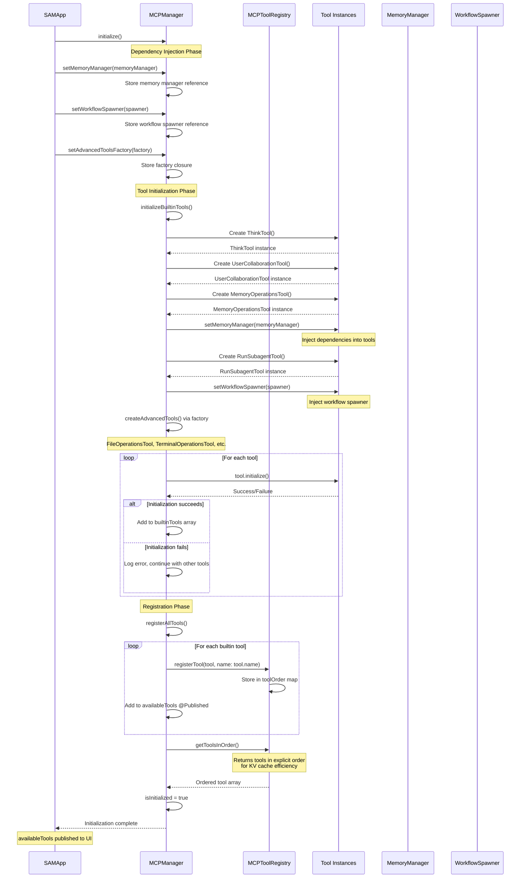
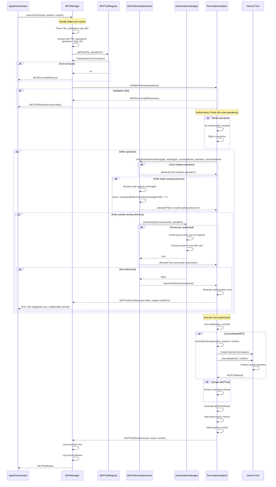
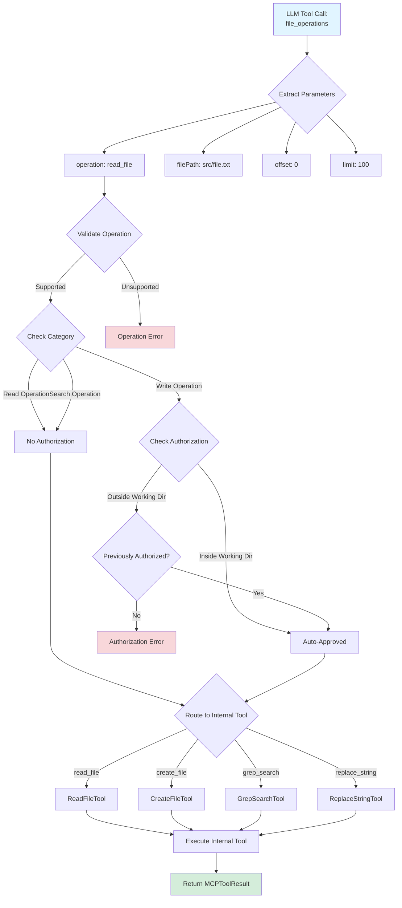
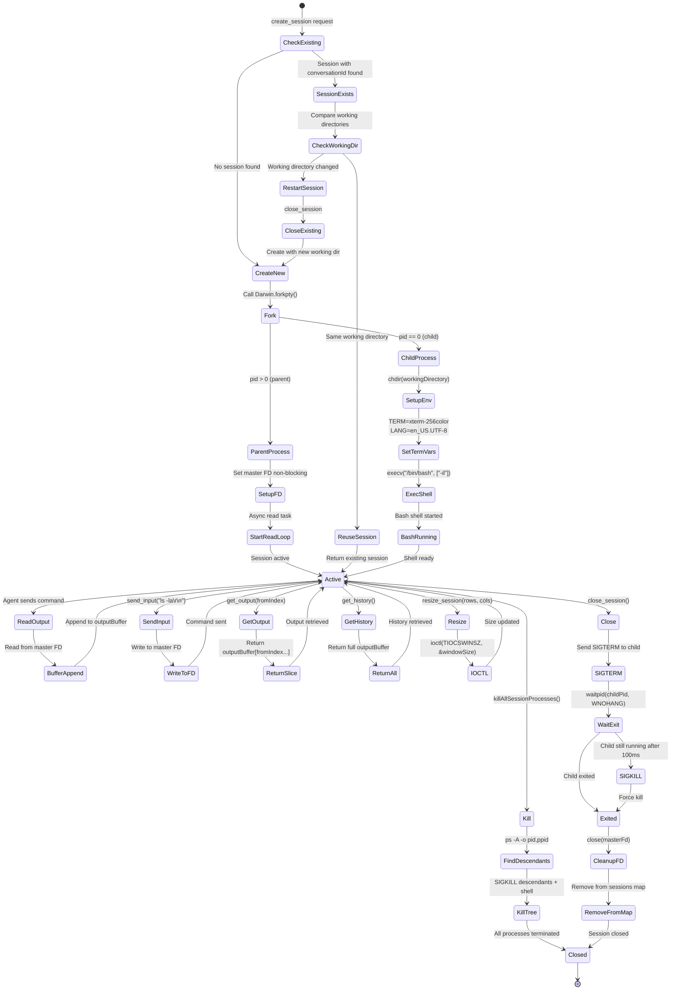
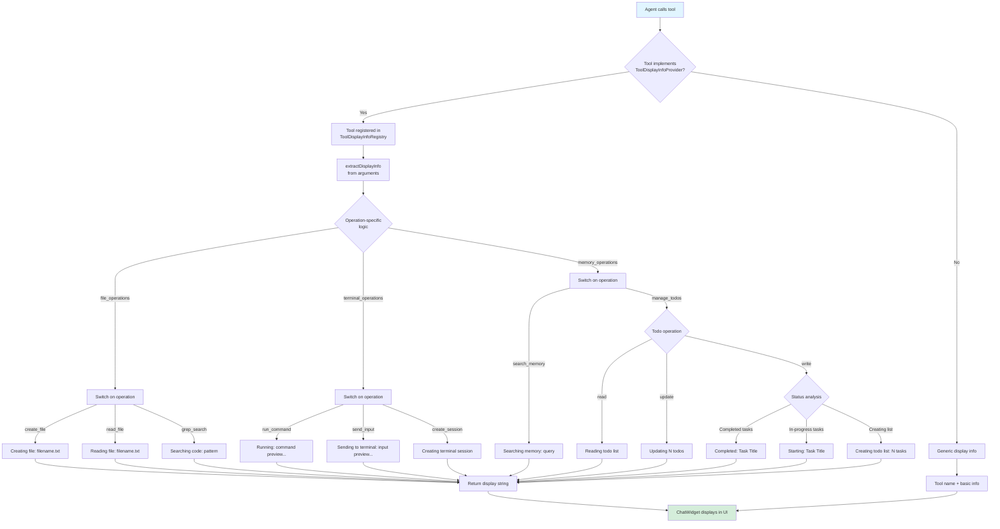
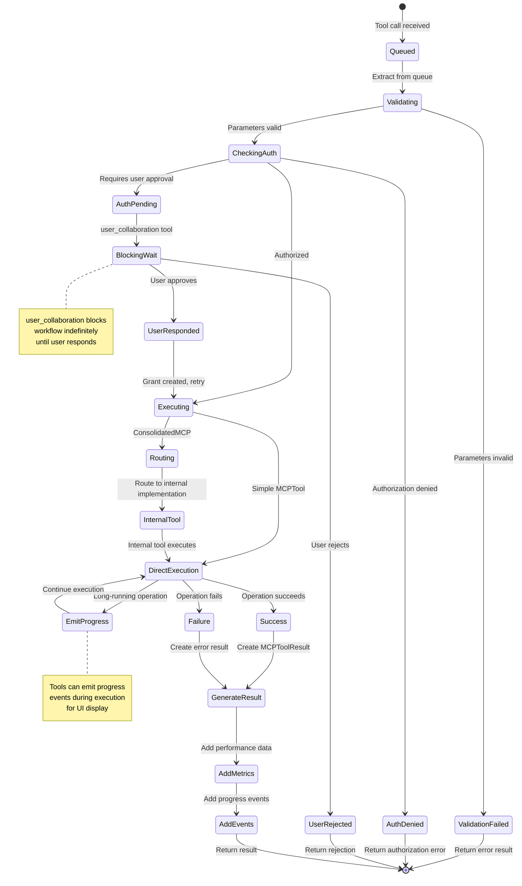

<!-- SPDX-License-Identifier: CC-BY-NC-4.0 -->
<!-- SPDX-FileCopyrightText: Copyright (c) 2025 Andrew Wyatt (Fewtarius) -->


# MCP Tool Execution Flow Diagrams

**Version:** 1.0  
**Last Updated:** December 1, 2025  
**Related:** `project-docs/2025-12-01/0800/MCP_FRAMEWORK.md`

## Overview

This document provides Mermaid diagrams visualizing the execution flows within SAM's MCPFramework subsystem.

---

## 1. Tool Registration Flow

Shows how tools are initialized and registered with the MCPManager.



**Key Points:**
- Dependency injection happens BEFORE tool initialization
- Tools initialize asynchronously (may fail individually)
- Registration uses explicit ordering for KV cache optimization
- Published availableTools array triggers UI updates

---

## 2. Tool Execution Flow with Authorization

Shows complete flow from agent request to tool execution, including authorization checks.



**Key Points:**
- Dotted tool names are parsed and converted to operation parameters
- Read operations skip authorization checks
- Write operations check path-based authorization first
- Temporary grants from user_collaboration are consumed on use
- ConsolidatedMCP tools route to internal tool implementations

---

## 3. ConsolidatedMCP Routing Pattern

Shows how consolidated tools route operations to internal implementations.



**Consolidated Tools:**
- `file_operations` - 16 operations (read, search, write)
- `terminal_operations` - 11 operations (command, PTY session)
- `memory_operations` - 4 operations (memory, todos)
- `build_and_version_control` - 5 operations (tasks, git)

---

## 4. User Collaboration & Authorization Flow

Shows the blocking user collaboration mechanism and authorization grant flow.

```mermaid
sequenceDiagram
    participant Agent as AI Agent
    participant Tool as FileOperationsTool
    participant AuthGuard as MCPAuthorizationGuard
    participant UserCollab as UserCollaborationTool
    participant NotifCtr as ToolNotificationCenter
    participant UI as ChatWidget UI
    participant User as Human User
    participant AuthMgr as AuthorizationManager
    
    Agent->>Tool: create_file("/etc/config.txt", content="...")
    
    Tool->>AuthGuard: checkPathAuthorization(path="/etc/config.txt", workingDir="/workspace/conv-123")
    
    AuthGuard->>AuthGuard: Resolve path → /etc/config.txt (absolute)
    AuthGuard->>AuthGuard: Compare to workingDir → /workspace/conv-123
    AuthGuard->>AuthGuard: Path is OUTSIDE working directory
    
    AuthGuard->>AuthMgr: isAuthorized(conversationId, "file_operations.create_file")
    AuthMgr->>AuthMgr: Check for existing grant
    AuthMgr-->>AuthGuard: false (no grant found)
    
    AuthGuard-->>Tool: .requiresAuthorization("Outside working directory")
    
    Tool->>Tool: Generate authorization error message
    Tool-->>Agent: MCPToolResult(success=false, output=authError)
    
    Note over Agent: Agent sees error, uses user_collaboration
    
    Agent->>UserCollab: user_collaboration(<br/>prompt="May I create /etc/config.txt?",<br/>authorize_operation="file_operations.create_file")
    
    UserCollab->>UserCollab: Extract toolCallId from context (e.g., "call_abc123")
    UserCollab->>UserCollab: Create PendingResponse entry
    
    UserCollab->>NotifCtr: postUserInputRequired(toolCallId, prompt, context, conversationId)
    
    NotifCtr->>UI: Notification posted
    UI->>UI: Display collaboration prompt to user
    UI->>UI: Show "Waiting for your response..."
    
    Note over UserCollab: BLOCKS WORKFLOW INDEFINITELY
    UserCollab->>UserCollab: while true { check for response; sleep 100ms }
    
    Note over User: User thinks, types response
    User->>UI: "Yes, proceed"
    
    UI->>UserCollab: submitUserResponse(toolCallId="call_abc123", userInput="Yes, proceed")
    
    UserCollab->>UserCollab: Store response in PendingResponse
    
    Note over UserCollab: Response detected, break wait loop
    
    UserCollab->>UserCollab: Check if response is approval
    UserCollab->>AuthMgr: isApprovalResponse("Yes, proceed") → true
    
    UserCollab->>AuthMgr: grantAuthorization(<br/>conversationId,<br/>"file_operations.create_file",<br/>expirySeconds=300,<br/>oneTimeUse=false)
    
    AuthMgr->>AuthMgr: Create AuthorizationGrant
    AuthMgr->>AuthMgr: Set expiry: now + 300s
    AuthMgr->>AuthMgr: Store in authorizations array
    
    AuthMgr-->>UserCollab: Grant created
    
    UserCollab->>NotifCtr: postUserResponseReceived(toolCallId, userInput, conversationId)
    
    UserCollab-->>Agent: MCPToolResult(success=true, output="User response: Yes, proceed<br/>ACTION REQUIRED: Process response and continue")
    
    Note over Agent: Agent retries file creation
    
    Agent->>Tool: create_file("/etc/config.txt", content="...") [retry]
    
    Tool->>AuthGuard: checkPathAuthorization(...)
    AuthGuard->>AuthMgr: isAuthorized(conversationId, "file_operations.create_file")
    
    AuthMgr->>AuthMgr: Find matching grant
    AuthMgr->>AuthMgr: Check: grant.expiresAt > now → true
    AuthMgr->>AuthMgr: Check: !grant.consumed → true
    
    AuthMgr-->>AuthGuard: true
    
    AuthGuard-->>Tool: .allowed("User previously authorized this operation")
    
    Tool->>Tool: Execute file creation
    Tool->>Tool: Write file to /etc/config.txt
    
    Tool-->>Agent: MCPToolResult(success=true, output="File created")
```

**Key Behaviors:**

**Blocking Mechanism:**
- `user_collaboration` has `requiresBlocking = true`
- Workflow execution STOPS until user responds
- No timeout - user has full control
- Infinite wait loop: `while true { check response; sleep 100ms }`

**Authorization Grant:**
- Default expiry: 5 minutes (300 seconds)
- Can be one-time or multi-use
- Consumed on first use if one-time
- Cleaned up when expired

**Response Detection:**
- Approval keywords: "yes", "ok", "proceed", "approve", "confirm"
- Rejection keywords: "no", "cancel", "stop", "deny"
- Case-insensitive matching

---

## 5. PTY Session Lifecycle

Shows creation, usage, and management of persistent terminal sessions.



**PTY Session Features:**

**Session Persistence:**
- Conversation-scoped (session ID = conversation ID)
- Maintains shell environment across commands
- Output buffer preserves full history
- Reused when working directory unchanged

**Output Capture:**
- Async read loop (non-blocking)
- Reads from master FD continuously
- Appends to thread-safe buffer
- Returns slices on demand (fromIndex parameter)

**Shell Configuration:**
- Bash interactive login shell (`-il`)
- 256-color terminal support
- UTF-8 encoding
- Inherits user's shell environment

**Cleanup:**
- Graceful shutdown: SIGTERM → wait → SIGKILL
- Descendant process cleanup
- FD closure
- Session map removal

---

## 6. Tool Display Information Flow

Shows how tools provide UI-friendly progress information.



**Display Info Sources:**

**extractDisplayInfo:**
- Returns concise string (e.g., "Creating file: test.txt")
- Truncates long values (50-80 chars)
- Operation-specific formatting

**extractToolDetails:**
- Returns array of detail strings
- More comprehensive than display info
- Used for tool execution cards in UI

**Example Implementation:**
```swift
extension FileOperationsTool: ToolDisplayInfoProvider {
    public static func extractDisplayInfo(from arguments: [String: Any]) -> String? {
        guard let operation = arguments["operation"] as? String else { return nil }
        
        switch operation {
        case "create_file":
            if let filePath = arguments["filePath"] as? String {
                let fileName = (filePath as NSString).lastPathComponent
                return "Creating file: \(fileName)"
            }
            return "Creating file"
        
        case "grep_search":
            if let query = arguments["query"] as? String {
                let preview = query.count > 50 ? String(query.prefix(47)) + "..." : query
                return "Searching code: \(preview)"
            }
            return "Searching code"
        
        default:
            return nil
        }
    }
}
```

---

## 7. Tool Execution States

Shows the different execution states and transitions during tool execution.



**State Transitions:**

**Queued → Validating:**
- Extract parameters
- Check required fields
- Validate types

**Validating → CheckingAuth:**
- Path-based authorization (write operations)
- Check existing grants
- User-initiated bypass

**CheckingAuth → AuthPending:**
- Path outside working directory
- No existing grant
- Agent-initiated operation

**AuthPending → BlockingWait:**
- user_collaboration tool called
- Workflow STOPS
- UI displays prompt

**Executing → Routing:**
- ConsolidatedMCP tools route to internal implementations
- Operation parameter determines routing
- Simple tools skip routing

**DirectExecution → Success/Failure:**
- Actual operation execution
- File I/O, terminal commands, etc.
- Error handling

**GenerateResult → Return:**
- Create MCPToolResult
- Add performance metrics
- Add progress events
- Return to orchestrator

---

## Summary

These flows illustrate:

1. **Tool Registration** - Dependency injection, initialization, ordered registration
2. **Tool Execution** - Authorization checks, routing, execution
3. **ConsolidatedMCP** - Operation-based routing to internal tools
4. **User Collaboration** - Blocking mechanism, authorization grants
5. **PTY Sessions** - Persistent terminals, lifecycle management
6. **Display Information** - UI-friendly progress messages
7. **Execution States** - Complete state machine for tool execution

All flows work together to provide a comprehensive, secure, and extensible tool execution framework for SAM's AI agents.

---

**End of TOOL_EXECUTION_FLOWS.md**
