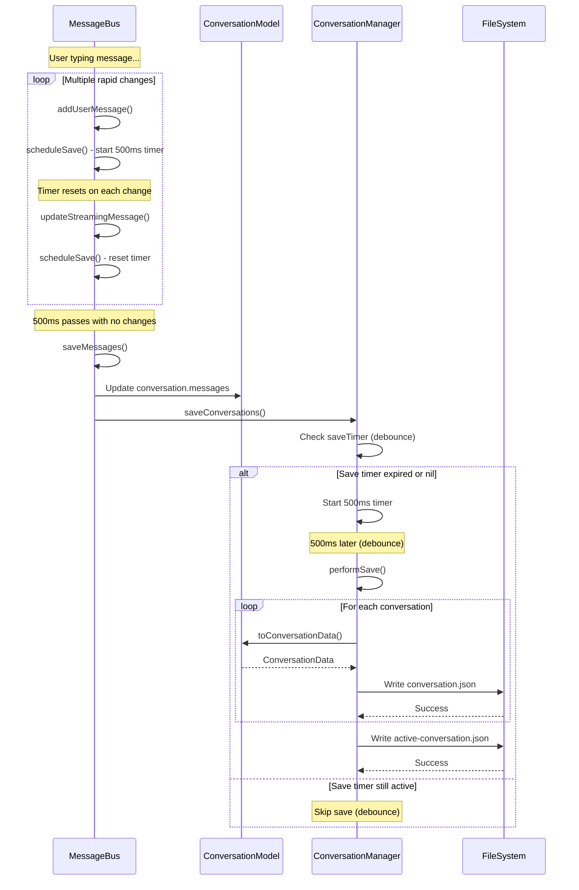
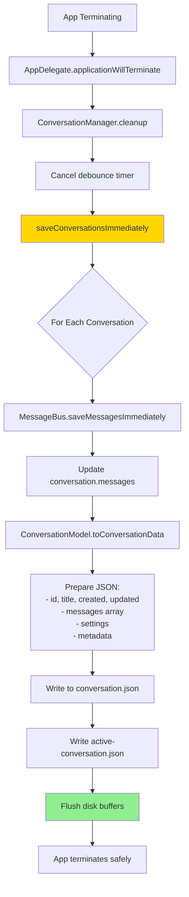
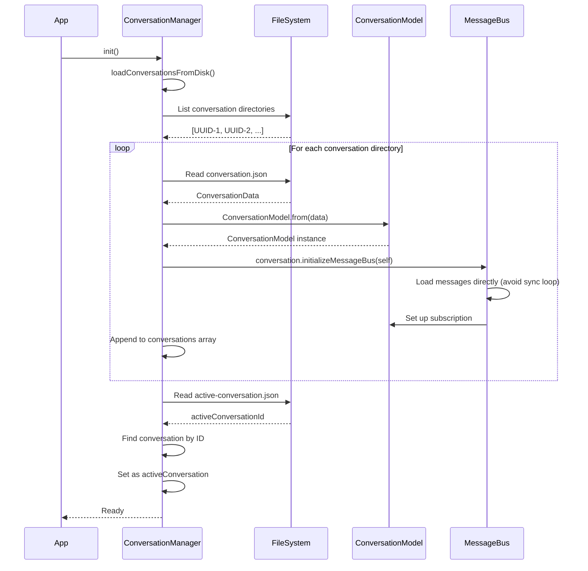
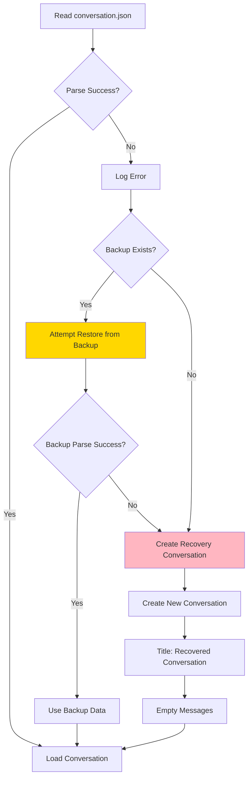
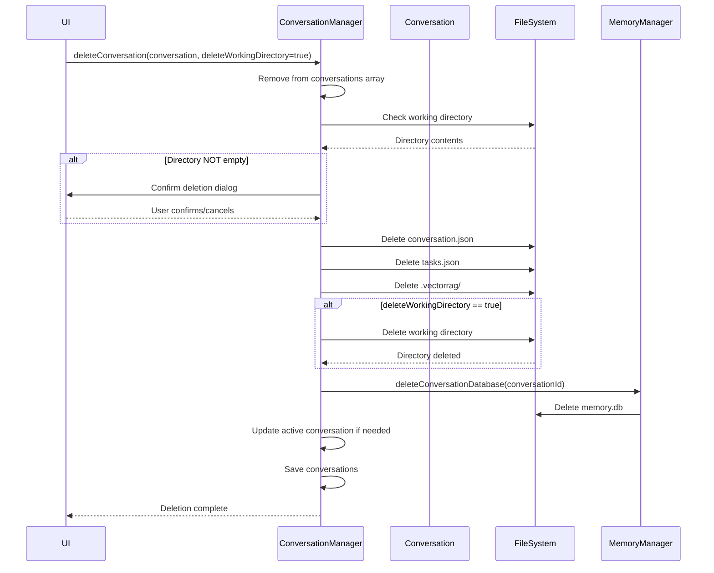
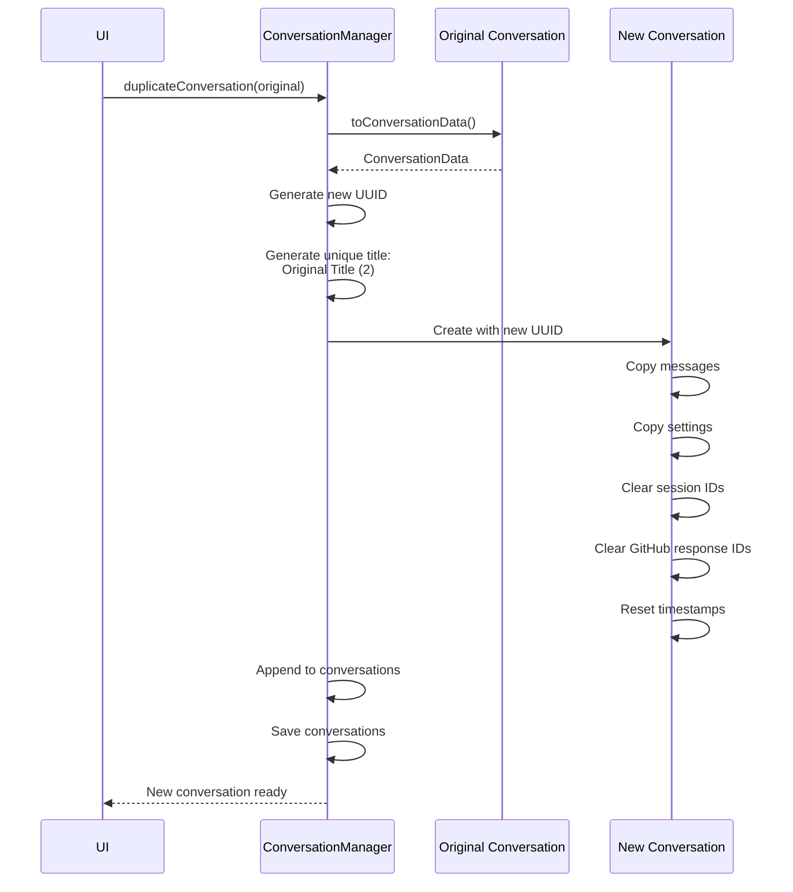
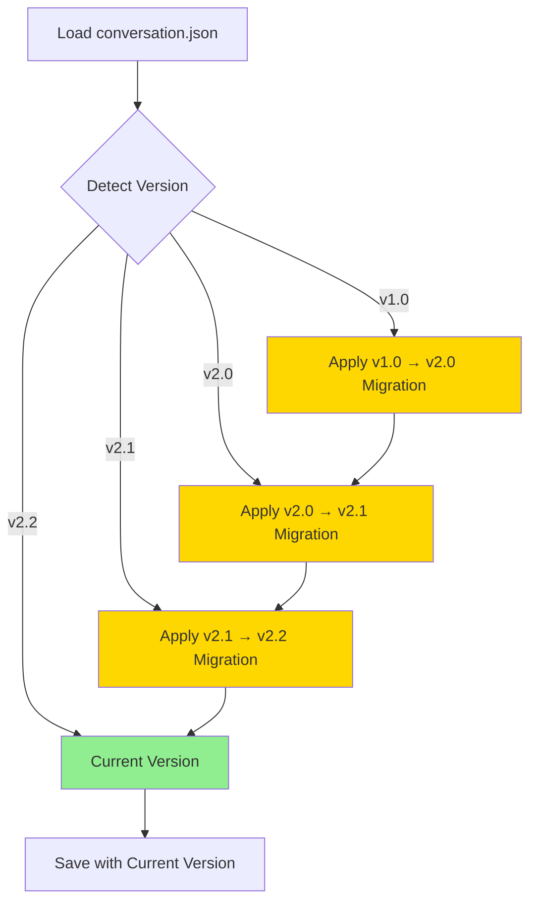

<!-- SPDX-License-Identifier: CC-BY-NC-4.0 -->
<!-- SPDX-FileCopyrightText: Copyright (c) 2025 Andrew Wyatt (Fewtarius) -->


# Conversation Persistence Flow

**Version:** 2.2  
**Last Updated:** December 1, 2025

## Overview

This document describes how SAM persists conversation data to disk, including the debounced save mechanism, file structure, and state synchronization between memory and persistent storage.

---

## Conversation File Structure

```
~/Library/Application Support/SAM/conversations/
├── active-conversation.json              # ID of currently active conversation
├── backups/                              # Automatic conversation backups
│   └── {conversation-id}_{timestamp}.json
└── {CONVERSATION_ID}/                    # Per-conversation directory
    ├── conversation.json                 # Conversation data + messages
    ├── tasks.json                        # Agent todo list
    └── .vectorrag/                       # RAG data (if documents imported)
        ├── chunks/
        └── index.sqlite
```

---

## Save Flow (Debounced)



---

## Immediate Save Flow



---

## Conversation Data Structure

### conversation.json Format

```json
{
  "id": "550e8400-e29b-41d4-a716-446655440000",
  "title": "SAM Development Discussion",
  "created": "2025-11-30T10:00:00Z",
  "updated": "2025-12-01T15:30:45Z",
  "messages": [
    {
      "id": "a1b2c3d4-...",
      "type": "user",
      "content": "Hello, SAM!",
      "isFromUser": true,
      "timestamp": "2025-11-30T10:01:00Z",
      "isPinned": true,
      "importance": 0.7
    },
    {
      "id": "e5f6g7h8-...",
      "type": "assistant",
      "content": "Hello! How can I help you today?",
      "isFromUser": false,
      "timestamp": "2025-11-30T10:01:02Z",
      "isPinned": false,
      "importance": 0.5,
      "performanceMetrics": {
        "firstTokenTime": 0.15,
        "tokensPerSecond": 45.3,
        "totalTokens": 150
      }
    },
    {
      "id": "i9j0k1l2-...",
      "type": "toolExecution",
      "content": "File contents:\n...",
      "isFromUser": false,
      "timestamp": "2025-11-30T10:02:00Z",
      "toolName": "file_read",
      "toolStatus": "success",
      "toolDuration": 0.05,
      "toolCallId": "call_abc123"
    }
  ],
  "settings": {
    "selectedModel": "github_copilot/gpt-4.1",
    "temperature": 0.7,
    "topP": 1.0,
    "maxTokens": null,
    "contextWindowSize": 128000,
    "selectedSystemPromptId": "00000000-0000-0000-0000-000000000001",
    "enableReasoning": false,
    "enableTools": true,
    "autoApprove": false,
    "enableTerminalAccess": false,
    "scrollLockEnabled": true,
    "useSharedData": false,
    "sharedTopicId": null,
    "sdNegativePrompt": "",
    "sdSteps": 25,
    "sdGuidanceScale": 8,
    "sdScheduler": "dpm++",
    "sdSeed": -1
  },
  "sessionId": "550e8400-e29b-41d4-a716-446655440000",
  "lastGitHubCopilotResponseId": "chatcmpl-abc123...",
  "isPinned": false,
  "workingDirectory": "/Users/user/SAM/SAM Development Discussion/",
  "isFromAPI": false,
  "folderId": null
}
```

### active-conversation.json Format

```json
{
  "activeConversationId": "550e8400-e29b-41d4-a716-446655440000"
}
```

---

## Load Flow



---

## Backup Flow

```mermaid
flowchart TD
    A[Conversation Save] --> B{Backup Enabled?}
    
    B -->|Yes| C[Check Backup Interval]
    B -->|No| Z[Skip Backup]
    
    C --> D{Time Since Last Backup > 1 hour?}
    
    D -->|Yes| E[Create Backup]
    D -->|No| Z
    
    E --> F[Generate Timestamp]
    F --> G[Backup Filename:<br/>{conversation-id}_{timestamp}.json]
    
    G --> H[Copy conversation.json to backups/]
    
    H --> I[Cleanup Old Backups]
    I --> J{Count Backups for Conversation}
    
    J --> K{> 10 backups?}
    K -->|Yes| L[Delete oldest backups]
    K -->|No| M[Keep all backups]
    
    L --> M
    M --> Z[Backup Complete]
    
    style E fill:#90EE90
    style L fill:#FFB6C1
```

---

## State Synchronization

### MessageBus → ConversationModel → Disk


### Performance Optimization: Delta Sync

Instead of copying entire messages array on each change:

```swift
// WRONG: Full array copy (slow during streaming)
conversation.messages = messageBus.messages  // 100+ messages copied

// RIGHT: Delta sync (fast, updates single message)
func updateMessage(at index: Int, with message: EnhancedMessage) {
    messages[index] = message
    objectWillChange.send()
}
```

---

## Edge Cases and Error Handling

### Corrupted Conversation File



### Conversation Deletion



---

## Conversation Duplication



---

## Performance Metrics

### Save Operations (Typical)

| Operation | Duration | Notes |
|-----------|----------|-------|
| MessageBus.saveMessages() | <1ms | Just sets conversation.messages |
| ConversationManager.saveConversations() | <1ms | Just schedules debounced save |
| Debounced Save (1 conversation) | 5-10ms | JSON encode + disk write |
| Debounced Save (10 conversations) | 50-100ms | Multiple JSON files |
| Immediate Save (app quit) | 50-150ms | Bypasses debounce |

### Load Operations (Typical)

| Operation | Duration | Notes |
|-----------|----------|-------|
| Load 1 conversation | 10-20ms | JSON decode |
| Load 10 conversations | 100-200ms | Multiple JSON files |
| Load 50 conversations | 500-1000ms | Sequential reads |
| Initialize MessageBus | 1-2ms | Per conversation |

### File Sizes (Approximate)

| Conversation Length | File Size | Notes |
|---------------------|-----------|-------|
| 10 messages | 5-10 KB | Simple text messages |
| 100 messages | 50-100 KB | Mixed text + tool calls |
| 1000 messages | 500KB-1MB | Long conversation |
| With large tool outputs | 5-10 MB | File contents in tool messages |

---

## Debouncing Strategy

### Why Debounce?

During streaming responses, messages update many times per second:

```
t=0.0s: "Hello"
t=0.1s: "Hello, I"
t=0.2s: "Hello, I'm"
t=0.3s: "Hello, I'm SAM"
t=0.4s: "Hello, I'm SAM."
```

Without debouncing: **5 disk writes in 0.4 seconds** (wasteful)  
With debouncing: **1 disk write 500ms after final update** (efficient)

### Debounce Implementation

```swift
private var saveTimer: Timer?

func scheduleSave() {
    saveTimer?.invalidate()
    saveTimer = Timer.scheduledTimer(withTimeInterval: 0.5, repeats: false) { [weak self] _ in
        self?.performSave()
    }
}

func saveConversationsImmediately() {
    saveTimer?.invalidate()
    saveTimer = nil
    performSave()
}
```

---

## Migration and Versioning

### Version Detection

```swift
struct ConversationData: Codable {
    // If version field missing, assume v1.0
    let version: String? = "2.2"
    
    // ... other fields
}
```

### Migration Path

When loading conversation with older version:



Example migration:

```swift
if data.version == nil || data.version == "1.0" {
    // Add default values for new fields
    data.settings.scrollLockEnabled = true
    data.settings.enableDynamicIterations = false
    data.version = "2.0"
}
```

---

## Related Documentation

- [ConversationEngine Subsystem](../subsystems/CONVERSATION_ENGINE.md)
- [Message Flow](message_flow.md)
- [Memory System Specification](../MEMORY_AND_INTELLIGENCE_SPECIFICATION.md)
