# LoRA Training Flow

## Overview

This document describes the complete flow of training a LoRA adapter in SAM, from data preparation through inference with the trained adapter.

## Flow Diagram

```mermaid
graph TD
    Start[User Opens Training Preferences] --> SelectModel[Select Base Model]
    SelectModel --> SelectDataset[Select Training Dataset]
    SelectDataset --> ConfigParams[Configure Training Parameters]
    
    ConfigParams --> ValidateParams[MLXTrainingService Validates Parameters]
    ValidateParams --> |Invalid| ShowError[Display Error Message]
    ShowError --> ConfigParams
    
    ValidateParams --> |Valid| PrepareEnv[Prepare Python Environment]
    PrepareEnv --> LaunchPython[Launch train_lora.py Script]
    
    LaunchPython --> LoadModel[Python: Load Base Model]
    LoadModel --> LoadDataset[Python: Load & Tokenize Dataset]
    LoadDataset --> SplitData[Python: Split Train/Validation]
    SplitData --> ConvertLoRA[Python: Convert Model to LoRA]
    
    ConvertLoRA --> TrainLoop[Python: Training Loop]
    TrainLoop --> |Each Step| ReportProgress[Emit Progress JSON]
    ReportProgress --> UpdateUI[Swift: Update Progress UI]
    UpdateUI --> TrainLoop
    
    TrainLoop --> |Epoch Complete| Validate[Python: Validation Pass]
    Validate --> |Continue| TrainLoop
    Validate --> |Complete| SaveAdapter[Python: Save Adapter Files]
    
    SaveAdapter --> SaveConfig[Python: Save adapter_config.json]
    SaveConfig --> SaveMetadata[Swift: Save metadata.json]
    SaveMetadata --> NotifyComplete[Notify Training Complete]
    
    NotifyComplete --> HotReload[EndpointManager Hot Reload]
    HotReload --> DiscoverAdapter[Discover New Adapter Directory]
    DiscoverAdapter --> LoadMetadata[Load Adapter Metadata]
    LoadMetadata --> ValidateBase[Validate Base Model Exists]
    
    ValidateBase --> |Invalid| SkipAdapter[Skip Adapter]
    ValidateBase --> |Valid| CreateProvider[Create MLX LoRA Provider]
    
    CreateProvider --> RegisterProvider[Register Provider in EndpointManager]
    RegisterProvider --> RefreshModels[Refresh Model List]
    RefreshModels --> UpdatePicker[Update Model Picker UI]
    
    UpdatePicker --> UserSelectsModel[User Selects LoRA Model]
    UserSelectsModel --> LoadForInference[MLXProvider Loads Model]
    LoadForInference --> LoadBaseModel[Load Base Model]
    LoadBaseModel --> LoadAdapter2[Load LoRA Adapter]
    LoadAdapter2 --> ApplyWeights[Apply LoRA Weights]
    ApplyWeights --> CacheModel[Cache Enhanced Model]
    CacheModel --> Ready[Ready for Inference]
    
    Ready --> UserQuery[User Sends Query]
    UserQuery --> Generate[Generate Response with LoRA]
    Generate --> Response[Return Response to User]
```



## Detailed Steps

### Phase 1: Configuration (User Interface)

**File**: `Sources/UserInterface/Preferences/TrainingPreferencesPane.swift`

1. User opens Preferences → Model Training
2. UI loads list of available base models from EndpointManager
3. User selects base model (must be local MLX model)
4. User selects training dataset file (.jsonl)
5. UI displays parameter configuration:
   - Rank (default: based on model size)
   - Alpha (default: 2× rank)
   - Learning rate (default: 1e-4)
   - Epochs (default: 3)
   - Batch size (default: 4)
   - LoRA layers (default: 8)
6. User optionally provides adapter name

**State Management**: `@Published` properties in `TrainingPreferencesPane`

### Phase 2: Validation (Training Service)

**File**: `Sources/Training/MLXTrainingService.swift`

1. User clicks "Start Training"
2. `MLXTrainingService.startTraining()` called
3. Parameter validation:
   ```swift
   guard rank >= 1 && rank <= 256 else { throw error }
   guard alpha > 0 else { throw error }
   guard learningRate > 0 && learningRate <= 1.0 else { throw error }
   guard epochs >= 1 else { throw error }
   guard batchSize >= 1 else { throw error }
   ```
4. Check base model path exists
5. Check dataset file exists and is readable
6. Create output directory: `~/Library/Application Support/SAM/adapters/{UUID}/`

**Error Handling**: Throws `TrainingError` with user-friendly messages

### Phase 3: Python Training (train_lora.py)

**File**: `scripts/train_lora.py`

**Step 1: Environment Setup**
```python
# Verify MLX installed
import mlx.core as mx
from mlx_lm import load, lora

# Parse arguments
model_path, dataset, output, rank, alpha, lr, epochs, batch_size, lora_layers
```

**Step 2: Model Loading**
```python
# Load base model with tokenizer
model, tokenizer = load(model_path)

# Convert to LoRA model
model = lora.convert_to_lora(
    model,
    rank=rank,
    alpha=alpha,
    num_layers=lora_layers,
    keys=["self_attn.q_proj", "self_attn.k_proj", "self_attn.v_proj", "self_attn.o_proj"]
)
```

**Step 3: Dataset Preparation**
```python
# Load dataset
dataset = load_local_dataset(temp_dir)

# Split train/validation (80/20)
train_set, val_set = split_dataset(dataset, split=0.8)
```

**Step 4: Training Loop**
```python
for epoch in range(epochs):
    for batch in train_loader:
        # Forward pass
        loss = model(batch)
        
        # Backward pass
        optimizer.step(loss)
        
        # Report progress
        if step % 10 == 0:
            print(json.dumps({
                "type": "progress",
                "step": step,
                "total_steps": total_steps,
                "loss": loss.item(),
                "progress": (step / total_steps) * 100
            }))
    
    # Validation
    val_loss = validate(model, val_set)
    print(json.dumps({"type": "validation", "loss": val_loss}))
```

**Step 5: Save Adapter**
```python
# Save adapter weights
adapter_path = output / "adapters.safetensors"
save_safetensors(model.trainable_parameters(), adapter_path)

# Save config
adapter_config = {
    "fine_tune_type": "lora",
    "num_layers": lora_layers,
    "lora_parameters": {
        "rank": rank,
        "scale": alpha / rank,
        "dropout": 0.0,
        "keys": ["self_attn.q_proj", ...]
    }
}
save_json(adapter_config, output / "adapter_config.json")

# Report completion
print(json.dumps({"type": "complete", "adapter_path": str(adapter_path)}))
```

### Phase 4: Progress Monitoring (Swift)

**File**: `Sources/Training/MLXTrainingService.swift`

```swift
// Parse stdout from Python process
let decoder = JSONDecoder()
if let message = try? decoder.decode(TrainingMessage.self, from: line) {
    switch message.type {
    case .progress:
        progressSubject.send((message.step, message.totalSteps))
        lossSubject.send(message.loss)
    case .validation:
        validationLossSubject.send(message.loss)
    case .complete:
        completionSubject.send(.success(message.adapterPath))
    case .error:
        completionSubject.send(.failure(TrainingError(message.error)))
    }
}
```

UI subscribes to publishers and updates:
- Progress bar
- Loss chart
- Status text
- Validation metrics

### Phase 5: Metadata Creation (Swift)

**File**: `Sources/Training/MLXTrainingService.swift`

After Python completes:
```swift
let metadata = AdapterMetadata(
    adapterName: userProvidedName ?? "Trained on \(datasetName)",
    baseModelId: baseModelId,
    createdAt: ISO8601DateFormatter().string(from: Date()),
    trainingDataset: datasetFile.lastPathComponent,
    epochs: epochs,
    rank: rank,
    alpha: alpha,
    learningRate: learningRate,
    batchSize: batchSize,
    trainingSteps: finalStep,
    finalLoss: finalLoss,
    layerCount: layerCount,
    parameterCount: parameterCount
)

let metadataPath = adapterDir.appendingPathComponent("metadata.json")
try JSONEncoder().encode(metadata).write(to: metadataPath)
```

### Phase 6: Provider Creation (Hot Reload)

**File**: `Sources/APIFramework/EndpointManager.swift`

EndpointManager's hot reload runs periodically and detects new adapters:

```swift
func reloadProviders() async {
    // Scan adapter directory
    let adaptersDir = FileManager.default.urls(for: .applicationSupportDirectory, ...)
        .appendingPathComponent("adapters")
    
    let adapterDirs = try FileManager.default.contentsOfDirectory(at: adaptersDir, ...)
    
    for adapterPath in adapterDirs {
        // Load metadata
        let metadata = try AdapterManager.shared.loadMetadata(from: adapterPath)
        
        // Get base model path
        let modelDirectory = getModelPath(for: metadata.baseModelId)
        
        // Validate base model (including split file check)
        let modelFile = modelDirectory.appendingPathComponent("model.safetensors")
        let splitFile = modelDirectory.appendingPathComponent("model-00001-of-00002.safetensors")
        let indexFile = modelDirectory.appendingPathComponent("model.safetensors.index.json")
        
        guard FileManager.default.fileExists(atPath: modelFile.path) ||
              FileManager.default.fileExists(atPath: indexFile) ||
              FileManager.default.fileExists(atPath: splitFile) else {
            continue
        }
        
        // Create provider
        let providerId = "lora/\(adapterId)"
        let provider = MLXProvider(
            config: config,
            modelPath: modelDirectory,
            loraAdapterId: adapterId
        )
        
        providers[providerId] = provider
    }
    
    // Notify model list changed
    NotificationCenter.default.post(name: .loraAdaptersDidChange, object: nil)
}
```

### Phase 7: Model List Update

**File**: `Sources/APIFramework/ModelListManager.swift`

1. Receives `.loraAdaptersDidChange` notification
2. Calls `refresh(force: true)`
3. Gets models from EndpointManager (includes LoRA providers)
4. Updates `@Published var availableModels`
5. Model picker observes change and refreshes

**Important**: LoRA adapters come from EndpointManager's provider iteration, NOT added separately to avoid duplicates.

### Phase 8: Model Selection & Loading

**File**: `Sources/APIFramework/MLXProvider.swift`

When user selects LoRA model:

```swift
func loadModelIfNeeded() async throws -> (model: any LanguageModel, tokenizer: Tokenizer) {
    // Check cache first
    if let cached = cachedModel, cachedModelPath == modelPath {
        return cached
    }
    
    // Load base model
    let (baseModel, tokenizer) = try await loadBaseModel(from: modelPath)
    
    // Apply LoRA if specified
    var finalModel: any LanguageModel = baseModel
    if let adapterId = loraAdapterId {
        // Load adapter
        if cachedAdapter == nil {
            cachedAdapter = try await AdapterManager.shared.loadAdapter(id: adapterId)
        }
        
        // Apply LoRA weights
        finalModel = try applyLoRAWeights(to: baseModel)
    }
    
    // Cache for next request
    cachedModel = (finalModel, tokenizer)
    cachedModelPath = modelPath
    
    return (finalModel, tokenizer)
}
```

**LoRA Application**:
```swift
func applyLoRAWeights(to baseModel: LanguageModel) throws -> LanguageModel {
    guard let adapter = cachedAdapter else { throw error }
    
    // Create LoRA container from adapter
    let container = try LoRAContainer(adapter: adapter)
    
    // Apply to model
    let loraModel = try MLX.LoRAModel(base: baseModel, container: container)
    
    return loraModel
}
```

### Phase 9: Inference

**File**: `Sources/APIFramework/MLXProvider.swift`

User sends query → Model generates response with LoRA weights active:

```swift
func processChatCompletion(_ request: OpenAIChatRequest) async throws -> ServerOpenAIChatResponse {
    // Load model (with LoRA applied)
    let (model, tokenizer) = try await loadModelIfNeeded()
    
    // Generate response
    let response = try await appleMLXAdapter.generate(
        model: model,
        tokenizer: tokenizer,
        prompt: prompt,
        options: options
    )
    
    return response
}
```

The LoRA-enhanced model now incorporates knowledge from training data.

## Error Recovery

### Training Failures

1. **OOM during training**
   - Swift detects error JSON from Python
   - Displays suggestion to reduce batch size or rank
   - Cleans up partial adapter directory

2. **Invalid dataset format**
   - Python validation fails early
   - Error reported to Swift with file/line info
   - User prompted to fix dataset

3. **Model loading failure**
   - Base model path invalid or incomplete
   - Provider creation skipped
   - Adapter remains dormant until base model fixed

### Runtime Failures

1. **Adapter file corruption**
   - MLX.loadArrays() fails
   - Catch in AdapterManager, log warning
   - Provider returns "adapter unavailable" error
   - User can delete and retrain

2. **Base model removed**
   - Hot reload detects missing base model
   - Provider marked as unavailable
   - Removed from model picker

## Performance Optimizations

### Caching

1. **Model Cache**: Loaded models cached in MLXProvider
2. **Adapter Cache**: Loaded adapters cached to avoid re-reading safetensors
3. **Provider Cache**: Providers persist across requests

### Memory Management

1. **Lazy Loading**: Adapters only loaded when model selected
2. **Unload on Switch**: Old model/adapter released when switching
3. **KV Cache**: Separate per-conversation caches with LRU eviction

## Credits

Flow design inspired by [Silicon Studio](https://github.com/rileycleavenger/Silicon-Studio).
