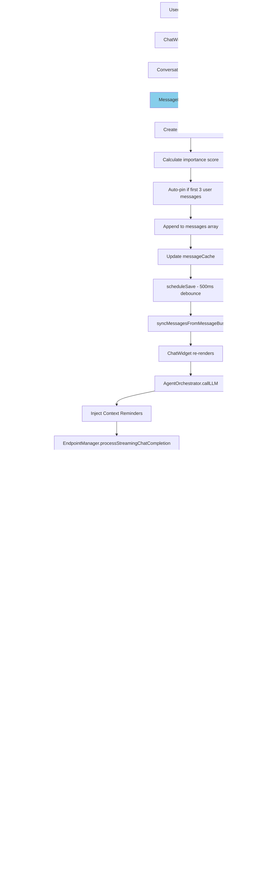

<!-- SPDX-License-Identifier: CC-BY-NC-4.0 -->
<!-- SPDX-FileCopyrightText: Copyright (c) 2025 Andrew Wyatt (Fewtarius) -->


# Message Flow

**Version:** 2.4  
**Last Updated:** December 5, 2025

## Overview

This document describes the complete message flow in SAM, from user input through AI processing to display, including streaming updates, tool execution, persistence, and context reminders.

---

## Complete Message Lifecycle



---

## Message Bus Architecture

### Single Source of Truth Pattern


---

## Streaming Message Flow


---

## Context Reminder Injection

Context reminders ensure the agent maintains awareness of user instructions, todo status, and imported documents across multi-turn conversations. Following VS Code Copilot's pattern, reminders are injected **RIGHT BEFORE** the final user message for maximum salience.

### Injection Sequence


### Reminder Order

1. **MiniPromptReminderInjector** - User's custom instructions (mini prompts)
2. **TodoReminderInjector** - Current todo list with progress rules
3. **DocumentImportReminderInjector** - Imported documents reminder
4. **User Message** - The actual user query

### Why Right Before User Message?

Positioning reminders immediately before the user's query ensures:
- **Maximum salience** - Most recent context has highest attention
- **VS Code compatibility** - Matches VS Code Copilot's `<TodoListContextPrompt>` pattern
- **Prevents "forgetting"** - Long research sessions maintain user instructions

---

## Tool Execution Flow


---

## Message Types and Structure

### EnhancedMessage Structure

```swift
struct EnhancedMessage: Identifiable, Codable {
    let id: UUID
    let type: MessageType                    // user, assistant, system, thinking, toolExecution
    var content: String
    let isFromUser: Bool
    let timestamp: Date
    
    // Tool execution fields
    var toolName: String?
    var toolStatus: ToolStatus?              // running, success, error
    var toolDetails: [String]?
    var toolDuration: TimeInterval?
    var toolCallId: String?
    
    // Performance metrics
    var performanceMetrics: MessagePerformanceMetrics?
    
    // Streaming state
    var isStreaming: Bool
    
    // Importance/context
    var isPinned: Bool
    var importance: Double                    // 0.0-1.0
    
    // Content parts (multimodal)
    var contentParts: [MessageContentPart]?   // Text, image, code, etc.
}

enum MessageType: String, Codable {
    case user
    case assistant
    case system
    case thinking                             // Extended thinking mode
    case toolExecution
}

enum ToolStatus: String, Codable {
    case running
    case success
    case error
}

struct MessagePerformanceMetrics: Codable {
    let firstTokenTime: TimeInterval?         // Time to first token
    let tokensPerSecond: Double?              // Generation speed
    let totalTokens: Int?                     // Total tokens generated
    let inputTokens: Int?                     // Prompt tokens
    let outputTokens: Int?                    // Completion tokens
}
```

---

## Message Cache Performance

### Cache Lookup Algorithm

```swift
private var messageCache: [UUID: Int] = [:]  // id → index

// O(1) lookup instead of O(n) search
func updateStreamingMessage(id: UUID, content: String) {
    guard let index = messageCache[id] else {
        logger.error("Message not found in cache: \(id)")
        return
    }
    
    // Direct array access - very fast
    var updated = messages[index]
    updated.content = content
    messages[index] = updated
    
    // No need to rebuild cache - index unchanged
}
```

**Performance Comparison:**

| Messages | O(n) Search | O(1) Cache | Speedup |
|----------|-------------|------------|---------|
| 10 | 5 comparisons | 1 lookup | 5× |
| 100 | 50 comparisons | 1 lookup | 50× |
| 1000 | 500 comparisons | 1 lookup | 500× |

### Cache Maintenance

```swift
func addMessage(_ message: EnhancedMessage) {
    let index = messages.count
    messages.append(message)
    messageCache[message.id] = index
}

func removeMessage(id: UUID) {
    guard let index = messageCache[id] else { return }
    messages.remove(at: index)
    rebuildCache()  // Required after removal
}

private func rebuildCache() {
    messageCache.removeAll()
    for (index, message) in messages.enumerated() {
        messageCache[message.id] = index
    }
}
```

---

## Importance Scoring Algorithm

### Calculation Logic

```swift
func calculateMessageImportance(text: String, isUser: Bool) -> Double {
    var importance = isUser ? 0.7 : 0.5  // Base importance
    
    // 1. Questions from assistant (agent wants to remember)
    if !isUser && containsQuestion(text) {
        importance = max(importance, 0.85)
    }
    
    // 2. Constraints/requirements (critical context)
    if containsConstraints(text) {
        importance = max(importance, 0.9)
    }
    
    // 3. Decisions/confirmations
    if isDecision(text) && text.count < 200 {
        importance = max(importance, 0.85)
    }
    
    // 4. Priority/focus shifts
    if containsPriorityKeywords(text) {
        importance = max(importance, 0.85)
    }
    
    // 5. Small talk (low value)
    if isSmallTalk(text) {
        importance = 0.3
    }
    
    // 6. Boost for longer user messages
    if isUser && text.count > 300 {
        importance = min(importance + 0.1, 1.0)
    }
    
    return importance
}
```

### Importance Use Cases

1. **Context Retrieval**: Higher importance messages retrieved first
2. **Context Pruning**: Lower importance messages dropped when at token limit
3. **Memory Storage**: Higher importance → more likely to be remembered long-term
4. **Summarization**: Focus summaries on high-importance messages

---

## Auto-Pin Logic

First 3 user messages automatically pinned:

```swift
func addUserMessage(content: String, isPinned: Bool? = nil) -> UUID {
    let currentUserCount = messages.filter { $0.isFromUser }.count
    
    // Auto-pin first 3 user messages (unless explicitly overridden)
    let shouldPin = isPinned ?? (currentUserCount < 3)
    
    let message = EnhancedMessage(
        id: UUID(),
        type: .user,
        content: content,
        isFromUser: true,
        timestamp: Date(),
        isPinned: shouldPin,
        importance: calculateMessageImportance(content, isUser: true)
    )
    
    addMessage(message)
    return message.id
}
```

**Rationale:**
- Initial messages contain task description and constraints
- Agents need guaranteed access to original request
- Prevents context loss in long conversations

---

## Delta Sync vs Full Sync

### Full Sync (Old Pattern - Inefficient)

```swift
// WRONG: Copy entire array on every update
conversation.messages = messageBus.messages  // 1000 messages × 50 updates/sec = 50,000 copies/sec

// SwiftUI re-renders entire message list
ForEach(conversation.messages) { message in
    MessageView(message: message)  // All 1000 views recreated
}
```

### Delta Sync (Current Pattern - Efficient)

```swift
// RIGHT: Update single message
func updateMessage(at index: Int, with message: EnhancedMessage) {
    messages[index] = message
    objectWillChange.send()  // Only changed row re-renders
}

// SwiftUI re-renders only changed message
ForEach(conversation.messages) { message in
    MessageView(message: message)  // Only 1 view recreated
}
```

**Performance Impact:**

| Streaming Speed | Full Sync CPU | Delta Sync CPU | Improvement |
|----------------|---------------|----------------|-------------|
| 10 chunks/sec | 15% | 2% | 7.5× |
| 50 chunks/sec | 75% | 5% | 15× |
| 100 chunks/sec | Drops frames | 8% | 12.5× |

---

## Message Persistence Timeline


**Result:** 5 rapid updates → 1 disk write (5× reduction)

---

## Multimodal Message Support

### Content Parts Structure

```swift
enum MessageContentPart: Codable {
    case text(String)
    case image(ImageContent)
    case code(CodeContent)
    case file(FileContent)
    
    struct ImageContent: Codable {
        let url: String?                   // Local file or HTTP URL
        let base64Data: String?            // Embedded image data
        let mimeType: String               // image/png, image/jpeg
        let width: Int?
        let height: Int?
    }
    
    struct CodeContent: Codable {
        let code: String
        let language: String               // swift, python, etc.
        let filename: String?
    }
    
    struct FileContent: Codable {
        let path: String
        let filename: String
        let mimeType: String
    }
}
```

### Multimodal Message Flow


---

## Error Handling

### Message Creation Failures

```swift
func addAssistantMessage(content: String) -> UUID {
    // Validate content
    guard !content.trimmingCharacters(in: .whitespacesAndNewlines).isEmpty else {
        logger.warning("Attempted to add empty assistant message")
        return UUID()  // Return dummy ID, don't add message
    }
    
    // Create and add message
    let message = EnhancedMessage(...)
    addMessage(message)
    return message.id
}
```

### Streaming Update Failures

```swift
func updateStreamingMessage(id: UUID, content: String) {
    guard let index = messageCache[id] else {
        logger.error("CRITICAL: Message \(id) not found in cache during streaming")
        
        // Recovery: Rebuild cache and retry
        rebuildCache()
        
        guard let recoveredIndex = messageCache[id] else {
            logger.error("CRITICAL: Message \(id) not in messages array either")
            return
        }
        
        // Continue with recovered index
        messages[recoveredIndex].content = content
        return
    }
    
    // Normal path
    messages[index].content = content
}
```

---

## Performance Monitoring

### Key Metrics

```swift
struct MessageBusMetrics {
    var messagesAdded: Int
    var messagesUpdated: Int
    var streamingUpdates: Int
    var cacheMisses: Int
    var savesScheduled: Int
    var savesExecuted: Int
    var averageUpdateTime: TimeInterval
    var peakUpdateTime: TimeInterval
}
```

---

## Streaming TTS Integration

When text-to-speech is enabled, the message flow integrates with the Sound subsystem to speak responses as they stream.

### Streaming TTS Flow


### Sentence Detection

During streaming, sentences are detected by looking for:
- Period followed by space or end of chunk (`. `)
- Question mark (`?`)
- Exclamation point (`!`)
- Newline after substantial text

```swift
// Simplified sentence detection logic
func detectCompleteSentence(in text: String) -> (sentence: String, remainder: String)? {
    let sentenceEndings = [". ", "? ", "! ", ".\n", "?\n", "!\n"]
    
    for ending in sentenceEndings {
        if let range = text.range(of: ending) {
            let sentence = String(text[..<range.upperBound])
            let remainder = String(text[range.upperBound...])
            return (sentence, remainder)
        }
    }
    return nil
}
```

### TTS Queue Management

The SpeechSynthesisService maintains a queue of sentences:

1. **queueSentence()**: Adds sentence to queue, starts speaking if idle
2. **processNextSentence()**: Called after each sentence finishes
3. **finishStreaming()**: Marks streaming complete, calls completion after queue empties
4. **clearQueue()**: Cancels all pending speech (for stop button)

### Voice Settings Integration

TTS respects user preferences from AudioDeviceManager:
- Selected voice identifier
- Speech rate multiplier
- Output device (system default or selected)

Settings changes take effect on the next queued sentence.

---

## Performance Monitoring

### Performance Logging

```swift
let perfStart = CFAbsoluteTimeGetCurrent()

// Perform operation
updateStreamingMessage(id: messageId, content: chunk)

let duration = CFAbsoluteTimeGetCurrent() - perfStart

if duration > 0.016 {  // > 16ms (60 FPS threshold)
    logger.warning("Slow message update: \(duration * 1000)ms")
}
```

---

## Related Documentation

- [ConversationEngine Subsystem](../subsystems/CONVERSATION_ENGINE.md)
- [Sound Subsystem](../subsystems/SOUND.md)
- [Conversation Persistence Flow](conversation_persistence.md)
- [Message Flow Redesign Specification](../MESSAGE_FLOW_AND_TOOLS_REDESIGN.md)
