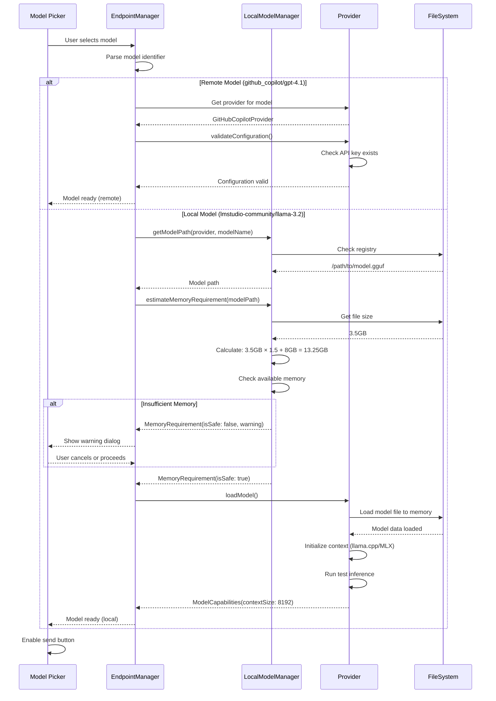
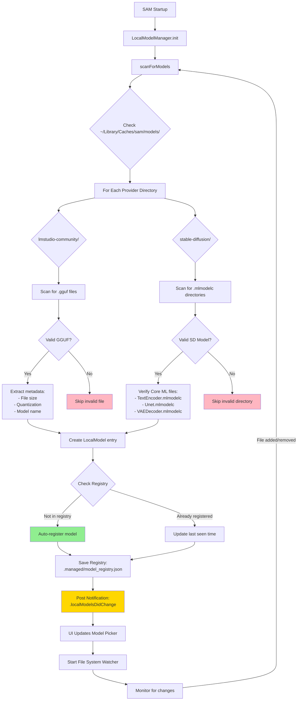
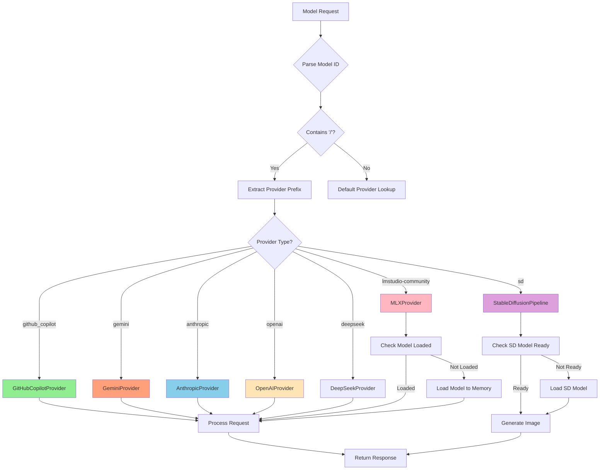
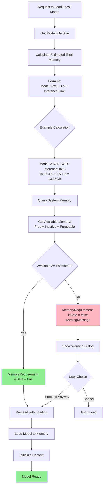
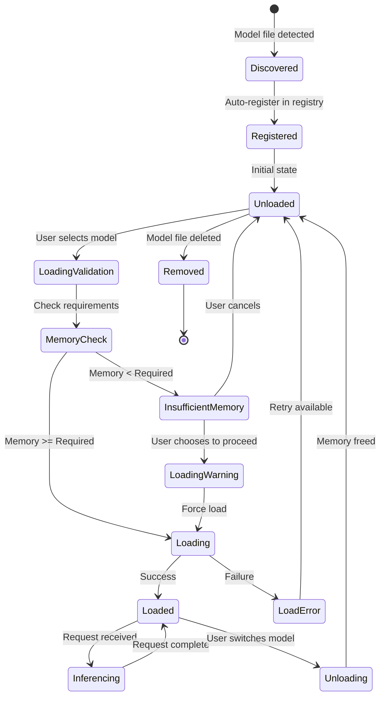
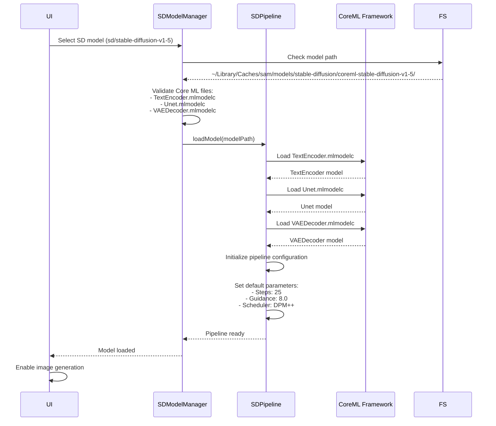
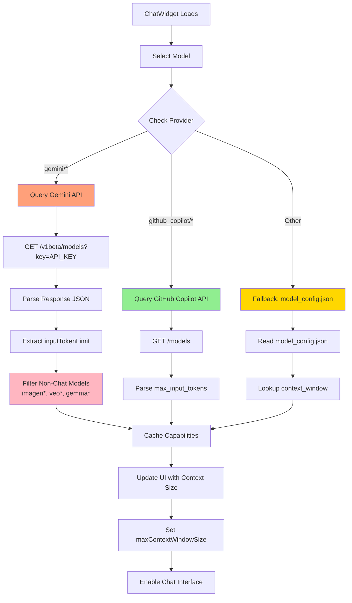

<!-- SPDX-License-Identifier: CC-BY-NC-4.0 -->
<!-- SPDX-FileCopyrightText: Copyright (c) 2025 Andrew Wyatt (Fewtarius) -->


# Model Loading Flow

**Version:** 2.2  
**Last Updated:** December 1, 2025

## Overview

This document describes the complete flow for loading and initializing AI models in SAM, covering both remote provider models (OpenAI, Anthropic, GitHub Copilot) and local models (GGUF, MLX, Stable Diffusion).

---

## Model Loading Sequence



---

## Model Discovery Flow



---

## Provider Selection Logic



---

## Memory Validation Process



---

## Local Model Lifecycle States



---

## Stable Diffusion Model Loading



---

## Model Registry Structure

```json
{
  "version": "2.2",
  "models": [
    {
      "provider": "lmstudio-community",
      "modelName": "Llama-3.2-3B-Instruct-GGUF",
      "path": "/Users/user/Library/Caches/sam/models/lmstudio-community/Llama-3.2-3B-Instruct-GGUF/model.gguf",
      "installedDate": "2025-11-30T10:00:00Z",
      "sizeBytes": 3758096384,
      "quantization": "Q8_0",
      "identifier": "lmstudio-community/Llama-3.2-3B-Instruct-GGUF"
    },
    {
      "provider": "stable-diffusion",
      "modelName": "coreml-stable-diffusion-v1-5",
      "path": "/Users/user/Library/Caches/sam/models/stable-diffusion/coreml-stable-diffusion-v1-5/",
      "installedDate": "2025-11-28T15:30:00Z",
      "sizeBytes": 2147483648,
      "quantization": "float16",
      "identifier": "sd/coreml-stable-diffusion-v1-5"
    }
  ]
}
```

---

## Error Handling

### Memory Validation Failures

**Scenario:** Model requires more memory than available

**Flow:**
1. Calculate memory requirement
2. Check available memory
3. If insufficient:
   - Show warning dialog with details
   - Offer options:
     - Cancel load
     - Proceed anyway (risky)
     - Suggest smaller model
4. If user proceeds anyway:
   - Log warning
   - Attempt load
   - Monitor for OOM errors

**User Message Example:**
```
⚠️ Insufficient Memory

Model: Llama-3.2-3B-Instruct-GGUF
Required: 13.25 GB
Available: 8.5 GB

Loading this model may cause system instability.

[Cancel] [Suggest Smaller Model] [Proceed Anyway]
```

### Model File Corruption

**Scenario:** Model file exists but is corrupted

**Flow:**
1. Attempt to load model
2. Loading fails with error
3. LocalModelManager marks model as invalid
4. Notify user
5. Offer to re-download (if from hub)

---

## Performance Considerations

### Loading Times (Approximate)

| Model Type | Size | Load Time (M1 Max) | Load Time (M1) |
|-----------|------|-------------------|----------------|
| GGUF 3B Q8 | 3.5GB | 5-8 seconds | 10-15 seconds |
| GGUF 7B Q4 | 4.1GB | 8-12 seconds | 15-20 seconds |
| MLX 3B | 6.5GB | 3-5 seconds | 6-10 seconds |
| SD 1.5 CoreML | 2.1GB | 10-15 seconds | 20-30 seconds |
| SD XL CoreML | 6.6GB | 30-45 seconds | 60-90 seconds |

### Memory Usage (Approximate)

| Model Type | File Size | RAM Usage | Notes |
|-----------|-----------|-----------|-------|
| GGUF Q8 | 3.5GB | ~5.25GB | 1.5× file size |
| GGUF Q4 | 4.1GB | ~6.15GB | 1.5× file size |
| MLX | 6.5GB | ~9.75GB | 1.5× file size |
| SD CoreML | 2.1GB | ~3.2GB | GPU memory |

---

## Model Metadata Discovery

SAM dynamically discovers model capabilities from provider APIs to ensure accurate context sizes and pricing information.

### Remote Model Metadata Flow



### Pricing Discovery Flow

```mermaid
flowchart TD
    A[Model Selected in Picker] --> B{Provider?}
    
    B -->|GitHub Copilot| C[Query Billing API]
    B -->|Gemini| D[Lookup model_config.json]
    B -->|Other| D
    
    C --> E[Get Multiplier<br/>0x = free<br/>1x-3x = premium]
    E --> F[Cache for 10 minutes]
    
    D --> G[Get costPerMillionInputTokens<br/>+ costPerMillionOutputTokens]
    G --> H[Format: $X/$Y]
    
    F --> I[Display in ChatWidget Header]
    H --> I
    
    I --> J[Show Tooltip:<br/>"Cost per million tokens"]
    
    style C fill:#90EE90
    style D fill:#FFD700
    style I fill:#87CEEB
```

### Rate Limit Notification Flow

```mermaid
flowchart TD
    A[Send Request to Provider] --> B[Provider Returns HTTP 429]
    
    B --> C[Parse retryAfterSeconds]
    C --> D[Post .providerRateLimitHit<br/>notification]
    
    D --> E[ChatWidget Shows Alert:<br/>"Rate Limited - Retrying in Xs"]
    
    E --> F[Wait for retryAfterSeconds]
    
    F --> G[Post .providerRateLimitRetrying<br/>notification]
    
    G --> H[ChatWidget Dismisses Alert]
    
    H --> I[Retry Original Request]
    
    I --> J{Success?}
    J -->|Yes| K[Return Response]
    J -->|No, 429 again| C
    
    style D fill:#FFB6C1
    style E fill:#FFA07A
    style G fill:#90EE90
```

**Key Features:**

1. **Provider-Based Routing**: Models query their own provider's API for metadata
   - `gemini/gemini-2.5-pro` → Gemini API
   - `github_copilot/gpt-4.1` → GitHub Copilot API
   
2. **Fallback Chain**: 
   - Try provider API first
   - Fall back to `model_config.json`
   - Final fallback to safe defaults (32k/16k)

3. **Smart Caching**:
   - Gemini capabilities cached per session
   - GitHub Copilot billing cached for 10 minutes
   - Reduces API calls and improves responsiveness

4. **User Notifications**:
   - Rate limits show countdown timer
   - Alerts auto-dismiss when retry begins
   - Clear visibility into provider behavior

---

## Related Documentation

- [API Framework Subsystem](../API_FRAMEWORK.md)
- [Local Model Manager Specification](../MLX_AND_MODEL_MANAGEMENT_SPECIFICATION.md)
- [Provider Configuration Guide](../DEVELOPER_GUIDE.md#provider-configuration)
