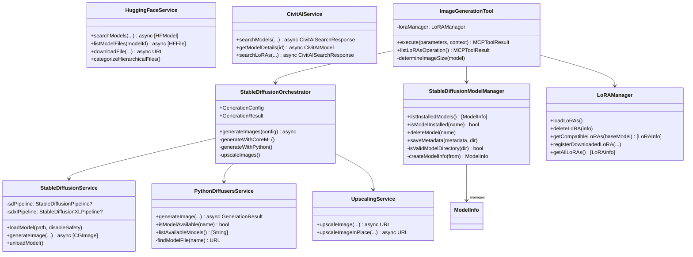

<!-- SPDX-License-Identifier: CC-BY-NC-4.0 -->
<!-- SPDX-FileCopyrightText: Copyright (c) 2025 Andrew Wyatt (Fewtarius) -->


# Stable Diffusion Generation Flow Diagrams

**Last Updated:** December 1, 2025

This document contains Mermaid flow diagrams for the Stable Diffusion integration subsystem.

---

## Model Discovery Flow


---

## LoRA Discovery Flow


---

## Dynamic LoRA Description Flow


---

## list_loras Operation Flow

```mermaid
flowchart TD
    A[User/AI calls image_generation] --> B{operation parameter?}
    
    B -->|list_loras| C[listLoRAsOperation]
    B -->|generate/none| D[Normal generation]
    
    C --> E[LoRAManager.getAllLoRAs]
    E --> F{LoRAs found?}
    
    F -->|No| G[Return no LoRAs message]
    
    F -->|Yes| H[Build LoRA list]
    
    loop Each LoRA
        H --> I[Add filename]
        I --> J[Add base model info]
        J --> K{Has trigger words?}
        K -->|Yes| L[Add trigger words]
        K -->|No| M[Skip triggers]
        L --> N[Format entry]
        M --> N
    end
    
    N --> O[Add usage instructions]
    O --> P[Return formatted list]
```

---

## LoRA Path Resolution Flow


---

## Compel Prompt Processing Flow


---

## Image Generation End-to-End Flow


---

## Device & Dtype Selection Flow


---

## Download & Conversion Pipeline


---

## Class Relationships



---

## Scheduler Auto-Correction Flow


---

## Memory Management Flow (Python)


---

## Related Documentation

- [Stable Diffusion Subsystem](../subsystems/STABLE_DIFFUSION.md)
- [API Framework](../subsystems/API_FRAMEWORK.md)
- [Prompt Architecture](../2025-12-01/2100/PROMPT_ARCHITECTURE.md)
