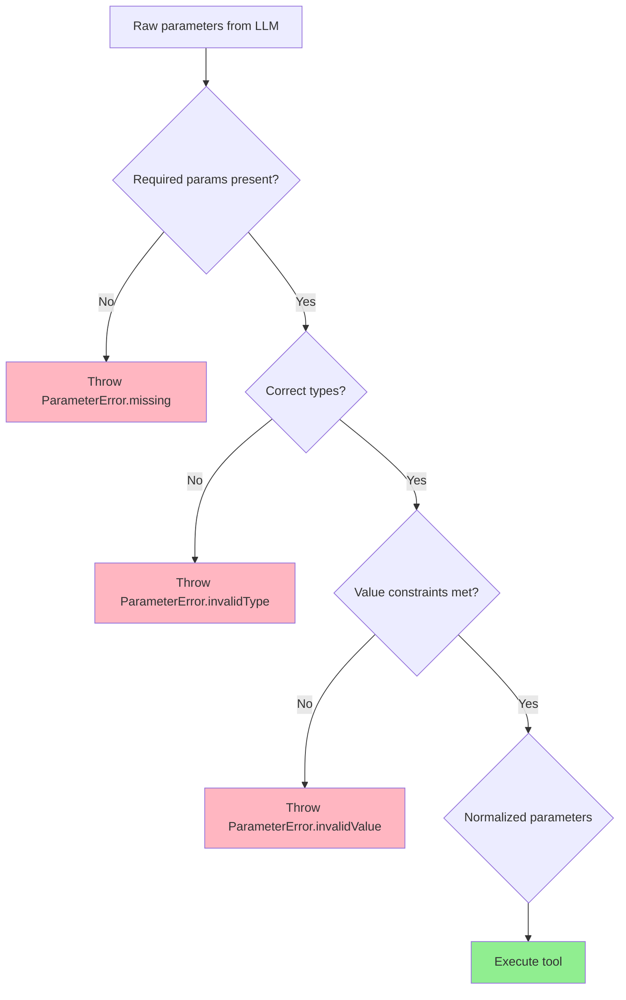
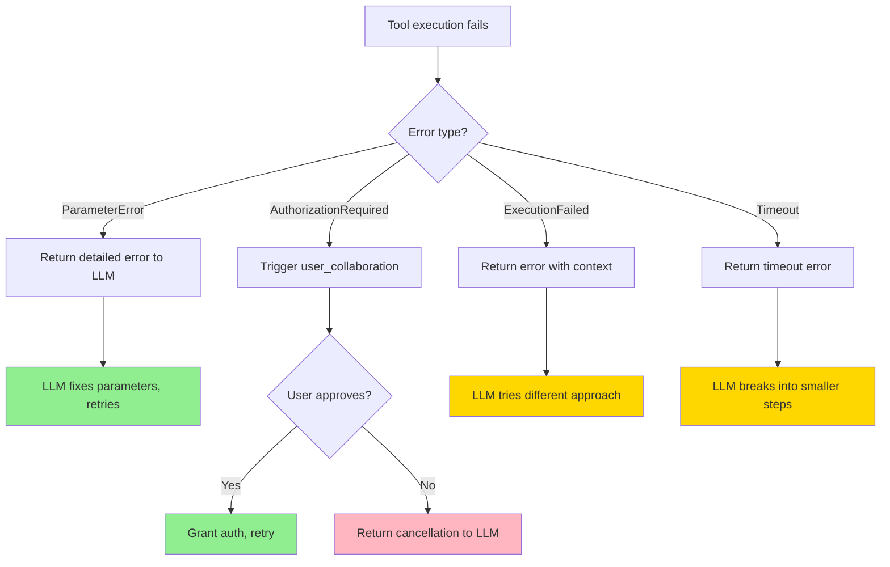

<!-- SPDX-License-Identifier: CC-BY-NC-4.0 -->
<!-- SPDX-FileCopyrightText: Copyright (c) 2025 Andrew Wyatt (Fewtarius) -->


# Tool Execution Flow

**Version:** 2.2  
**Last Updated:** December 1, 2025

## Overview

This document describes the complete flow for executing MCP tools in SAM, from LLM tool call to result handling, including authorization, validation, and error recovery.

---

## Complete Tool Execution Sequence

```mermaid
sequenceDiagram
    participant LLM
    participant AO as AgentOrchestrator
    participant MM as MCPManager
    participant Reg as MCPToolRegistry
    participant Tool
    participant Auth as AuthorizationManager
    participant UC as UserCollaborationTool

    LLM-->>AO: Response with tool call
    AO->>AO: Parse tool call JSON
    
    AO->>MM: executeTool(name, parameters, context)
    
    Note over MM: Dotted name resolution
    MM->>MM: Check if name contains "." (e.g., "file.read")
    MM->>MM: Split into base tool + operation
    
    MM->>Reg: getTool(resolvedName)
    
    alt Tool not found
        Reg-->>MM: nil
        MM-->>AO: MCPError.toolNotFound
        AO->>AO: Create error message
        AO-->>LLM: Tool error in context
    end
    
    Reg-->>MM: Tool instance
    
    MM->>Tool: validateParameters(resolvedParameters)
    
    alt Validation fails
        Tool-->>MM: throws ParameterError
        MM-->>AO: MCPError.invalidParameters
        AO-->>LLM: Parameter error
    end
    
    Tool-->>MM: Validated parameters
    
    MM->>Tool: execute(parameters, context)
    
    activate Tool
    
    alt Consolidated Tool
        Tool->>Tool: Extract "operation" parameter
        Tool->>Tool: validateOperation(operation)
        Tool->>Tool: routeOperation(operation, params, context)
    end
    
    Tool->>Auth: isAuthorized(conversationId, operation)
    
    alt Not authorized & dangerous operation
        Auth-->>Tool: false
        Tool-->>MM: MCPToolResult(requiresAuthorization=true, message)
        deactivate Tool
        MM-->>AO: Result requires authorization
        
        AO->>UC: user_collaboration(message, requireApproval=true)
        UC->>User: Show approval dialog
        
        alt User approves
            User-->>UC: Approve
            UC->>Auth: grantAuthorization(conversationId, operation)
            UC-->>AO: User approved
            
            Note over AO: Retry tool execution
            AO->>MM: executeTool(name, parameters, context)
            MM->>Tool: execute(parameters, context)
            activate Tool
            Tool->>Auth: isAuthorized(conversationId, operation)
            Auth-->>Tool: true
            Tool->>Tool: Perform operation
            Tool-->>MM: MCPToolResult(success)
            deactivate Tool
            
        else User rejects
            User-->>UC: Reject
            UC-->>AO: User rejected
            AO-->>LLM: Operation canceled by user
        end
    else Authorized or safe operation
        Auth-->>Tool: true or N/A
        Tool->>Tool: Perform operation
        
        alt Operation succeeds
            Tool-->>MM: MCPToolResult(success=true, output)
        else Operation fails
            Tool-->>MM: MCPToolResult(success=false, error)
        end
        deactivate Tool
    end
    
    MM-->>AO: MCPToolResult
    AO->>AO: Format result for LLM
    AO-->>LLM: Tool result in next message
```

---

## Tool Call Parsing

### LLM Tool Call Format (OpenAI Compatible)

```json
{
  "role": "assistant",
  "content": null,
  "tool_calls": [
    {
      "id": "call_abc123",
      "type": "function",
      "function": {
        "name": "file_operations",
        "arguments": "{\"operation\":\"read_file\",\"filePath\":\"src/main.swift\"}"
      }
    }
  ]
}
```

### AgentOrchestrator Parsing Logic

```swift
func parseToolCalls(from response: ChatCompletionResponse) -> [ToolCall] {
    guard let toolCalls = response.choices.first?.message.toolCalls else {
        return []
    }
    
    return toolCalls.compactMap { tc in
        guard let args = try? JSONSerialization.jsonObject(with: tc.function.arguments.data(using: .utf8)!) as? [String: Any] else {
            logger.error("Failed to parse tool call arguments")
            return nil
        }
        
        return ToolCall(
            id: tc.id,
            name: tc.function.name,
            arguments: args
        )
    }
}
```

---

## Dotted Name Resolution

### Problem: LLMs sometimes use dotted notation

LLMs may generate:
```json
{"name": "file_operations.read_file", ...}
```

Instead of:
```json
{"name": "file_operations", "arguments": {"operation": "read_file", ...}}
```

### Solution: Automatic resolution in MCPManager

```swift
func executeTool(name: String, parameters: [String: Any], context: MCPExecutionContext) async throws -> MCPToolResult {
    var resolvedName = name
    var resolvedParameters = parameters
    
    // Handle dotted tool names (e.g., "file_operations.list_dir" → tool: "file_operations", operation: "list_dir")
    if name.contains("."), toolRegistry.getTool(name: name) == nil {
        let components = name.split(separator: ".", maxSplits: 1)
        if components.count == 2 {
            let baseTool = String(components[0])
            let operation = String(components[1])
            
            if toolRegistry.getTool(name: baseTool) != nil {
                logger.info("Resolved dotted tool name: '\(name)' → tool='\(baseTool)', operation='\(operation)'")
                resolvedName = baseTool
                // Only add operation if not already specified
                if resolvedParameters["operation"] == nil {
                    resolvedParameters["operation"] = operation
                }
            }
        }
    }
    
    // Continue with resolved name...
}
```

---

## Parameter Validation

### Validation Stages



### Example: FileOperationsTool Validation

```swift
func validateParameters(_ parameters: [String: Any]) throws -> [String: Any] {
    // 1. Required: operation parameter
    guard let operation = parameters["operation"] as? String else {
        throw ParameterError.missing("Missing required parameter 'operation'")
    }
    
    // 2. Validate operation is supported
    guard supportedOperations.contains(operation) else {
        throw ParameterError.invalidValue("Unknown operation '\(operation)'")
    }
    
    var validated = parameters
    
    // 3. Operation-specific validation
    switch operation {
    case "read_file":
        guard let filePath = parameters["filePath"] as? String else {
            throw ParameterError.missing("Missing 'filePath' for read_file")
        }
        validated["filePath"] = filePath
        
    case "replace_string":
        guard let filePath = parameters["filePath"] as? String,
              let oldString = parameters["oldString"] as? String,
              let newString = parameters["newString"] as? String else {
            throw ParameterError.missing("Missing required parameters for replace_string")
        }
        validated["filePath"] = filePath
        validated["oldString"] = oldString
        validated["newString"] = newString
        
    // ... other operations
    }
    
    return validated
}
```

---

## Authorization Flow

### When Authorization is Required

**Dangerous Operations:**
- File writes outside working directory
- File deletions
- Terminal commands with elevated permissions
- System modifications

**Safe Operations (Auto-Approved):**
- File reads anywhere
- File writes inside working directory
- Semantic searches
- Memory operations

### Authorization Check

```swift
func execute(parameters: [String: Any], context: MCPExecutionContext) async -> MCPToolResult {
    let operation = parameters["operation"] as! String
    
    // Check if operation needs authorization
    if requiresAuthorization(operation, parameters, context) {
        let authKey = "\(name).\(operation)"
        
        if !AuthorizationManager.shared.isAuthorized(
            conversationId: context.conversationId,
            operation: authKey
        ) {
            return MCPToolResult(
                toolName: name,
                success: false,
                output: MCPOutput(content: "Authorization required"),
                metadata: [
                    "requiresAuthorization": true,
                    "authorizationKey": authKey,
                    "reason": "Operation affects files outside working directory"
                ]
            )
        }
    }
    
    // Proceed with operation...
}
```

### User Approval Dialog

```swift
// AgentOrchestrator handles authorization requirement
if result.metadata?["requiresAuthorization"] as? Bool == true {
    let authKey = result.metadata?["authorizationKey"] as? String ?? ""
    let reason = result.metadata?["reason"] as? String ?? "Unknown"
    
    // Call user_collaboration tool
    let approvalResult = await mcpManager.executeTool(
        name: "user_collaboration",
        parameters: [
            "message": """
                The agent wants to perform: \(operation)
                Reason: \(reason)
                
                Approve? (yes/no)
                """,
            "requireApproval": true
        ],
        context: context
    )
    
    if approvalResult.success {
        // Grant authorization
        AuthorizationManager.shared.grantAuthorization(
            conversationId: context.conversationId,
            operation: authKey,
            expirySeconds: 300,
            oneTimeUse: true
        )
        
        // Retry tool execution
        return await mcpManager.executeTool(name: toolName, parameters: originalParams, context: context)
    } else {
        // User rejected - return cancellation
        return MCPToolResult(
            toolName: toolName,
            success: false,
            output: MCPOutput(content: "Operation canceled by user")
        )
    }
}
```

---

## Consolidated Tool Routing

### Operation-Based Dispatch

```swift
// ConsolidatedMCP default execute implementation
func execute(parameters: [String: Any], context: MCPExecutionContext) async -> MCPToolResult {
    // 1. Extract operation
    guard let operation = parameters["operation"] as? String else {
        return operationError("", message: "Missing 'operation' parameter")
    }
    
    // 2. Validate operation
    guard validateOperation(operation) else {
        return operationError(operation, message: "Unknown operation '\(operation)'")
    }
    
    // 3. Route to handler
    return await routeOperation(operation, parameters: parameters, context: context)
}

// Tool-specific routing (e.g., FileOperationsTool)
func routeOperation(_ operation: String, parameters: [String: Any], context: MCPExecutionContext) async -> MCPToolResult {
    switch operation {
    case "read_file":
        return await readFile(parameters, context)
    case "create_file":
        return await createFile(parameters, context)
    case "replace_string":
        return await replaceString(parameters, context)
    // ... all 16 operations
    default:
        return operationError(operation, message: "Unhandled operation")
    }
}
```

---

## Error Handling

### Error Types

```swift
enum MCPError: Error {
    case toolNotFound(String)
    case invalidParameters(String)
    case executionFailed(String)
    case authorizationRequired(String)
    case operationNotSupported(String)
    case timeoutExceeded
}
```

### Error Result Format

```json
{
  "toolName": "file_operations",
  "success": false,
  "output": {
    "content": "ERROR: File not found: /nonexistent/file.txt",
    "contentType": "text"
  },
  "metadata": {
    "errorType": "FileNotFound",
    "attemptedPath": "/nonexistent/file.txt"
  }
}
```

### Error Recovery



---

## Performance Considerations

### Tool Execution Timing (Approximate)

| Operation | Duration | Notes |
|-----------|----------|-------|
| file_operations.read_file (small) | 1-5ms | Reading 100 lines |
| file_operations.read_file (large) | 10-50ms | Reading 1000+ lines |
| file_operations.grep_search | 50-200ms | Depends on workspace size |
| terminal_operations.run_command | 100ms-5s | Depends on command |
| memory_operations.search_memory | 20-100ms | Vector similarity search |
| run_subagent | 5s-60s | Full workflow execution |

### Optimization Strategies

**1. Consistent Tool Ordering (KV Cache Hit)**
```swift
// Tools always returned in same order
let toolOrder = ["think", "user_collaboration", "file_operations", ...]
```
Result: 90%+ KV cache hit rate for system prompts

**2. Parameter Validation Before Execution**
```swift
// Catch errors early, before expensive operations
try tool.validateParameters(parameters)
// Then execute
await tool.execute(parameters, context)
```

**3. Cached Tool Instances**
```swift
// Tools initialized once, reused
private var registeredTools: [String: MCPTool] = [:]
```

**4. Background Processes for Long-Running Operations**
```swift
// Don't block on long operations
{
  "operation": "run_command",
  "command": "npm run dev",
  "isBackground": true  // Returns immediately
}
```

---

## Related Documentation

- [MCPFramework Subsystem](../subsystems/MCP_FRAMEWORK.md)
- [Authorization & Safety](../subsystems/MCP_FRAMEWORK.md#authorization--safety)
- [Consolidated Tools](../subsystems/MCP_FRAMEWORK.md#consolidated-tools)
